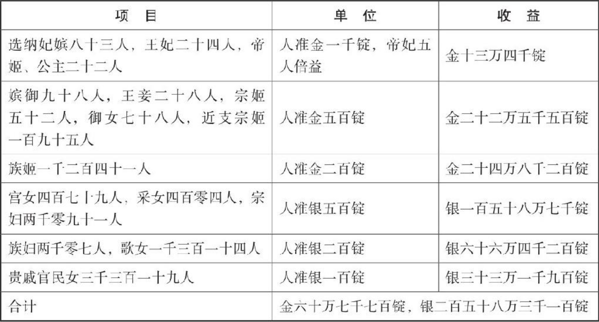

北宋朝廷无法支付巨额赔款，于是应金人所求，将后宫诸姬（公主、妃嫔、宫女、歌女、贵戚官民女等等）按照身份不同定出不同的价格，尽数“卖”给金人。

负责执行的是开封府。开封府在搜寻完全城所有的女性后，像列商品清单一样一一列出了她们的名字和身份，及售卖的价格。
中国古代女性的名字大多隐于夫家，称为“某氏”、“某夫人”或“某皇后”、“某妃”，而在这最为悲惨的时刻，她们的名字反而显现出来了。这也是我印象中第一次在史籍中看到，这么多鲜活、跳动着的女性的名字：

金弄玉、陈娇子、月里嫦娥、申观音、金秋月、朱素辉、左宝琴、新刘娘、奚巧芳、江南春······

赵玉盘、赵金奴、赵瑚儿、赵巧云、赵璎珞······（皆为公主）

莫青莲、叶小红、李铁笛、邢心香、罗醉杨妃、小金鸡、卢袅袅、顾猫儿······

曹妙婉、卜女孟、席进士、程巧、俞玩月、顾玩童、沈知礼、褚月奴、骆蝶儿······

······

······

“猫儿”这个名字出现了几次（顾猫儿、王猫儿、卫猫儿（后自刎）），大概这些女孩也曾和象上的诸位一样，有一只可爱的小猫吧；李春燕、杨春莺、鲍春蝶，大概是在春天出生的小女孩（想象一只游弋着的蝴蝶的灵魂钻入了母亲的肚子里）。

有许多“奴”、“姑”、“云”、“芳”、“娥”这样女孩名字常用的字眼，也有诸如“张好郎、沈金男、纪男郎、顾小郎”这样不知是因为性格像男孩，还是父母期盼她们是男孩的名字（倘若真是男孩也许就好了，能够像北宋诸多官兵一样苟活，再不济也是战死沙场）。

“顾顽童”这个名字让我停下来读了几遍，想象着究竟是个怎样调皮捣蛋的小女孩才会让父母给她取这样一个名字呢？“小金鸡”这个名字的由来又是怎样的？“苟玉虎”大概是一个性格比较刚烈的女孩，或者长着两颗小虎牙。

“月里嫦娥”、“金秋月”、“江南春”，多么好听的名字啊，仅仅只是名字也足以知道她们有多美了。

·······

像这样名字被记录下来的只有一二百人，同样被记录在册，但是只是以一个数字形式存在的有上万名女性，而被烧杀劫掠却没有被以任何方式记录下来的女性就又不知道有多少了。也许可以说，这些记录下来的名字，已经不再只是在记录和陈述她们个人，也是在替那个时代的所有女性以某种方式发声，或者说，哀呼。

一一把她们的名字细细读过去一遍，然后摘抄了下来。以后如果写古代背景的小说，可以从这些美丽的名字里选，刚好免去了我不会取名字的烦恼，也是某种方式的记录和祭奠。