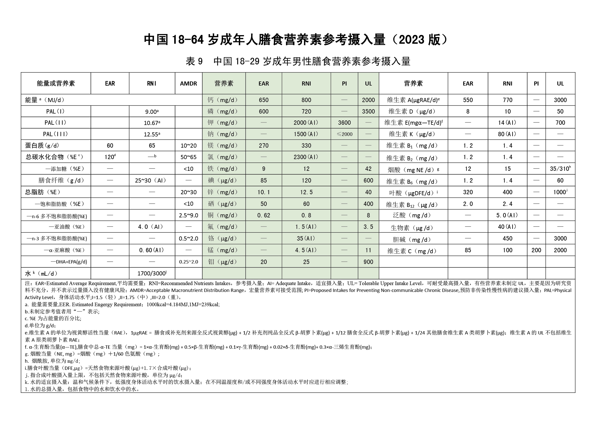

> 说明：本文基于“表9 中国18–29岁成年男性膳食营养素参考摄入量（2023版）”这张图表（见上图）进行逐步解析，帮助阅读与实操应用。建议以中国营养学会《DRIs（2023版）》原表为准。

<!-- more -->

## 1. 图表适用范围与总体结构
- 适用人群：18–29岁成年男性。
- 表头四类指标（从左到右）：
  - EAR：平均需要量。满足50%同类人群需要。
  - RNI：推荐摄入量。可满足几乎所有健康人群（约97%）需要，是日常“目标值”。
  - AI/AMDR：适宜摄入量/可接受的能量供给比范围。多用于无法给出RNI时或宏量营养素供能占比范围。
  - UL：可耐受最高摄入量。长期不宜超过。
  - PI：预防慢性病的建议摄入量（出现在部分项目中）。

图表左半部分是能量与宏量营养素（蛋白质、碳水化合物、脂肪及脂肪酸、膳食纤维、水等），右半部分是维生素与矿物质（微量营养素）。

## 2. 能量需求的判读（PAL）
- PAL = 身体活动水平。表中给出3个活动等级：
  - PAL I（低/静坐型）≈ 9.00 MJ/d（约 2150 kcal/d）
  - PAL II（中等活动）≈ 10.67 MJ/d（约 2550 kcal/d）
  - PAL III（高/体力劳动）≈ 12.55 MJ/d（约 3000 kcal/d）
- 用法：先依据你日常活动强度选择一个 PAL 档，再据此计算宏量营养素的“克数范围”。

> 换算：1 MJ ≈ 239 kcal；蛋白质/碳水化合物 4 kcal/g，脂肪 9 kcal/g。

## 3. 宏量营养素条目如何读
- 蛋白质：给出“克/天”（EAR、RNI）与“供能占比（%E）”。
  - 示例（表值可见原图）：RNI ≈ 65 g/d；%E 推荐区间约 10–20%。
- 碳水化合物：提供 AMDR（供能占比范围）与与“添加糖/游离糖”的 PI 限制。
  - 示例：总碳水 AMDR ≈ 50–65%E；添加糖 PI < 10%E。
- 脂肪：给出总脂肪 AMDR 以及分类脂肪酸的建议（SFA、PUFA n–6 / n–3、ALA、DHA+EPA）。
  - 常用记忆：总脂肪约 20–30%E；饱和脂肪酸（SFA）建议控制在 <10%E；多从鱼类、坚果、种子与植物油获得 n–3 / n–6 PUFA。
- 膳食纤维：以 g/d 给出适宜量（AI），成年男性常见区间约 25–30 g/d。
- 水：给出日需水（mL/d）范围/参考值（受气候、出汗、运动量影响较大）。

> 上述具体数值以图表为准；本文更侧重“读表方法+实操步骤”。

## 4. 微量营养素（维生素与矿物质）
- 每个项目通常出现 EAR、RNI（或 AI）、PI、UL 四列。
- 使用原则：
  1) 优先以 RNI/AI 作为日常“目标值”；
  2) 接近或超过 UL 的补充应谨慎，最好在专业人士指导下进行；
  3) 若给出 PI（如维生素D、钠/钾等项目常见），它面向慢性病风险管理，并非“越多越好”。

## 5. 一步步把“表9”落到个人计划（示例）
以“中等活动（PAL II）”为例：
- 总能量：10.67 MJ ≈ 2550 kcal。
- 宏量营养素换算：
  1) 碳水 50–65%E → 1275–1657 kcal → 319–414 g 碳水/日。
  2) 脂肪 20–30%E → 510–765 kcal → 57–85 g 脂肪/日。
  3) 蛋白质 10–20%E → 255–510 kcal → 64–128 g 蛋白质/日（与 RNI≈65 g/d 对齐）。
  4) 添加糖 <10%E → <255 kcal → <64 g/日。
- 食物结构建议（示例框架）：
  - 主食/全谷杂粮/薯类为碳水主来源（优先全谷物与杂豆）；
  - 蛋白质优先鱼类、禽肉、蛋、奶、豆制品，注意“瘦肉+低脂乳”；
  - 脂肪来源偏向坚果、种子、深海鱼、橄榄/菜籽/大豆油，控制 SFA；
  - 每日蔬果丰富多彩，确保膳食纤维 25–30 g；
  - 适量饮水，口渴前喝；体力活动/高温天相应增量。

> 小提示：若控制体重，可在 AMDR 范围内略降低脂肪占比并提高蛋白质的克数（不越 UL），同时配合力量训练与充足睡眠。

## 6. 表格脚注与易混概念
- RNI ≠ 最低需要；EAR 才是“平均需要”，RNI 更“保险”。
- AI 出现在缺乏充分证据给出 RNI 时的项目上；用作“目标值”也是可以的。
- PI 针对慢病风险，与传统“缺乏症”阈值不同。
- UL 是长期上限，不是一次性剂量上限；补剂叠加时尤其要留意。

## 7. 清单：从“表9”到行动
1) 判定你的 PAL 档（I/II/III）。
2) 依据 AMDR 把总能量拆成碳水/蛋白/脂肪的“克数范围”。
3) 对照右侧维生素/矿物质条目，检查是否明显不足或超标；
4) 把食谱落到一日三餐（含加餐），一周为周期迭代优化；
5) 跑步/力量/通勤等活动量变化时，动态微调能量与电解质摄入。

## 8. 个性化计划（25岁男性，170 cm / 60 kg，PAL II；目标：增肌或维持）
- 能量目标：
  - 维持期≈ 2550 kcal/d（PAL II）。
  - 增肌期在维持基础上+200–300 kcal → 2750–2850 kcal/d。
- 蛋白质：1.6–2.2 g/kg → 96–132 g/d；建议目标 110–120 g/d，分3–4次摄入（每餐25–40 g），优先高生物价来源（鱼禽蛋奶豆）。
- 碳水：训练日 4–6 g/kg → 240–360 g/d；常规目标 300–340 g/d（约45–50%E，按 2700 kcal 计）。静息日 3–5 g/kg 合理下调。
- 脂肪：其余能量补足，约 25–30%E → 75–90 g/d；SFA <10%E，优先不饱和脂肪来源（橄榄/菜籽/大豆油、坚果、深海鱼）。
- 膳食纤维：25–30 g/d；蔬果多样+全谷杂豆。
- 饮水与电解质：基础 1700–3000 mL/d；炎热/大汗运动额外每小时+500–1000 mL，必要时补充含钠饮料。

### 维生素A与B族追踪（按表9目标值）
- 维生素A：RNI 770 μgRAE/d；UL 3000 μgRAE/d。
- 维生素B1（硫胺素）：RNI 1.4 mg/d。
- 维生素B2（核黄素）：RNI 1.4 mg/d。
- 烟酸（维生素B3）：RNI 15 mg NE/d；UL 35 mg/d。
- 维生素B6：RNI 1.4 mg/d（注意补剂勿长期接近/超过 UL，详见DRIs）。
- 叶酸：RNI 400 μg DFE/d；补充剂与强化食品的合成叶酸 UL 1000 μg/d。
- 维生素B12：RNI 2.4 μg/d。
- 泛酸：AI 5 mg/d；生物素：AI 40 μg/d；胆碱：AI 450 mg/d（留意总量避免超上限）。

建议建立简易日常记录（示例）：
| 指标 | 目标 | 今日实摄 |
|---|---|---|
| 蛋白质 | 110–120 g | |
| 碳水 | 300–340 g | |
| 脂肪 | 75–90 g | |
| 维A | 770 μgRAE | |
| B1/B2 | 各1.4 mg | |
| 叶酸 | 400 μg DFE | |
| B12 | 2.4 μg | |

### 示例一日餐次框架（按≈2700 kcal）
- 早餐：燕麦50 g+牛奶300 mL+鸡蛋2枚+香蕉1根（蛋白≈30 g，碳水≈80 g）
- 午餐：糙米/全麦饭100–120 g生重+鸡胸/鱼肉150–200 g+大份蔬菜+橄榄油1勺（蛋白≈40 g，碳水≈90 g，脂肪≈20 g）
- 加餐：希腊酸奶200 g+坚果一小把（蛋白≈20 g，脂肪≈15 g）
- 晚餐：杂豆饭/土豆适量+牛/豆腐/鸡蛋组合30–40 g蛋白+彩色蔬菜（蛋白≈35 g，碳水≈90 g）
- 训练后（可选）：乳清/牛奶+水果1份（迅速补充优质蛋白+碳水）

——

参考：
- 中国营养学会. 中国居民膳食营养素参考摄入量（DRIs）（2023版）.

