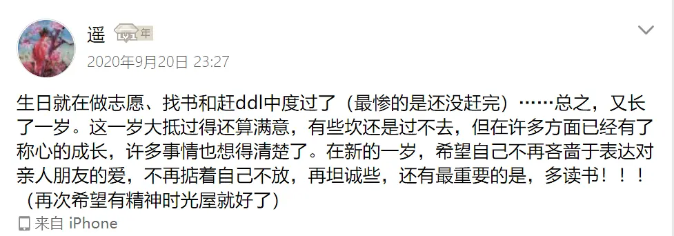
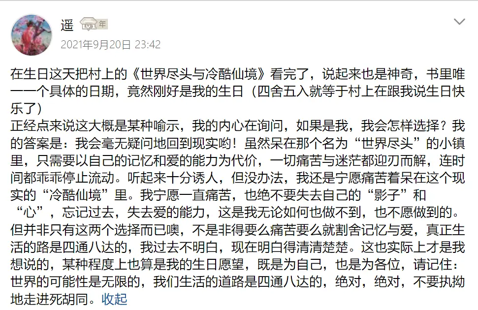

> 2025.01.02 更新： 我现在感觉超好，一切都在向着我想要的方向前进，我觉得很满足。

其实两年的生日愿望大概都算落空了，既没能表达爱和关心，也近乎丧失爱的能力。

所以今年的生日愿望（之一）大概是：接受自己可能完全独自一人在这世界上生活，没有爱人，也无法与人知心，彻彻底底的孤独一人。

没有爱我倒是不难过，一个人生活我也很习惯。说起来爱是很虚无缥缈的东西，没有就没有吧，没什么所谓。可是我连仅仅只是拥抱一个人的能力都在失去。

如果只是没有拥抱的对象，那我还能怀着憧憬等待，可是我失去的是「拥抱的能力」，一旦失去，就无法再拥抱任何人。如果连拥抱他人都已经做不到，那么究竟是为什么还继续存在着呢？我有时候会冒出这样的疑问。

但实际是，就算这样也要好好吃饭休息，一个人也要很好地生活下去。继续行走，无论前方是不是无人的荒野。

心门其实也许还没完全闭合吧，是青豆以一己之力撑开了一丝裂缝（其实很神奇，也不是有意识这么做，但是生日的时候刚好都在读村上，去年是《世界尽头与冷酷仙境》，而且书中时间和现实时间都是在九月）。今天凌晨的时候我刚好读到这：

青豆为了再见天吾一面，暂时放弃了自杀的打算，她想着：

“也许在那个小公园我能同天吾君再见一面。青豆这么想着。之后再死也可以。就一次，我要赌那么一次。只要还活着——只要不死——我就还有再见到天吾的可能性。我想活着，她这么明确地想。真是不可思议的心情。以前的我有过一次这样的想法吗”

我想这是青豆以自己的生命为筹码给予我的。只要还活着，只要还尝试着打开自己的心门，就还有那种可能性。无论如何，应该抱有微茫的希望，然后安静等待。甚至也许并不是为了等待谁，而是需要做到等待本身。

“如果再也见不到天吾出现在这个公园里，到充满谜团的1q84年结束为止，我都只能像现在这样，在高圆寺一日日重复单调乏味的生活。做点饭菜，做做运动，检查新闻，翻着普鲁斯特的书页等待天吾出现在公园里。等他已经成为我的生活中心课题。现在的我，仅靠着这么一根细线辛苦地生存下去。如同在爬下首都高速路的紧急楼梯时见到的蜘蛛一般。在脏兮兮的铁丝网的角落，织着粗陋的网，然后屏息等待的一只小黑蜘蛛。桥下刮过的风摇动，那张满是污物的网，就这么四下飘散了。看见这个的时候，青豆觉得很可哀。但是现在自己也处于和那只蜘蛛相同的境遇。”

还没看到后面，但我猜，大概，一定，青豆能见到天吾。即使我确实无法再拥抱任何人，青豆也应该见到天吾。这是他们的命运。我的命运在哪呢？不清楚。