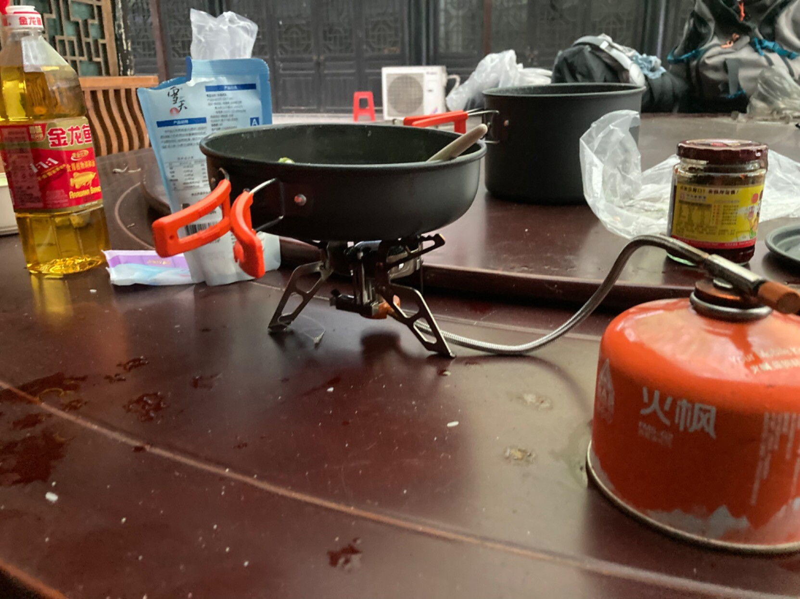
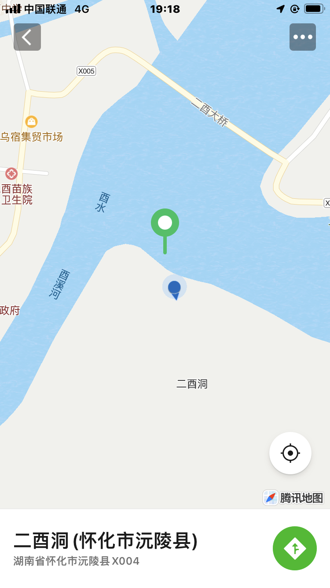

> 写了一大段描述今天的旅途，但是发现无论怎么写都描述不了今天的神奇——我得需要一段时间才能描述和表达出我今天所遇到的那位好像阿城小说中的人物，和我躺在石板上，任瀑布的水淋在我身上的那种感觉。这一切都太神奇了，我也许会永远记住这一天。- 07.01

> 今天最神奇的事情之一是，在一座等待翻修的废弃佛寺建筑中，发现一黑一白两只宠物兔。（大概是这里的工人养来陪伴他的？两只兔子吃得很好，有特意买宠物粮，还有胡萝卜和青菜叶）
>
> 在一座完全失修、破败，木头都已经腐烂，行将倒塌的佛寺中，能发现两只安安静静吃着胡萝卜的兔兔，有种难以形容的奇妙感觉。-07.03

>在有竹筏和蓝色蜻蜓的小溪边，洗了个野澡（水好凉快——！）。07.03
>
>
>
>

> 今天的徒步大概是开始徒步以来最完美、最不可预料的一次，我们大概怎么想也想不到今晚会坐船去江对面一个半废弃的山庄里面住，然后正儿八经在一张桌子上烧油起锅煮起菜和饭，最后端着碗坐在江边，一边看着江水一边吃。 - 07.03
> 
> 
> 
>

> 看上去很深的水潭，总感觉里面随时会钻出一条苍龙…… - 07.04
>

