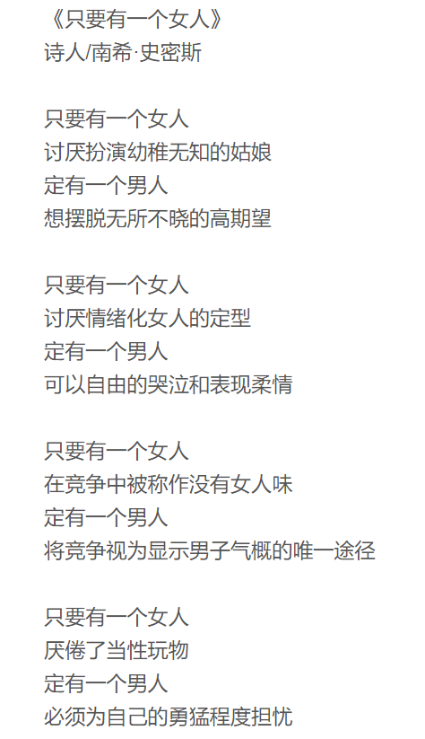
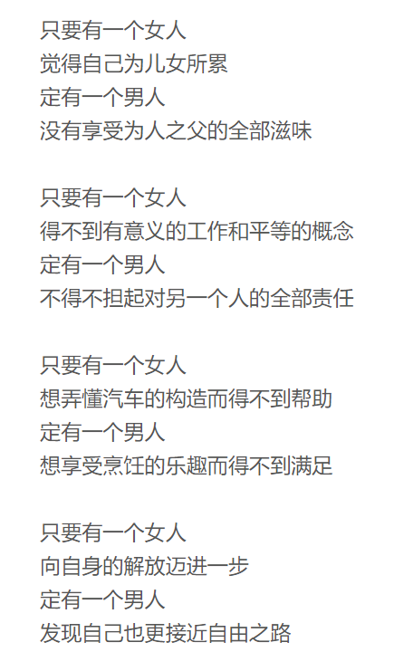

> 看完《奇葩说》的最新一期，终于有个契机把这首诗分享给大家了。
>
> 女权主义从西蒙娜·波伏娃的《第二性》开始就是一种定义明确的社会理论与运动，有其一系列成系统的理念，其中的核心追求就是性别平权。
>
> 但为什么不呼吁性别平权，而是呼吁女权？很简单的一个回答是：前者会模糊化弱势的对象。从“平权”一词中看不出女性是性别中的受害者，而指出这一点很重要，特别重要。
>
> 更需要注意的一点是，就像诗中说的那样，性别的平等最终促进的是男女双方互相的解放，这也是所有人成为自由人的必经之路。所以，支持女权运动并不应该只是某个性别的责任，而是整个人类社会向进一步发展所需要做出的决定。

