我的短想法通常会写在[cmx](https://m.cmx.im/@Heracleitus)上，有一些觉得有必要的就会同步在这个文档中。

## 2025

### 9月

> 这是一段用于测试的文本。
> 
>
> - 09.30 17:04

> 这是一段用于测试的文本。
> 
>
> - 09.30 17:04

> 这是一段用于测试的文本。
> 
>
> - 09.30 17:04

> 这是一个带时间的测试想法
>
> - 09.29 15:30

> 这是一个测试想法，用于验证脚本功能是否正常工作。
>
> - 09.30

> 今天！终于跑进状态了！！跑完一点不累，还觉得神清气爽，特别舒服。前天跑完还累得半死，完全靠死撑，今天非常自然就跑完了，全程不累，而且速度更快，跑得也更久，区别真的太大了。
> 
> 感觉埋头累死累活跑了两个月就是为了今天，这种跑进状态的感觉真的太舒服了！
>
> - 09.22

>好喜欢NAIAD这个游戏，它真的好美啊
>
>- 09。16

> 刚跑完步回来路上见到两件奇事：
>
> 十一点半棺材店老板还不睡觉，拿了个好像是砂纸的东西，在给棺材磨砂，店面里还放着其它几幅棺材，看上去有点瘆人。
>
> 小区便利店门口，三个穿着附近小学校服的小学生一人一瓶罐装啤酒坐在门口的椅子上，疑似在桃园结义。
>
> - 09.11

> 很离谱的一件事情是，作为一个有着基础编程技能的人，一直用着非常笨的方法手动创建blog，刚刚突然想明白，可以用脚本来缩短整个流程。
>
> - 09.05

>做完Elick了真开心，有种“啊终于算是有了可以称作是作品的东西”的感觉。在做的过程中想到，也不一定只用文字来完成某种创作，做一个工具也是一种创作，也是某种证明自己存在的痕迹。
>
>而且这种可以自己做东西解决自己需求的感觉真的太棒了耶，一年前我就一直在找像Elick这样的工具，然后没找到，想不到一年后我自己做出来了嘿嘿
>
>这种感觉真的很棒，当然！如果还能顺带赚钱就好了！ :ablobaww: 赚到钱我就还能继续做其它自己想做的东西，赚不到的话我就只能挣扎着自己想做的东西了（哈哈根本没有不做的选择
>
>之前做东西付费总会觉得不好意思，因为总感觉做得不够好不够有用，但是做这个完全没有！这次我非常好意思！因为它真的很有用！请有需要的象友一定买买买！ :ablobdundundun: 就当是好心支持象友追梦了（不是
>
>我下一个想做的是一个能在Apple watch上面用的一个工具，已经完成一个小demo了，我计划是用来查看和管理我自己的精力和注意力，然后用于根据精力和注意力分配自己要做的事情，也许能以某种方式帮到ADHD的象友，不过现在说还太远了，所以我就是随便念叨一下（x
>
> - 09.03

### 7月-8月

> 这几天的睡眠真是七荤八素的，每天只睡了3，4个小时。今天好不容易没事，想早睡，刚一躺进床里小猫就开始哇哇叫，来回折腾了几遍，最后又只才断断续续地睡了一会儿。晚上还去健身，在爬楼机上面爬了二十分钟心脏有点不对劲了，赶忙下来坐了一会儿，坐着的时候觉得好困，但还是挺着精神把《四个春天》的“结尾”（[余生](https://mp.weixin.qq.com/s/TGE7jBzu4Kj5kz-RHtiQUQ)）看完了。
>
> - 08.20

> 有一个友友夸我写的东西很有灵气，很开心嘿嘿。
>
> 以前也有过朋友夸我写的东西，高中毕业的时候还有同学特意写卡片和我说，后来新认识的朋友也都是因为我写的东西认识的，但是之前好像就很难从这种认可中获得快乐。好像那时候我总是非常苦恼于写不出自己想要的东西，所以就只能发一些“边角料”（指以前天天在qq空间or豆瓣and现在的毛象碎碎念），如果这些边角料如果受到别人的夸赞，对我来说也不算什么值得开心的事情。
>
> 现在我想通了，边角料也是一种创作，能让人觉得开心，让人喜欢也是写作非常重要的一种意义。 - 8.13

> 发现vibe coding的一个巨大好处是，AI在coding的时候我可以趁机rua会小猫 - 8.08

> 有时候我发现也许是这样，我是在缅怀死去的老爸一样缅怀过去的自己，因为过去的自己也死去了。现在的我就像那篇谈到怪核是什么的文章里说的那样，是过去的自己不在之后留下的幽灵，是过去自己对未来美好期望的余响，这就是为什么我也总是感觉到怪核里那种温暖又奇怪的哀伤。
>
> 自己已经死去这种说法真的很奇怪，但却是我时常会感觉到的事情，它如此真实而有效地解释了我身上的许多事情。福尔摩斯说，排除一切不可能的，剩下的即使多么不可思议，那也一定是真相，我想福尔摩斯说得对。
> 
> #发表生与死的获奖感言
>
> - 7.29

> 读到这个突然想到，大家并不一定要以世俗所定义的成功才能为自己骄傲吧，如果还能像小时候这样即使一点点微小的成功也为自己由衷感到自豪和开心，人生会快乐很多的。
> 
> 
> 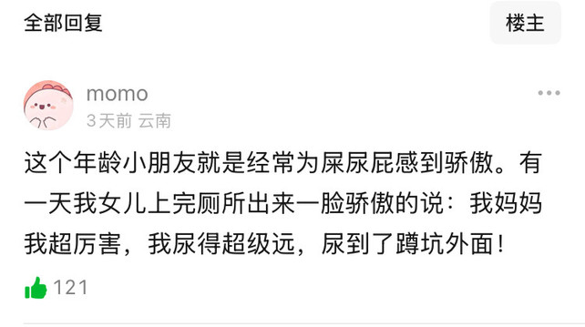
> - 7.14
### 1月-2月

> 今年过年很少出去和朋友见面，一方面是因为身体抱恙，另一方面是终于开始觉得，大家确实还是因为种种原因变得疏离和分散了，也许也并没有必要维持这份关系，天下莫有不散的宴席。 - 2.8

> 年前感冒一次，年后又感冒一次，感觉身体免疫力肉眼可见地比以前降低好多了，今年一定要恢复锻炼了！ - 2.4

> 去年还是前年和我统一战线不婚不育的表姐也结婚了！孩子也有了，今年过年看到表姐状态挺好的，那就行，说到底，这些都没那么重要，如果自己觉得结婚更幸福更合适那就应该结。- 1.29

> 感觉海外用户（特别是Mac用户端）的付费意识真的比国内要好很多，看见好的而且免费的应用竟然会第一时间问这个应用怎么赚钱，然后会主动劝开发者应该要实现付费的模式，这一点真的还挺意外的。- 1.28

> 笑死看完浅野忠信因为《幕府将军》得奖的发言，感觉浅野忠信屏幕内外的形象落差真多很大，演的角色都是那种冷酷变态帅（特别是《杀手阿一》里，实际上人有点憨，说话也大大咧咧的 - 1.6

> 今天完全好了！除了还有点流鼻涕， 我的抵抗力可真强，药也没吃，完全靠生扛扛过来了。- 1.6

> 昨天喉咙不舒服，然后发烧了，躺了一天，贼累，生病的感觉真的很不好受，光是发个烧我就觉得很不舒服了，很难想象那些生了重病的人的痛苦。这次病好后打算慢慢恢复锻炼了，因为忙着写代码，好久没好好锻炼了。- 01.05

> Cursor的Tab功能真非代码场景下有时候也挺好用的，比如我记录了一段内容，忘记是出自什么地方了，结果给我补充出来了···当然可能也是因为这段内容确实很经典（出自桑德尔的《公正：该如何做是好》），但也真的有点意外。还有刚刚我输入“黄锦树《乌”，就给出我补充出了《乌暗暝》，我还以为这样相对小众的书籍不太可能被正确猜测出来。- 01.04

> 看到之前自己记录的《1Q84》里的句子，想着是不是到了又该读一遍的时候了，感觉这次读应该会有很不一样的体验了。 01.03

> "我已经厌倦了嫌恶别人，憎恨别人的生活。厌倦了无法爱任何人的生活。我连一个朋友也没有，哪怕是一个。最重要的是我甚至连自己都爱不起来。为什么不能爱自己呢？是因为无法爱别人。一个人需要爱某个人，并被某个人所爱，通过这些来学习爱自己的方法。你明白我的意思吗？不会爱别人的人，不可能正确的爱自己。不，我不是说这些该怪你。仔细想想，或许你也是受害者之一。你大概也不知道该怎样爱自己。不是吗？" - 1q84

> 小猫现在正躺在我的电脑桌上，我一伸嘴就能亲到她嘿嘿。没有小猫之前看博主吸猫感觉怎么那么浮夸，虽然小猫是很可爱吧，但是咱也得矜持啊，自己有小猫后，我亲亲亲亲亲——！ - 01.03

> 为什么会有这么多短想法呢···因为自从初中开始我就有这个瞎囔囔的习惯了，所以留下来了很多很多短想法，现在还在慢慢搬运中。- 01.02

> 正在心满意足地搭建自己的digital garden，感觉非常棒！其实很早就有blog了，但一直没怎么更新，感觉是因为如果只是以文章的方式记录的话总会让我感觉压力有点大？像这样如果只是记短想法的话，我一天能记好多条···- 01.02

## 2024

### 12月

> 之前在上课的时候提到红衣主教黎塞留，总是提到他在政治上如何如何，外交上如何如何，然后刚刚看到一篇回答才知道他是一名猫奴，养了十几只猫咪，其中有一只叫Lucifer（路西法），然后还有一只叫Soumise（乖乖），是黎塞留最喜欢的猫，黎塞留还记载说乖乖很爱要抱抱··· - 2024.12.28

> 给经常用的一个工具提了一个pr，增加了一个我觉得挺适用的新功能，发现这种可以自己完善自己用的工具的感觉真不错啊，以前只能找适合自己的工具，现在可以自己做，真的太好了。 - 2024.12.05

> 《三体》中一个非常荒谬的点是，物理学是不会因为某些观测结果不符合预期就崩溃的，科学史上多次物理学的范式转换都是因为看到了不符合原来理论的结果，每次新的观测结果都能带出新的物理学；科学家更不会因为实验结果不对就寻死觅活，只会更来劲而已。
>
> 但，历史告诉我们，科学确实是会崩溃的，科学家也是会自杀的，但不是因为智子，不是因为三体人——刘慈欣大概自己亲眼看到过，经历过，在某个时期，科学崩溃了，成批的科学家自杀，可能只有了解那段时期，才能理解《三体》中许多非常“荒谬”的设定和刘慈欣在书里对人性的悲观。
>
> 我想，可能并不是因为刘慈欣不了解科学史和科学家，只是因为他确实看到过，然后想以某种方式记录吧。- 2024.03.27

> 想象这个世界上只有你一人，而你只能活三十岁，许多事情就会一下明晰了。” - 2024.02.06

## 2023

### 11月
> 虽然是出于热心，我也非常感谢，但我是实在不太明白我的亲友们怎么会觉得你们能够指挥我的人生？更不明白你们怎么会觉得你们会比我自己更知道我的人生应该要怎么过？而且我的亲友们你们究竟有没有想过，你们的想法已经不适合现在的情况？你们真有明白现在在发生什么吗？…再说了，就算我爸在他也管不着我，其他人就更别想了。
> 从做出高中独自到市里学校读书，到高二放弃成绩更好的文科读理科，然后大学又转专业到历史系，再到现在转码学计算机，我非常清楚自己在做什么，我对我自己的每一次决定都认真思考过，我也为我的选择负责。
>
> 我这么认真读书和学习真不是为了最后又绕回来当教师、当公务员的，您可以操控和命令你的孩子去做，但别管我的事情好吗？我这么大一个人，有自己的想法和计划。今年过年再让我听到让我去考研考编，我就在手上纹一个大花臂。- 2023.11.19

> 看到一个回答说，说他考上大学，第一次去学校，从河北到云南，他那没怎么出过远门的老爹陪着他坐42小时的慢车去的学校，最后又坐了42h的火车回去。
>
> 于是想到很久前，大概是高一还是初中，我爸说，如果我大学考到北京就开车从湖南送我去北京，我当时可爱玩了，从湖南到北京，一路上多少好玩的啊，我跳起来问我爸是真的吗？我爸笑着点点头。
>
> 当然最后我没考到北京，到了天津，我爸也在我高中毕业之前就去世了。最后我一个人坐着长途火车坐了一天一夜到天津，刚下车就有人喊我的名字，我懵住了，不知道是谁，很多人在喊，在第一次来到的城市，莫名其妙有很多人喊我的名字，在人来人往的火车站，我真的呆住了。
>
> 后来才知道那是附近一所中学的名字。- 2023.11.14

> 不得不说，这一年里真是每天都在接触各种各样新的东西和问题，没有一个是能从我以前的经验中参考的，全都是全新的知识和领域。我一边看一边学一边用，很多时候因为时间太紧，事情也太赶，没有来得及巩固之前学的就又要接触新的领域和问题，就这样一直赶啊赶的，竟然能在一年里（实际上真正学习的时间一年都不够）学完了基础的东西，然后还能在开源软件的基础上做出一个非常有用的学习语言的工具！我真的太强了（！）
>
> 一年前的我绝对想不到一年后的我会是在做什么……好奇一年后我又会在做什么呢，如果是在做独立游戏开发就好了（！）虽然听上去挺离谱，但要是一年前说我现在在做的事情，那也挺离谱的… - 2023.11.09

> 在查资料的时候把屈原的几首诗简单读了一遍，把自己逗乐了···这不是咱中国人自己的《神曲》么，什么时候有公司能发奋图强，弄一个屈 May Cry出来（x）- 2023.11.03

### 10月

> 测试想法
>
> - 2025.10.01

> 音乐的探索真是永无止境啊，，我以为我这么多年库库听应该该知道的乐队都知道了，但是总能又突然冒出来很多个我完全不知道但是又很好听很厉害的乐队！
> 
> 
>
> - 10.01 15:54

> 看某豆友对南阳迷笛事件的评价：
>
> “南阳刘子骥，高尚士也，闻之，欣然规往。”
>
> 太贫了哈哈哈哈 - 2023.10.05

> 散步完回来，在小区里看见一个小女孩孤零零地站在那，我戴着耳机经过，看了两眼小女孩，灯光太暗，我又戴着耳机，看不清也听不见，走了两步不放心又回头看左右，没看见有大人，于是摘了耳机走近问小女孩怎么一个人在这里，需要帮忙吗。
>
> 小女孩和我侄女年纪相近，两三年级，说起话有种小女孩特有的认真和可爱，她说：
>
> “我爸爸让我去外婆家玩。但是我打不开那个门——”
>
> 我指向前面那道门，我问她是不是这道门，她说是。
>
> “噢好，我帮你开吧，我也住这。”
>
> “好好。”然后小女孩就独自在那絮叨，说她有点害怕。但是她的语气却听不太出来，甚至可以说有些平静。我都惊讶小女孩一个人在晚上十一点半在这么黑的小区里进不去门，也没有非常着急或者哭起来，只是在听见我可以帮忙后非常安静地陈述了她的情况。
>
> “我这几天不是放假嘛，我爸就让我去外婆家玩，但是我打不开那个门。”
>
> 我有些懊恼她父亲怎么把一个小女孩就这样抛在这而不是陪着她过来，我问她有没有手机或者电话手表之类的，她说有我才放下一点心，她至少可以联系到家人。
> “噢，这里是你外婆家吗？”
>
> 她也没说是不是，就说她爸爸和爷爷都在这里，我也有点懵，然后才反应过来她大概是刚从外婆家回来？
>
> 最后小女孩又东说西说了一大堆，这时候才感觉到她还是确实有点害怕的。最后我俩一起进了电梯，她13楼，我16楼。我看她有手表，而且已经到13楼了所以就走了，现在回想起来应该至少一起陪到她看到她家人才走。
>
> 应该是没事的，只是这小女孩让我响起了我侄子侄女，我好想带这俩小孩出去玩——早知道我应该把小女孩带到家的，这样又保证她的安全，说不定也能没事去找她玩！真的对于我来说，和小孩聊天和比绝大多数成年聊天有意思得多，这次和小女孩非常简短的聊天我觉得也很有趣。- 2023.10.02

### 9月

> 和老妈视频聊天，聊到我小时候有多么调皮，我竟然一点印象都没有。
>
> 我以为我小时候都是特乖巧一小孩，结果老妈说我天天找人打架，被人咬到破皮···把家里的几大瓶牛奶倒了用来洗澡，把米和猪糠混在一起···总之就是一特能倒腾的破小孩，比我侄子侄女（也就是老妈的外孙女外孙）还让她头疼···
>
> 我全程的表情都是：啊？我？
>
> 可是我的记忆中我小时候真的很乖的好嘛！我印象中我从来不打架，从来不招惹别人？也许是干了坏事就下意识忘记吧···
>
> 不过也从某种意义上确证了，我原来一直都这么精力充沛，这么能瞎折腾···- 9.29

> 同样的感情，刘过的“欲买桂花同载酒，终不似，少年游”不如姜夔的“少年情事老来悲”，前者究竟有些“老生常谈”，但姜夔却是完全属于自己的情感，自己的表达。记得当初在古诗词鉴赏中初次读到这首词时，我反复默诵几遍，眼泪就留下来了，那种悲伤实在太过浓郁，诸多诗词中也鲜有像这首里面那种对过往记忆的悲凉，许多诗人是怀念、是追忆、是无可奈何但又不得不move on，只有姜夔到老还停留在当时的那种痛苦之中。
>
> 全诗如下：鹧鸪天·正月十一日观灯·姜夔巷陌风光纵赏时。笼纱未出马先嘶。白头居士无呵殿，只有乘肩小女随。花满市，月侵衣。少年情事老来悲。沙河塘上春寒浅，看了游人缓缓归。- 9.21

> 教师节不得不感叹一下，自己从小到大，遇到的各位老师都对我很好很宽容。
>
> 我所遇到的长辈老师从来没有说觉得这个学生是不是太跳太不守规矩而打压我，反而他们总是在他们力所能及的条件下帮助和肯定我，我真的很感谢他们，感谢他们没有尝试用权威去磨平我的棱角，感谢他们没有像绝大多数长辈一样，总是以高高在上的态度告诉我应该要做什么，应该不要做什么，更没有用他们粗浅固执己见的态度把我限制、扭曲成他们想要的木偶，他们总是鼓励我多尝试，多做“刺头”。
>
> 不得不说，因为这些长辈老师的宽容和鼓励，在做出人生的选择是我总是想走反叛的那一条，我总是想做一个“刺头”，有时候真的因为这样做多走很多弯路，吃很多苦，但这确实是我想要的，如今回望过去，至少到现在为止，我可以说我十分幸运地长成了我想要成为的人，甚至远比我当初想象中还要做得更好。真的很感谢诸位长辈老师。- 9.10

### 7月

> 青年旅社里遇到的店员姐姐竟然是高中大我两届的学姐，说不定还在学校见过，也是挺巧的。
>
> 有一次我在北京一家二十四小时书店通宵看书，等早上七点多的高铁回天津，我看着看着突然窗外有人在向我招手，抬头才发现是隔壁寝的朋友。在同一个城市时我其实不会特别想去联系朋友，但是这样意外的相遇却总是让我十分开心。
>
> 我在想以后是不是还会在这样完全预想不到的地方遇到熟人呢？虽然两个人看上去像是从同一个起点往不同方向发出去的两条射线，一个要去天涯，一个待在海角，日后却因某种因缘际会，在两人完全预想不到的位置和时刻如同奇迹般又相见——然后寒暄两句后又各自挥手告别——相遇是奇迹，告别却是寻常。- 7.29

### 5月

> 耶！网页部署完了！还没设置域名解析，不过已经能够用公网IP打开了！用手机打开的一瞬间还是挺激动的，虽然发现因为没有设置自适应，在手机中显示得特别乱，也还有很多地方需要调整···但是，终于算是所有流程都走完了！
>
> 虽然我也不知道这个网页究竟有什么用，但是，总算是有了一个自己的网页了！- 5.26

> 接我幼儿园的小侄子回家，他在车后唱：
>
> baby——咕咕咕咕咕咕咕~~鲨鱼姐姐！
>
> baby——咕咕咕咕咕咕咕~~鲨鱼叔叔！
>
> baby——咕咕咕咕咕咕咕~~鲨鱼爸爸！
>
> baby——咕咕咕咕咕咕咕~~鲨鱼妈妈！
>
> baby——咕咕咕咕咕咕咕~~鲨鱼奶奶！
>
> baby——咕咕咕咕咕咕咕~~鲨鱼爷爷！
>
> 唱了一路！ - 5.6

> 上楼的时候看见楼梯特别亮堂（以往不开灯都是一片漆黑），正想着哪来的灯光，抬头一看，皓月当空。- 5.3

>《漫长的季节》看完了，真好看啊，看完连连叹气。
>
> 最后一幕，王响看见数十年前的自己驾驶着火车经过，一路小跑着跟上，对以前的自己喊“往前看，别回头！”，但我在心里默默喊的却是“捎上我吧，我想回到过去。” - 5.2

> 楼下几只狗一直叫叫得我心烦，上次的事还没算账呢，于是多少带着怒气地下楼去看它们究竟在干什么，结果，猜猜我看到了什么！
>
> 一只特好看的纯白色猫猫！而且还肥嘟嘟的，比我之前看到的猫都要肥上一两圈！（之前在村子看到的猫猫大多是一般的黄褐色，特别瘦小一个）
>
> 当场就心生歹念，想回去拿猫粮诱惑它，但是它和我对视了两秒就跑了，最后我用我的户外小锅装了一碗猫粮和一杯水给它放在了它应该能够到，但是狗够不到的墙上，还给它放了张凳子，放了个纸箱。
>
> 然按常理来说大概是家养的，但是好像也没看见村子里面有人养猫···所以还是心存侥幸···猫猫你能来我家住吗! - 5.1

> 早起搞了一早上卫生，属实是劳动节了）- 5.1

### 4月

> 按这两天下雨这劲头，再下个一礼拜得发洪水了，我可就住河边不到一百米···
>
> 小学一二年级的时候有印象发过一次洪水，我家一楼的水都淹到了我膝盖。一开始还挺新奇的，整个世界都变成了一个大泳池，我到处游着玩，但后来看到好多蛇在水里游就不敢了。

> 有一幕印象特别深，邻居站在一个高地上，拿着扫把还是什么衣杆，然后水里大概七八条蛇仰着头围着他···还有就是洪水褪去后邻居家门把手上挂了几条蛇···- 4.28

> 记得确实是“最肯忘却古人诗，最不屑一顾是相思”，今天唱着唱着突然觉得应该是“最肯忘却故人事”才对。- 4.28

> 今日写码感想：GPT-4真强，我也真强，强强联手 - 4.26

> 现有发言都在尝试分割范新和一页的关系，许多人也认为一页是一页，范新是范新——这确实也有道理，一页是一个很好的出版品牌，出过很多好书，这一点任何人都无法否认。但事实是如果不抵制一页，不对一页的生意造成重大的影响，这群人别说在乎其他人是否受到侵害了，就连一个简单的解释声明也没有，只是保持沉默。
>
> 普通读者打破沉默的的唯一有效方式就是声明抵制一页的书籍，在一页官方做出任何合理的解释之前都拒绝购买一页的任何书籍。甚至也不需要声明，就默默不再购买一页的书籍就好了，当他们发现书的销量大减，书再也卖不出去后，沉默自然会被打破。- 4.25

> 网站的开发颇有点进入正轨的意思了，不用ChatGPT也慢慢能够实现自己的需求和修改错误，然后自己有时候也能想到比ChatGPT给出的更有效的解决方法。终于算是有点“这是我写的代码”的感觉了（之前基本全靠我说，ChatGPT实现，然后我再改，再说，再让ChatGPT实现···）！- 4.21

> 村子里的狗真的好过分，自己吃不到还守着不让猫进，刚才听到猫咪尖叫和狗吠的声音了，不知道猫咪有没有受伤……- 4.18

> 有只狗在院子大门前徘徊一两个小时了，还想用爪子推开大门，估计是是闻到味道想吃院子里我给猫咪准备的罐头···
>
>还敢冲里嗷嗷叫 我下去会会它!
>
> 虽然知道它们可能也饿，但是它们这群狗子白天占着垃圾桶，还能跑别人家吃剩饭，附近野猫白天都不敢出门···- 4.17

> 呃突然想起午饭还没吃 早上吃了碗粉回来就一直在写码 本来说解决这个坑就下来煮午饭吃的 结果一直耽误在现在……
>
> 在一个坑里踩了一下午终于出来了 :blobcatcry: 出去骑会自行车车，完成今天的锻炼任务再回来总结错误. - 4.17

> 没睡着，听见有东西在我家院子里扑腾，往下一看果然是野猫，好像还不只一只，看样子我在院子墙上放的猫罐头把方圆几里的野猫都给吸引过来了……我就在二楼探出头去看它们在院子里飞檐走壁，也不知道它们吃到没有……- 4.17

> 哈哈哈从邻居家还不怎么会说话的小妹妹那讨来一块小饼干，她好乖地递给我一块，虽然只是一块很普通的饼干但是很开心！- 4。15

> 我家小区这什么神仙快递站啊又有小猫又有小狗的
>
> 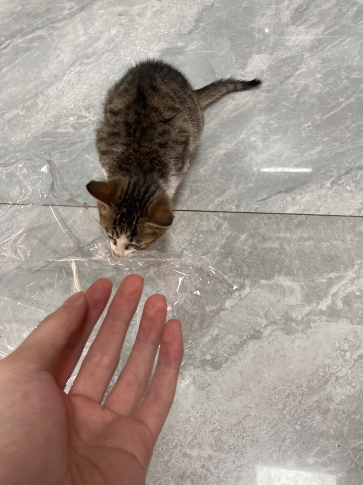
> 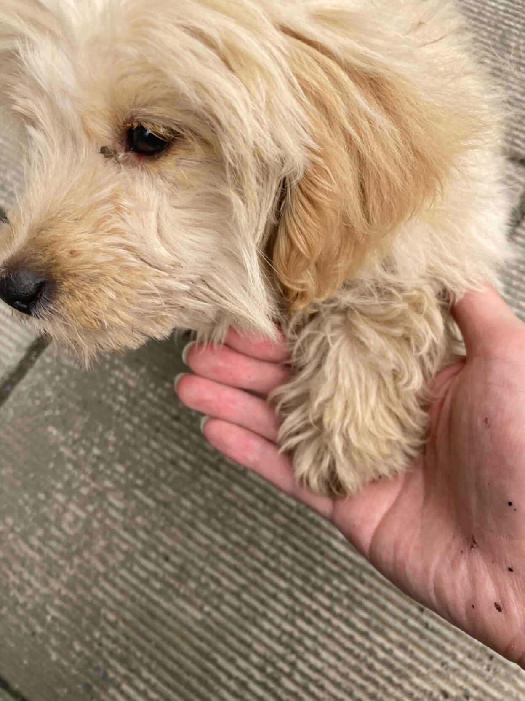
>
> 还有一只大狗，但是它对我不够热情，不给它拍照片 - 4.15

>
> 重开黑魂三，用骑士一分钟不到过了新手古达……这是当初折磨我的古达老师吗... 你怎么拉成这样了
>
> 果然还是时隔多年，我的二人转技术已经到了炉火纯青的地步了吗！- 4.11

> 听不懂狗话不知道发生什么了，只听见突然附近的狗都喊了起来，起码十几只吧，然后还看见好多狗向某个地方赶去……X村灵异事件（？）- 4.11

> 和ChatGPT共同完成一个项目就像LOL里猫咪和剑圣共同完成一次五杀……它从中一塔追到水晶，全程嗷嗷砍，我就挂在它身上不用动，还能一只手吃零食一只手偶尔放个技能……
>
> 最后：我们俩真厉害- 4.11

> 有时候觉得很奇怪，我明明知道对方会很乐意帮忙，知道这件事如果要完全我自己来做就会很麻烦或者根本做不了，而麻烦一下对方就能很轻松实现（这件事一般对方也能很轻松做到，如果不是我不会麻烦别人），但我还是不愿意寻求帮助，非得自己不停折腾，折腾到确定实在没有办法的时候才会特别扭捏地寻求帮助。
>
> 我不应该是这样的···我知道我希望尽量事事都依靠自己，可是学会寻求和接受他人的帮助也很重要啊···为什么这么奇怪，我真的不明白，帮助他人是如此自然而让我开心的事情，但是向他人寻求帮助却让我反复挣扎？
>
>我真的需要学会和别人说我需要你的帮助···否则一定迟早会陷在自我的泥潭里的···- 4.9

> 吃晚饭，上幼儿园的小侄子拍拍我的背喊我多吃点，我内心：？这不应该是我对你说的台词吗？- 4.07

> 真诚地认为这世界上最了解我的是网易云的私人FM···好多次都有“你怎么知道我会喜欢这首歌？”的惊喜。
>
> 有些听后特别特别喜欢的歌，如果FM不推荐给我的话靠我自己去探索也许永远不会找到（比如我现在都还不知道专辑名是什么意思的קצת אחרת，如果不是fm推荐我怎么会听到他们的歌x）。- 4.7

> 看了深焦对孔一山（导演）和王一通（编剧）的采访，果然“等待麻雀的少年”这个形象很重要。某种意义上来说这个形象是电影的“点睛之笔”，如果没有他，或者这个形象不以这样的方式演绎，那这部电影就其实只是老生常谈而已。- 4.7

> 你知道我最引以为傲，或者说我唯一会引以为傲的能力是什么吗？那就是对我最喜欢的创作者，我能够最精确、最感同身受地理解到他们的表达，我能够穿越所有框架、所有理论，如同平原上两个赤裸着的人般与他们对话。这种能力才是我唯一的天赋。- 4.6

> 《宇宙探索编辑部》真好看啊，这样的电影好少在影院看到了。
>
> 很难形容，“等待麻雀的少年”这个形象给我的震撼。怎么说好，我感觉他身上有某种特别的“神性”，这个人物是故事的主要角色，但他本身的存在却完全超然于这个故事。
>
> 他像那种日本传统文化中（应该以更精确的语言来形容的，但是大脑短路了）莫测的神灵
> 
> 好好奇这个剧本是怎么写出来的，哪里来的灵感？这个少年又是如何冒出来的？- 4.5

> 善良的人是最聪明的人，因为关于善的知识最难寻索。 - 4.5

> 我小侄子的生日愿望：获得超能力，变成索尼克打姐姐（） - 4.2

### 3月

> 最近的一个学习经验：在实际操作中遇到问题后再去学理论，会比学习理论后再来实际操作更有效，操作后再来看理论会有一种恍然大悟的感觉。- 3.29

> 一个de了一个多小时的bug来源于我搞错了文件））我拷贝了A的备份A‘，然后在A’里写代码，但是服务器运行的是A，我说怎么无论我怎么改都一点反应没有···又气又想笑 - 3.29

> 凌晨起来煲玉米排骨汤，这个时区有我这样雅兴的人不多了）- 3.28

> 笑死，一下楼进屋又看见两只猫咪从房间里蹿出来。看了一下放在桌子上的排骨还在，面包也没有被打开，也没有什么地方被打乱的痕迹，所以它们大概是听见我在小猫电台发的广播，跑进来避寒躲雨了。
> 
> 我帮它们在一楼卧室的衣柜里用被子简单铺了一个小窝，外面也用纸箱和被子铺了一个窝。还放了一些面包和腊肠到房间里，不知道它们吃不吃？
>
> 待会等看见一楼熄了灯，听见我“咚咚咚”的上楼声，它们大概就会从阴影里跑出来，爬回我为它们准备的小窝里吧。- 3.28

> 下楼发现大门小门都没关，心想是要遭贼了，果然一进门就碰见一只小喵咪。看花色好像是上次看见在路边晒太阳那只，也不知道它跑一楼卧室做什么去了（抓老鼠？），听见我的脚步声后急匆匆从卧室里跑出来，慌不择路地朝阳台跑去，然后发现那边没出口就绕回来从我身边穿过跑了出去，全程不超过三秒钟…
>
> 流浪狗虽然看见我也会躲，但是不会退太远，看我没有驱赶它们的打算就又靠近吃碗里的饭菜，等下次就非常自然地就跑进院子里看碗里有没有剩菜剩饭。但是流浪猫一看见我就跑得飞快，飞远，绝不会和我在同一个镜头里待超过三秒… - 3,28

> 今天开车在路上瞥见一只被浇得湿淋淋的小猫的body。没办法啊，这几天雨下得实在太大了，气温也一下降了好多。
>
>前几天升温出太阳的时候还能看见有猫咪在路边晒太阳，现在下这么大的雨也不知道它有没有找到躲雨的地方。
>
> 如果有个小猫电台之类的东西，广播一声告诉它们可以到我这儿暂时躲雨休息，避过这几天坏天气就好了。我会非常非常乐意招待你们一段时间的…… - 3.25

> 摘下耳机倚着窗侧身看外面的大雨，偶尔的闪电会将房间照亮，随后一阵雷声轰隆。不知道为什么，有种很特别、很特别的幸福感。
>
> 我想起中学喜欢的女孩，我曾经特地麻烦她，让她等下雨的时候，把雨点滴落在她家屋檐上的声响录下。
>
> 因为那儿的雨点落在屋檐上的声音实在太过清脆动人了呀，我现在还难以忘记，那特别的滴答滴答的声响；曾经有一个晚上，我望着窗外痴痴听了许久，而她就在离我不到一米的距离写着试卷。
>
> 南方的春雨大概是世界上最好的辅佐回忆的佐料之一了，记忆随着淅沥的雨声，如此细无声地浸润脑海。假使这场雨下得足够漫长，我也能就着这场雨写出我的《追忆似水年华》了。- 3.24

> 好想点外卖，可是我在村子里,想开小电摩出去吃还在下雨 -3.24 

> 我所犯下的罪是我不够爱身边的人，特别是我爸，我过去太把别人的爱当作理所当然了，也许。我以后大概再也毫无机会学习，并且会在这方面做得越来越糟。确实是足够“等价代换”的惩罚了呀，对于我这样一个如此需要爱的人。- 3.21

> 我有一点好奇，为什么面对新技术的出现，很多人会先担心害怕自己被取代，而不是把这当成一次机会，利用好新技术取代别人？ - 3.16

> 记得以前有段时间还挺沉迷末日+公路片这个组合的，但是除了《疯狂的麦克斯》外一直没看到多少满意的电影和剧，《最后生还者》真是完全满足我这个要求了。-3.13
>
> 噢还有去年看的《芬奇》也很不错！

> 本来想在那篇把儒学批得一无是处的嘟嘟下面至少替夫子和孟子辩驳两句，想想还是算了，容易变成没有意义的争吵。
>
> 孔孟的儒学和荀子的儒学不一样，和董仲舒的儒学更完全不一样，董仲舒和朱熹的又完全不一样。劳思光老先生甚至认为，在秦焚书之后，真正的儒学思想已经近乎失传，董仲舒的儒学是在皇权制衡下，结合阴阳学的另一种产物，只是冠了儒学的名而已。五四时期和原嘟嘟所斥骂的儒学主要是指董仲舒以后，在朱熹那集大成的“儒学”。
>
> 如果不分辨清楚这些区别，骂儒学只是自己虚空立个靶子，发泄情绪罢了。- 3.12

> 发现一个可以借鉴的项目，有代码可以抄···不是借鉴和参考的感觉真好。
>
> 接下来几天的任务大概是把抄的代码吃透，然后改造成自己想要的效果。
>
> 可惜只有前端代码，不能借鉴和参考后端是如何设计的，不过有ChatGPT在应该问题也不大，慢慢来。-3.11

> 看《人间世》关于精神病院的那一集，里面有一位姚爷爷，说自己“从七岁起就能看见一个小女孩，他和女孩一起长大，又相知相恋一直到老。直到现在他依旧能听到女孩的声音。”
>
> I have to say, this is incrediblely romantic…
>
> 然后我又想到塞林格的那篇《威格利大叔在康涅狄格州》，里面也有一个小女孩（埃诺伊丝的女儿）幻想有一个小男孩总是在陪伴着自己。最初读的时候我不懂这个情节的意思，我以为只是为了表现小孩的童稚可爱而已。看完姚爷爷的故事后，我突然明白过来，原来那个小男孩某种意义上是埃诺伊丝对战死恋人感情的投射，是真挚而悲痛的爱，是恋人战死已经多少年后，她已经和其他人有了自己的孩子，过上幸福美满的生活后，仍然无法割舍的，她记忆中的小男孩。
>
> 明白这一点，这个故事就更让人难过了。
>
>而且我才发现原来埃诺伊丝战死的恋人就是格拉斯家族那位沃尔特·格拉斯。- 3.11

> 今天只码农了两个小时，但是码字码了五个多小时哈哈 - 3.9

> 虽然我知道ChatGPT看不见，但我还是忍不住在屏幕前给它竖起大拇指并默念一句：
>
> 牛！ - 3.9

> 各种依赖和配置信息给我绕晕了））看一集美末缓一缓
>
> 小熊女这么可爱，不知道有些人在抱怨什么！ - 3.8

> 把冰箱里剩的生菜、火腿、胡萝卜、瘦肉再加上白米，丢砂锅里一通乱炖，最后配上拌饭酱。本来不抱希望，但想不到是最近吃得最香的一顿。- 3.8

> 今天晚上看到的视频：放鹿人遇见一只肚子被掏出来的小鹿，奄奄一息躺在雪地里。他一遍又一遍rua着小鹿的耳朵、脖子，对小鹿说：“对不起啦，不能救助你了，你这回是彻底不行了。哪怕是断个腿啊，也能救救你啊，我只能跟你最后的道别了，只能跟你最后道别了。白瞎了，多好的小狍子啊。这一条生命啊就这么结束了。” - 3.7

> 我好像想到一个很有趣也很有意义的点子，希望未来我的技术能力能够支持我慢慢一点一点去完善并实现它。3.6

> 发现ChatGPT还能帮我校正译文，而且效果非常不错，无论是句子的结构还是某个单词的用意，改正了很多我理解错的地方。
>
> 悟了，下辈子凑合凑合跟ChatGPT过了/ - 3.02

> 只要给予足够的文本，ChatGPT理解人物心理想法的能力也好强···有好多地方我都没想到，但是ChatGPT可以把人物的心情和心里想法解释出来。-3.2

> 刚刚玩LOL大乱斗还挺感慨的。
>
> 一个队友玩的劲夫，用雪球砸到人直接冲上去，然后被集火秒了，问我们怎么不上。
>
> 这种情况下基本没人理他，或者脾气暴的就直接骂他sb瞎冲什么，然后就吵起来，我都已经习惯了。但是队里的女队友（时光老头）特别温柔地打字说：
>
> 宝宝，你别强人所难
>
> 你雪球上去的，怎么跟得上呢？
>
> （这句话换成一般的男性表达就是：你sb吧你一个雪球就冲上去我们怎么跟得上？？
>
> 然后劲夫的脾气瞬间就被熨得服服帖帖得，打完后还ping自己心之钢叠了多少层，7000血，就跟那种中学时期炫耀自己玩具的小男孩一样···
>
> 怎么说好，冒出一个奇怪的想法，我总觉得女性的存在对于男性是非常非常必要的存在。如果没有女性，世界上所有的男性大概会互相贬斥辱骂殴打直至死还不知反省。- 3.2

### 2月

> 我把一些固定的语句输入到Quicker中，比如当需要询问某个概念的定义时，只需要启动Quicker的快捷指令，就选中内容，然后再粘粘就行了。
>
> 比如我想问什么是多线程，它的特点和应用场景，以前需要打很多字，现在就只需要选择“多线程”三个字再粘粘就行了。
>
> 同理运用于其它固定语句。这样可以节省很多打字的时间，再把ChatGPT升下级的话，效率会比以前快很多。
>
> 理论上来说，这样的话绝大多数时间都可以用在直接的学习上面，而不是耗费在打字、搜索和等待ChatGPT的回答上面……- 2.28

> 每次找到做一件事情更有效率的方式就觉得生命延长了一点点）- 2.28

> 终于又有了看电影的心情！明天看《晒后假日》！ - 2.28

> 如果世间的交换都是等价代换，我仍然相信，用我的心所做的交换是最珍贵的。- 2.27

> 象友的深夜食堂：大展厨艺.jpg
>
> 我的深夜食堂: 热下剩饭剩菜。- 2.27

> 刚刚从Z-Library下一本书，有种奇怪的幸福感。以前从不觉得，现在才发现能从Z-Library下书有多么幸福，果然是要失去过才知道珍惜呀。如今失而复得，更得倍加珍惜了。- 2.25

> 得到一点帮助都足以让我诚惶诚恐，感激不尽，而对于那些能够心安理得，甚至把别人的帮助当作理所当然的人，时常让我有种“望洋兴叹”（您的廉耻心可真如滔滔江水——里的一根针，怎么找也找不着呀！）的奇怪感觉。- 2.25

> 我真的希望我能写出一点什么来，给那些脆弱、忧伤而敏感的心，像塞林格为埃斯米写的那样，既有爱也有凄苦。- 2.25

> Big Thief从2016年的Masterpiece到2022的Dragon New Warm Mountain I Believe In You，成长可真是惊人，特别是主唱Adrianne Lenker，感觉像完全长成了另一个乐队，成为另一个人···听Time Escaping时怎么听也听不出这竟然是唱Paul的那支乐队···- 2.24

> 其实学不会某个东西时，要检讨的不是自己的智商、天赋之类的虚无缥缈的东西，要反思的是学习方法，学习工具，学习的计划安排……太多地方可以检讨和改进——但太多人不在这方面努力，就只是不停以低效的学习方式重复练习，期望自己的努力能得到报酬，一旦失败就归于智商和天赋。这其实算是某种意义上真正的偷懒吧。- 2.24

> 早上起来熬粥，熬粥的间隙看会闲书，闻到香味就知道差不多了。有时候看书看入迷了，就多熬会也没关系。- 2.24

> 天气回暖了，今天收拾完东西又搬回村子里来住。
>
> 整理一楼床铺的时候，发现好多老鼠屎，一度气愤得想立即打开淘宝买粘鼠板，或者养一只靠谱的小猫，但是转念想到老鼠也许是因为我家附近的那几只小野猫没能挺过这个冬天（确实很久没见到过了，如果它们在的话老鼠们应该是不敢这么猖狂的），顿时有些难过。又想到小老鼠们也是窝成一团蜷缩着躲在我的被窝里，艰难地想要度过这个冬天。
>
> 哎，算了吧，即使是小老鼠，也很不容易地在活着。- 2.24

> 小孩确实可爱，但小孩给母亲带来的痛苦也是真实、毋庸置疑的。也许有这样一个世界，小孩是在树上长成的，成熟后就掉在树下等待的情侣手中。母亲不因分娩而痛苦，也无需为自己的一部分被分割而悲哀。最重要的是，孩子也不用再受限于父母，孩子的父母是天地，是自然，是冥冥，父母只是为尽一己私欲，偷偷将他们带走抚养。父母知道孩子是自然赠与的馈赠，他们怀着感恩接受这份礼物，并尽自己所能抚养他们，他们始终明白，孩子是独立于他们的存在，各自有各自的命运，他们无从干涉也不应干涉。- 2.22

> 最近会暂时取关一些象友，抱歉，不是对各位有什么意见，而是现在状态不好，好像变得很脆弱，看见什么都容易受伤。等状态好点也许会重新关注您，请谅解。各位也可以随意取关我，这不会对我造成任何伤害。- 2.20

> We are not supposed to be lovers
> 
> Or friends like you said to me
>
> We are not supposed to know each other
>
> Accept my apology - 2.18

> 我的猫儿会飞 它可以飞上天
>
> 我的猫儿会飞 它可以看到爱 -2.18

> 刚才听《我不愿再有来生》才突然惊醒意识到这张专辑封面的特别：一个女性（主唱陈思江）端坐在镜头前，穿着中山服，略微昂着头，以一种疲惫与冷漠，而又带着鄙夷和不屑的眼神直视着前方。
>
> 和去年广州被捆绑跪在地上的女孩遥相呼应，尽管是完全不同的姿势，不同的神态，表现的却是同一种含义，同一种生存的处境。- 2,17

> 我有一套黄油小狗的微信表情包，因为它实在过于可爱，我只在和信得过的人聊天时才使用。 - 2.17
>
> 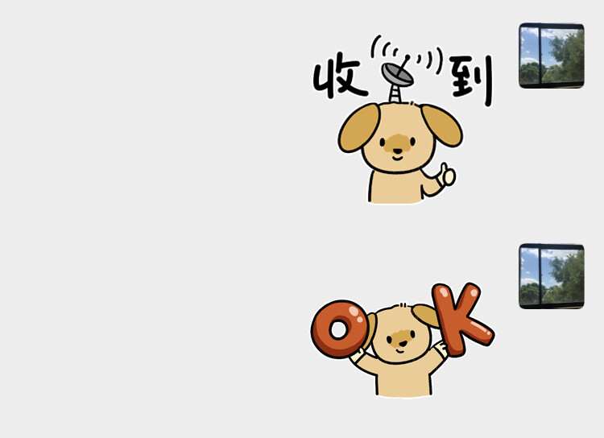
> 2025.01.07 更新： 这是从一命那里偷来的表情包！我想她了5555。

> 在无人的旷野独自行走太久，久到遗忘什么是被需要的感觉，久到觉得自我可能随时迷失，与旷野，与虚无融为一体。- 2.16

> 一面觉得难过，一面觉得好笑……但是在爱情面前我实在是硬气不起来呀，整个人都会虚脱，脆弱到事后怀疑这个人竟然是自己，这些话竟然是自己说的地步。- 2.16
>
> 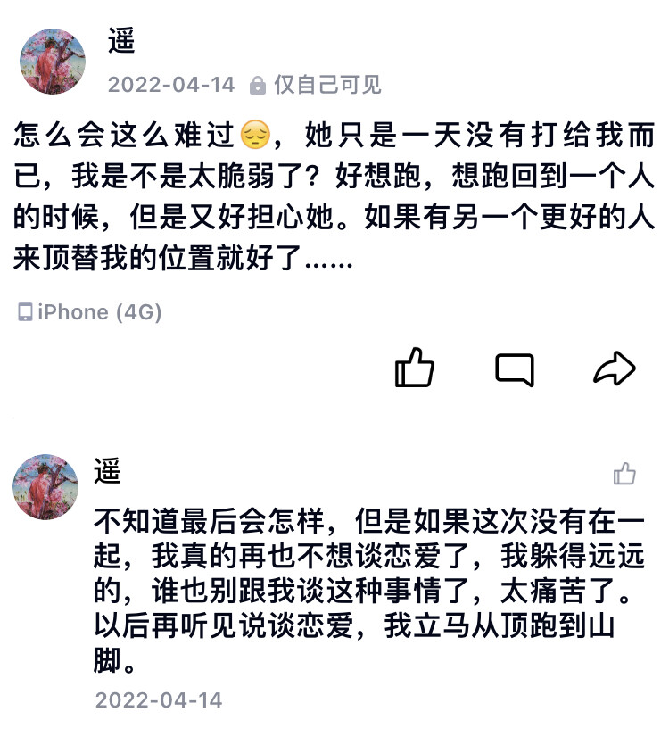

> 国内绝大多数对ChatGPT的批判就像在对着一个锤子批判它为什么不符合社会主义核心价值观。
>
> ChatGPT就是工具而已，对待工具的态度就是弄清楚它的适用范围和使用方法，非得扯一大通有的没的……一边在红着脸问锤子为什么不符合社会主义核心价值观，另一边则质问锤子为什么不能夹面吃…… - 2.15

> 周二下午谁没来/水仙斗活佛（都是同一群人）的作词功底和其余绝大多数乐队是完全不在一个同一个层次上的，甚至说隔了一个时代，属于是现代和后现代的差距也不过分······
>
> 只可惜这几位写歌只是“业余爱好”，演奏技术上实在不能说好······如果能把万能青年旅店或孤独的利里的技术分一半过来，他们可以是有史以来最好的中文乐队之一了。没有的话，大概只能屈居当我最喜欢的中文乐队之一了··· -2.14

> 好羡慕向友能看不剪的风雨云啊 - 2.14

> 很多问题我以为我已经忘记，或者不再关心，但当问题的答案要出现时，我的脑袋就会突然把这个问题弹出，告诉我这件事可能与我之前想的问题有关，然后我就很自然地顺着这个思路把以前想破脑袋也想不出的问题解决了。
>
> 比如读过的小说，有很多情节在当时读完全不理解，他为什么那样做？她为什么会有这样的想法？所有问题缠成一个线团怎么捋也不清，但在后来有了相关的经历后，一下就顿悟原来他/她当时的感受和心情是这样的。这种故事与生活相互感应交织的感觉真是奇妙且难以言说。- 2.14

> 太妙了，看はやぴ创作的日式克苏鲁怪物，卡了很久的一篇小说一下有了思路。
>
> 这个思路其实很简单：真正的恐怖，不再只是像LoveCraft说的那样来源于未知，那更多从属于上一个时代，是一切知识都处于爆发性发展时带来的反面效应。我们这个时代的恐怖也许已经不一样了，我们这个时代的恐怖，更多在于控制与压迫，臣服、异化与奴役。はやぴ的创作的怪物图很好地呈现了这个主题。- 2.12

> 吃粉丝的时候，总是太长不好夹，经常想是不是应该有一把剪刀，但是这么用剪刀有点奇怪？还想着也许有那种什么专门用来剪断粉丝的餐具，但今天看《四重奏》才发现，原来就是用剪刀来剪的呀。- 2.9

> 早上的阴雨天气让人感觉仿佛正在经历永劫的轮回。- 2.09

> 你好 好久沒问候過你啦，
>
> 我現在給你email了，
>
> 今天的天氣很好啊，
>
> 東京的天空也是藍的嗎，
>
> 杏花的季節快要來臨，
>
> 請代我轉達給她 我還好。
>
> —— 2.09

> OpenAI给自己的定位竟然是非盈利组织···这就是朝着改变世界来的啊···好好奇，好想提前看到他们给世界带来的变化···- 2.8

> 大学的课程里面其实一丝不苟学完且收获颇丰的只有史学理论、拉丁语和西方原著选读。
>
> 在史学理论上学习并重塑历史的认知和研究方法，深刻认识到历史不是历史事件的简单串联，探究历史并不是简单地探询真相，历史学可以是一门高深且复杂的技艺。
>
> 在第二门课上学习一门古语言，历史研究的基础技能，不必多说。
>
> 然后在最后一门课接触一手历史文本（在课上老师选的是《大宪章》），学习历史学的“解剖”手法并进行实践——从它的由来与演变开始（版本溯源），到它的历史背景，参与签订的各方人群；由某个词引出它背后的历史制度，由某个人引出各方势力的角逐，最后由一篇文本的最细微处慢慢引申出一个时代的全景图。
>
> 其实也不知道说这些有什么意义。想到两年前的拉丁语课上，刘老师说我不继续从事历史研究太可惜了，我也不知道该如何回话。如果非说可惜，不是可惜在我没有从事历史研究，而是可惜我知道在这片国度上，我所期望的那种历史研究，那种古希腊式的对纯粹知识的本质热爱根本不存在。与其从事那种研究，我宁愿赚够大概的钱后，早早退休自己把历史当作业余爱好来研究。
>
> 几个老师都常常说，做历史研究要沉得住心，坐得住冷板凳。哎，我倒是十分坐得住的，但整个房子都要烧起来了，怎么坐得下来呢？- 2.6

> 《死亡搁浅》真的是艺术品。比《艾尔登法环》还远远让我赞叹，毕竟无论如何，法环仍从属于游戏，仍属于通俗文化，而《死亡搁浅》已经是一种十分严肃且完整的表达，不输任何一部文学或电影巨作。不过最让我赞叹的还是，小岛秀夫竟然真的把这种游戏做出来了，真的有制作人愿意投钱，也真的有玩家愿意买单。这一切都证明，游戏作为相对较新的表达媒介，无论是在表达内容，还是表达形式或商业化上都已经完全成熟到能够媲美——甚至也许因为其交互性——在某种程度上超过了传统的文字和影像。
>
> 玩的时候其实在想，Sam这份工作真的好适合我……我也喜欢一个人……喜欢在这样的风景中徒步穿过森林高山湖泊……好想去……- 2.5

> 有时候我还是觉得挺神奇的，如果提笔要写的话竟然有这么多的事情可以写。生活本身，还有记忆，看上去它们好像可以无限延伸，犹如一条永恒流动的河流，每当我写出一些什么来，就只是从里面取了一瓢而已。- 2.5

> 明明从时间和空间上来说，生活本身是极其有限的，有些人终身被限制在一个房间，再大些一个城市，再大些一个国家，但最大也只是一个星球而已。但当我们从记忆中感受它，感受其带来的痕迹，我们却看不见，它的纹路蔓延开来后的终点。即使在当时一件非常微小的事，在经过记忆的拉长后，也被刻上永恒的烙印，在我们的脑海中经历永劫般无限的反刍。- 2.5

> 看见用用行化矩阵解线性方程组很容易就能配平化学方程式，而且理论上可以应用于所有化学方程式，顿时觉得当初花在配平化学方程式上的精力都白白浪费了。配平方程式明明这么简单……就和如果会方程，解决鸡兔同笼问题就特别简单一样……
>
> 我就不理解，为什么当初就不教呢？
>
> 想到当初被高中化学老师折磨的时光，老师人是真的很好，教也是真的教不明白……- 2.4

> 《狂飙》前面是真的好看，一度有当初看第一季《绝命毒师》的感觉……但到二十六集指导组出现后质量就开始断崖式滑坡，越看越不对劲，总感觉这一幕怎么和当初看《权力的游戏》这么像：关键人物莫名其妙死亡，智商超高的反派开始降智，一些前言不搭后语的对话开始出现……果然，看到最后一集烂尾了，又线性回归到了国内样板戏的答辩水平……- 2.3

### 1月
> 写了几遍德国汉堡大学，竟然一点也没察觉到哪里不对劲……（是洪堡大学啊喂！）- 1.31

> 看到网友对流浪地球计划的评价：闪现迁坟。
>
>笑死。- 1.31

> 我写的东西真的好混乱啊，像龙珠一样散布在手机备忘录、线上线下笔记本和各个word文档、还有许多我也搞不清楚的角落里，如果好好把这些收集起来，说不定能召唤神龙，凑出一篇自己满意的文章…… - 1.31

> 答应小侄女的数学寒假作业还没写，今天一问，好家伙，还有两天就开学了。于是时隔多年，又在开学前两天补起了寒假作业……
>
> （还好只是小学三年级而已）- 1.28

> 哈哈刚看了一集《重启人生》，对话真的太有笨蛋节奏的风格了
>
> 笑死，也不知道笨蛋节奏是什么脑回路，能在一份薯条上纠缠出一个人的人生来）
>
> 一本正经地说出“您会投胎为危地马拉的大食蚁兽”也太搞了） -1.25

> 3点睡，8点起，全靠打麻将醒了会神，一不打马上困得趴在桌上睡着）- 1.22

> 为了搞懂矩阵这个数据结构是做什么用的，学了一个多小时已经几年没怎么碰过的数学······- 1.21

> 年还没过，置办的年货（主要是零食）已经被我们仨小孩快吃完了。
>
> 炸的准备除夕夜吃的饺子，现在也在被我疯狂偷吃中）- 1.20

> 看见《重启人生》的编剧是笨蛋节奏就打算看了，我太喜欢他编和参演的《住住》了（也有可能是太喜欢二阶堂fumi）！那种无聊的有趣（或者说有趣的无聊）纯瞎叨叨的剧情真的太能戳到我了！
>
> 当初看《住住》的时候就在想，如果我也在就好了，我真的太适合这种地方了，我就喜欢在这些稀奇古怪，莫名其妙的事情上瞎叨叨，我能和他们仨瞎聊一晚上不带累的······
>
> 不过说起来挺奇怪，其实自己平时并不喜欢和人闲聊，无论是线下还是线上，我都很少和人闲聊。现在想来，大概其实不是不喜欢闲聊，内心其实有非常喜欢瞎叨叨的一部分，只是没有找到同步脱线的人，没能说出来而已。 - 1.20

> 笑死，被我妈拉去她常去的理发店把长发剪了。本来以为最多就是从“日系美男”变回“大街上一男的”，结果直接给我剪成了中年妇女……不愧是大妈云集的理发店，无论什么年龄什么性别，进来了咱都是中年妇女无所谓，今年这年不拜也罢。- 1.15

> 家里俩小孩都吃不了一点辣，以后怎么在湖南生存下来啊……- 1.15

> 这个月第二次参加葬礼。回来的路上听大伯说，光我们村就已经去世了十五六人，其中有四人还是在五十岁以下。- 1.13

> 如果我真的有天赋的话，请不吝啬再赐给我一点吧，我需要它，我有很多事情想要去完成。- 1.13

> 凌晨就隐隐约约听到远处葬礼的唢呐声。现在好像到处都在办葬礼，小县城里几乎每过段路就有一场举办中的葬礼。同亲戚的交谈中常常听到哪些哪些老人又去世的消息，我自己也前不久去参加了村里一位老人的葬礼。
>
> 死亡在以极快的速度蔓延。它出现的方式是如此寻常，葬礼谁没见过呢？可是又这么不寻常，如此多的葬礼如此密集地发生在如此狭窄的空间和时间里。- 1.12

> 二姑对我真的好好。大伯二伯都让我喝点酒，二姑知道我喝不了都拦着他们；还硬塞给我钱让我去剪头发（因为无意中提到过年各个理发店都涨价了）。
>
> 小时候我们这大年三十晚上有个习俗，类似圣诞节时的“trick or treat"? 小孩都会举着一个用红纸包裹着的白萝卜走街串巷，向大人要糖果或者几毛钱的零钱。那时候我每次举着萝卜去二姑家，二姑都会直接给我一张“大钞”——五块钱，让小伙伴都羡慕得不得了。
>
> 同样的，我爸对我一个大哥哥（大伯的长子）不知道为什么也特别好，甚至好到被这个哥哥骗了很多钱后失联也不埋怨——当然，我妈是埋怨我爸埋怨了很久。（后来我爸葬礼上，与家里人常年失联，过年不回家，也不打电话回来，自己的儿子也不抚养的大哥哥来到我爸葬礼上，沉沉地磕了几个响头）
>
> 我以前其实不太明白为什么。不明白我二姑怎么对我这么好，也不明白我爸怎么对这个大哥哥这么好，直到我也亲眼看着我的小侄子、小侄女，从一个小不点长成已经能够天天欺负我（不是）的小男孩、小女孩，我才明白一下明白那种感情。
>
> 那是因为我曾经也是那样在二姑的照看下长大的，大哥哥也是在我爸的照看下长大的。那是一种类似于对自己孩子但又不同（也许更加纯粹）的爱——对自己的孩子你会抱有期望，抱有一种责任感，会担心他的未来，但是对哥哥姐姐的孩子不会，于是对他们反而能够更放心地去爱，那种爱反而更像是一种无条件的爱。
>
> 也不知道说明白没有，但是如果有一个非常可爱的侄子侄女的象友应该很容易就能明白我的意思？- 1.11

> 虽然但是，直接上4070Ti是不是太过分了······但是已经在路上了······记住，我是为了督促自己好好学习））- 1.10

> 在犹豫要不要剪掉长发···虽然剪了长发就要从“日系美男”变成“街上一男的”，但是不剪，我的头发又特别容易油，每过两天就必须得洗，洗头、吹头也得很久···
>
> 来来去去得额外耗费好多时间和精力，像我这么高效利用时间（指懒散）的人，实在接受不了。以前肯留完全是因为确实好看，主要是喜欢的女生也觉得好看，但现在好像就没什么必要了。
>
> 所以大概最后还是会回归比较舒服的短发（其实也不短，只是相对来说），算是用颜值来换舒适度了x··· - 1.09

> 之前象友送的一箩筐书，一两个月了，一本还没看；送的小饼干，瞬间就吃完了……- 1.09

> 有时候我必须得竭尽全力来面对这件事：即使在梦中——或者在超现实的现实中，当我遇见我爸，也已经会觉得陌生，无论是我对他，还是他对我。
>
> 过去的我大概很难理解，一个最疼最爱他的人，他的父亲，最后会和他变得如此陌生，仿佛只是大洋彼岸出生并死去的某个未曾谋面的人。
>
>他大概会非常激动地要我解释，我怎么变得如此冷漠？连自己的父亲也漠不关心？！我只能十分窘迫地向他道歉，也无法给他一个合理的解释。
>
> 也许我只是说，在漫长得几乎亘古不变的荒野里，我已经独自前行了如此之久。荒野是如此荒芜，除了我自己什么也没有，如此为了继续走下去——尽管我已经不知道为什么——我只能食自己的心脏，一瓣一瓣，先吃掉左心房，然后是右心室，直到里面空空如也，我终于确信，即使在这片荒无人烟的原野，我也能独自前行。
>
> 事情就是如此变成了现在这幅模样。好消息是，我还在继续走下去；坏消息是，我已经没有心了。这大概就是，即使是父亲，也无法辨认出我的原因吧。- 01.08

> 她曾说，我们的相遇并不是那种命中注定式的一见钟情，只是两只跃出海面的鲸鱼对彼此的匆匆一瞥。在只是远远，仿佛用尽余生的一眼后，我们就各自潜回自己阴沉沉的、深不见底的海域。
>
> 我们无法想象那样的生活——在一片温暖明亮的海域里，在恰到好处的阳光下，我们拖动着自己沉重的鱼鳍，笨拙地尝试贴合在一起，像要跳一支探戈一样，在海底自在地游弋；等时候到了，我们就共同跃出海面，呼吸新鲜空气。- 01.08

> 看许鞍华反省拍摄《黄金时代》时的问题（主要是谈到和主要演员汤唯互动的问题），还挺感慨的。一方面看到许导反思的诚恳，另一方面也是看到汤唯这个演员本身的诚恳。只是确实很可惜，明明是很好的导演，也是很好的演员，最后却没能有一个好结果。
>
>导演和演员之间的互动，可能比想象中还要复杂得多得多。不同导演下的汤唯都是汤唯，她本身那种压抑不住的灵性盖过了剧本给的人物。剧本对于她只是一种“cosplay”，只是从不同的角度阐述她的“灵性”。朴赞郁特别理解这一点，所以才能在《分手的决心》里给出“宋瑞莱”这么一个，至少在我个人观影史里留下深深印象的角色。- 01.05

> 图书馆联盟的验证码图片好像都是猫咪（什么猫奴联盟x）- 01.05

> 前两天屁股上长了个泡，一做就疼；今天扫地，扭到了腰，只能趴着。去年除了新冠无病无灾一整年，而今年才开始三天就……这是什么本命年，怕不是绝命年……- 1.02

## 2022

### 12月

> 和Pulp同时期喜欢的乐队（Oasis、Blur、Radiohead、The Stone Rose等等）都没那么喜欢了，只有对Pulp的爱经久弥深。越听就越能听出Jarvis的特别。- 12.31

> 去大伯家吃饭，大伯说我们这（湖南南部小县城）的公务员几个月没发工资了，老师的工资也发不出。- 12.28

> 看一篇解包《艾尔登法环》中的AI设计的文章，看到自己以前打的BOSS变成一串代码摆在面前，有着很特别的奇妙感觉。- 12.27

> 看了两集《想见你》，有点看不下去。忍不住和最近看完的《正常人》比较，比较完就明白过来了，我就是不太能喜欢那种看上去如此“正常”的爱情故事······
>
> 以我的个人喜好，一个爱情故事，如果它的基调，或者说底色不基于一种复杂的、无法轻易言说的痛苦，爱情的走向不是幽怨、曲折、山重水复疑无路的，相爱的人之间没有一堵比生死还要难以跨越的沟壑竖立在两人之间的，我都无法那么喜欢······
>
> 《想见你》给我的感觉就是，它太“正常”了，它太“正常”了，它太“正常”了，以至于我无法喜欢它。- 12.26

> 本来想和老家这群老鼠平安相处，井水不犯河水的，毕竟说不好它们在这栋房子里住的比我还久……但是！这群老鼠！它们居然！跑我床上！拉屎！我之前一直睡在二楼没发现，今天下楼一打开床铺，好多老鼠屎！
>
> 不是，你们住我家就算了，偶尔偷吃我家米和菜我也当作没看见，居然还睡我的大床……还在上面拉屎……真以为房产证上写的是你们这群家伙的名字吗！忍不了了，你们这群不讲卫生的老鼠都给我滚！再不滚过几天就请你们吃老鼠药！
>
> （说到这突然想到附近的流浪猫……如果懂猫语就好了，我就可以雇佣它们帮忙清理，这样刚好还可以顺便提供给它们吃的和一个取暖的地方…可惜我不懂，它们也一看到人就跑得远远的…- 12.26 

> 给小侄女玩动森，名义上是给她玩，实则让她给我打工赚钱，她开心我也开心
>
> 不得不承认小学三年级的小侄女玩动森玩得要比我好……我更适合玩环世界…… 
> 
> 一天给我赚了10w，这童工效率真高（不是）- 12.25

> 哈哈昨天吃了一包小儿柴胡，今天就已经好了！！我大概得的不是新冠，只是普通流感？但是又很难解释，我家人都得的是新冠，而我是流感…所以大概是身体免疫力好？——或者更有可能是猫咪保佑（？）- 12.25

> 好像阳了，难受了一天，干咳、头晕、手脚酸痛。但是中午，从床上竭尽全力爬起来去厨房煮饭的时候，意外听到了小猫的叫声。
>
> 之前天气骤冷，我在门口放的鱼干和肉都没猫来取，我以为它们都遭遇了不测……很是伤心了一会儿……今天听到猫咪叫声赶紧跑到阳台去，拍下一张非常模糊但是确实代表着它们还活着的照片！ - 12.24
>
> 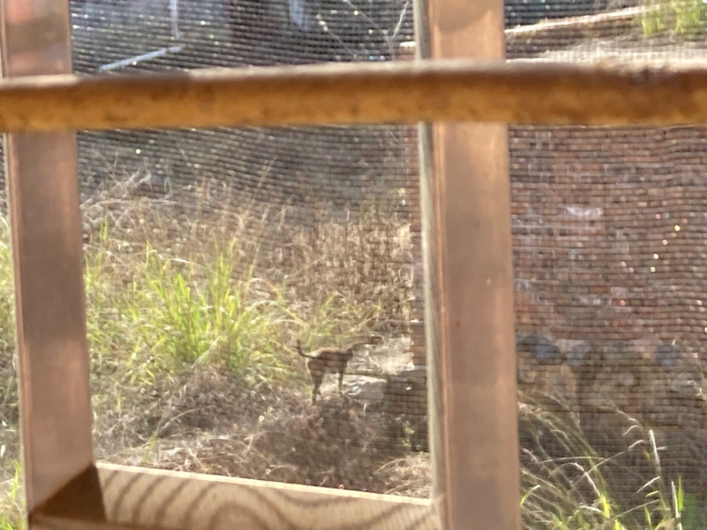

> 在chatGPT的手把手教学下，一上午弄懂了怎么写打地鼠的代码…感觉没有chat的话得我一个人得拖拖拉拉地瞎倒腾好几天，最后还有很多细节搞不懂…
>
> 有chat的话真的就哪不懂就问哪，一直追到最细节的问题和概念上，反正它也不会觉得你问的问题弱智或者觉得不耐烦，而且它还一天二十四小时不停歇！想什么时候问就什么时候问！
>
> 最重要的——相对于搜索引擎或者问人来说，它能够迅速理解你的问题，这样能够在产生疑惑时就迅速得到解答，从而产生很好的正反馈，让人想要不停继续学下去。
>
> 以前用搜索引擎来找一个问题的解答，就经常找不到满意的结果，或者找到以后又产生新的问题，然后又去问……这中间又要让搜索引擎理解你的问题，又要耗费大量时间和精力来找答案，期间产生的间隔和耗费的精力就让我很难长时间地学下去，经常就“西八！怎么又报错了！不学了，让我休息会……”
>
> 有了chat后就是：报错-复制给chat-chat给出可能原因-弄懂解决方案-排错……一套流程就很自然，根本不会产生那种厌倦和不耐烦的心理，一直都在全身心专注于发现问题-弄懂解决方案-解决问题上。
>
> 总结：chatGPT用来自学CS真的简直不要太好使……12.20

> 一个最有感触的事是：之前学大概学1-2个小时就很疲惫很累了，而且怎么说，觉得自己好像也没学到什么。
>
> 现在用chatGPT可以很轻松地学3-4个小时，而且完全不累，觉得自己学到了很多。- 12.20

> 所以学习时长大概跟所谓意志也没多大关系，主要是看是否有合理的学习方法让自己形成足够良好的正反馈？- 12.20

> 老实说，吵架这种事情，除非对方付费让我参加，否则我是绝对没有兴趣的……
>
> 更主要是因为一旦发展成吵架，就基本意味着沟通已经失效了。失效了的沟通再继续下去，无异于哑巴在对着空气说话……- 12.19

> 吃完早餐上顶楼来晒太阳，看昨天没看完的书。懒人沙发再配上我的气垫，往洒满阳光的地板上一铺，躺在上面好舒服～ - 12.15

> 以前读过布莱希特几首诗，当时只是觉得他写得很精彩，很切合现在我们的状况。现在读他的诗集，才真正完全感受到他那澎湃的激情和生命力，那种愤怒与磅礴，他既是“我们织！我们织！”的海涅，也是“噢，船长，我的船长”的惠特曼，他写诗的方式和姿态都真的让我十分印象深刻，让我明白原来诗还可以这么些，而且写得这么好。 - 12.14

> 笑死，打开ChatGPT的第一个问题就是问它能不能跟我跑场团x

>不过说真的，感觉如果给ChatGPT喂足够的语料（各个经典模组，而且如果想玩古代背景的模组，可以喂大量明清小说…），那它理论上来说应该是能做到比绝大多数GM都做得好的。而且如果联网，ChatGPT能够随时调用各种影音资源，根据对应的关键词迅速生成画面和音效，这跑团体验会很精彩。
>
> 未来ChatGPT商用后，再“简单”地进行下魔改，肯定很好玩！！（对不起我只想到玩x）
>
> 哈哈哈我就知道肯定有人往这方面想，还就真有类似的游戏——一个叫《AI地牢》的19年的游戏，有点像TRPG中的DND。

> 它用的是更早的OpenAI的GPT-2和供电GPT-3文本生成算法。如果未来能够用上更完善的GPT-3.5(也就是ChatGPT)和GPT-4，似乎真的很有可能实现我说的那些功能（事实上我看到21年的新闻说《AI地牢》的开发者正在开发相关功能中······）！ - 12.12

> 感觉要弄懂ChatGPT的工作原理，还得恶补一下语言学知识。像自己之前用COCA也是，我不太明白是如何通过大量的语料、词语之间的搭配频率等等关系来理解具体的句子意思的？ 
>
>是我的错觉吗？感觉chatGPT在谈到programing问题时会明显更积极？问其它问题时它就按部就班，有啥信息给啥信息；问到programing问题时语气就瞬间变热情了- 12.12

> 对着ChatGPT和OpenAI一顿猛夸，然后它非常客气地感谢我，然后说他们对未来的期望。有一点点期待他们所能实现的那个未来。- 12.12

> 每天得到听见窗外小鸟开始叫了我才略有睡意。- 12.09

> 好想看《台湾男子叶石涛》……叶石涛和张爱玲在一个方面挺像的，都是在母语写作到了一个极其成熟的地步后，又不得不以另外一种语言来从事写作。
>
> 但叶石涛更特别些。如果说张爱玲更像我们现在所说的“母语的流亡”，叶石涛的情况更奇怪，因为他生于日治时代，最初他写作上的“母语”实际上是日语，虽然他和家人们讲的是客家话（还是什么话忘了）。后来台湾收复，官方不再允许以日语写作，于是叶石涛又不得不重新用白话文来写作。
>
> 他像是从来没有过自己的“母语”，只有被官方赋予的“某种语言”。在电影中念旁白的那位演员（似乎是庄益增？）也意识到了这一点，他做出一个很特别的抉择，某种意义上也是代表着一直以来居住在这座岛上的“土著”的心声：他选择用台湾话（具体是什么方言我也不清楚）来念所有本来是日语或国语的书信。
>
> 这大概容易被一些大陆人当作某种所谓台独，但在我看来这其实只是岛人自己尝试去做出的，一种对自我真正的独立与解放而已，只是以政治或地域的方式去看待也未免太狭隘，太小看了其中的含义。- 12.09

>宋徽宗、宋钦宗二人弄得汴京城内民不聊生，金兵——主要是溃散后的官兵几次入城烧杀劫掠，朝廷还不停搜刮百姓来支付赔款。即使这样，官方史书里还能脸不红，心不跳地写“百姓哭着喊着不让钦宗离开，甚至用手拉着轿子导致被砍掉几根手指”、“百姓自发筹款赎买钦宗”。
>
> 和如今官方宣传中的“疫情史”可以说得上是一脉相承、历史悠久了。- 12.05

> 看到金太宗废黜宋钦宗的《废国取降诏》，脑海里突然冒出了“境外势力废黜本朝皇帝”这样一句没头没脑的话x - 12.05

> 看书看到天亮，睡觉睡到天黑。
>
>（嗯不过其实也就是从早上七点半睡到下午五点半，睡了十个小时而已） 12.05

> 《汴京之围》里提到的一个有意思的对比：宋徽宗花费全国人力、物力，不惜引起起义也要从各地运来奇石异木，建成他的艮岳。而在汴京之围中，艮岳中的奇石被当作投石机的炮弹投了出去，而异木则因为冬天太冷都被砍去当了柴薪。
>
> 艮岳建成于宣和四年（1122），而汴京之围发生于靖康二年（1127），前后不过才几年。12.05

> 在尝试把以前写成的碎片，拼成一篇尽量完整的故事。- 12.04

> 向我幼儿园的小侄子撒娇要吃一口他的汉堡，得到一小块面包皮、一小片生菜、一粒芝麻。
>
> 气得强吃三大口！（其实是小侄子禁不住我烦 说他不喜欢吃番茄酱 让我帮忙吃掉 然后我就炫了三大口 - 12.04

> 有些代价其实可以轻易地躲开，但我还是要固执地选择承受。因为留下疤更容易让人记住这份痛苦，记住是谁带来的，记住它的结果会是怎样。每一天起来，看看这道疤，一切的一切都了然于心。- 12.03

> 平时不会觉得，但是在冷天吃得饱饱就有种幸福的感觉。- 12.02

> 有只小老鼠藏在我房间的衣柜下面，总是想跑但又因为我就在附近跑不了。每次它探头出来，先看我有没有注意到它，没有它就蹑手蹑脚（一步一挪的小动作有点小可爱x）地想要跑出房间，我就用余光看着它，只要我弄出一点声响或者只是调头看向它那边，它就马上很灵敏地又躲回衣柜下面去。就这样来来回回僵持了得有一个多小时，发现自己大概是有一点点过分了？虽然我是知道自己在跟它玩，不会抓它，但是它大概害怕得要死吧···下次就假装看不见放它离开了，不过它不会恩将仇报，下楼去偷吃我的米吧··· 
>
>它胆子太小了···只要有一点小声音，或者小动作就缩回去了，弄得我还得屏气敛息，不敢随便动···- 12.01

### 11月

> 被雨滴敲窗户的声音吵醒了，一看窗外居然下冰雹了……前天我还在穿短袖出去散步……我还是担心家附近的两只野猫……在这种环境下它们怎么过啊 - 11.30

> 插播一条日常：打开冰箱，有虾仁和番茄，没看食谱也没看视频，不管三七二十一凭感觉一顿煮了。（唯一的理论依据是：它俩色系差不多，应该能一起煮吧） - 11.28

> 看到一个哭笑不得的视频：
>
> 杭州九堡客运中心路段，有一个超过百人的队伍走着，不说话也没举牌，身后几个警察和交警全程跟随。
>
> 以为是游行抗议要求解封的队伍，结果实际上是一支烂尾楼维权的队伍。
>
> 等到越来越多的不公出现，越来越多维权的队伍出现，迟早各个队伍会在某个路口相遇，汇聚成一支更大的队伍吧。
>
> 11.28

> 火点起来仅仅是因为被煽动么？我们都知道至少需要氧气，和大量堆积已久的柴薪。没有这二者，火是如何煽动也烧不起来的。一听说煽动便只看得见煽动，看不见那里我们每个人呼吸着的氧气，看不见那堆积了数年，乃至数十年的柴薪。
>
> 火焰啊，继续烧吧！你是这片寒冷土地上衣衫褴褛、饥寒交迫的子民们唯一能够依靠的温暖了！继续烧吧，烧得更猛烈些！看看我们这堆积如山的柴薪能够给这个世界带来多久的光亮和温暖。而当火焰熄灭，愿新世界能如愿从你们布满棍棒伤痕的尸体中——在你们的余烬中得以诞生。
>
> 11.28

> 觉得好笑，当初看《觉醒时代》看得心潮澎湃发朋友圈、恨不得默读背诵新青年标准的人，现在要Ta当新青年的时候到了，就开始装聋作哑，当作无事发生。这也就罢了，人想当旧青年也不是罪，但是过分的是这些人还想当伥鬼。
>
> 可用您的脑子好好想想，新青年是在街头、校园游行抗议的那群人，还是您这在网上咬牙切齿说“有境外势力”的人？您是没看过《觉醒时代》么？当初只是纯粹想凑个热闹？好吧，您没看过《觉醒时代》，那鲁迅先生的《纪念刘和珍君》总该读过？
>
> “但段政府就有令，说她们是“暴徒”！”
>
> “但接着就有流言，说她们是受人利用的。”
>
> 您要不看看您做的事情是属于新青年，还是以上说的“段政府”和“流言”？非常抱歉，仅以我非常个人的意见来看，您还是就别自称新青年比较好，实在谈不上。要说起来，您和走狗倒是可能沾点边。
>
> 11.28

> 所谓保持理智与冷静，其实只是想掩藏自己的懦弱无能。这些人一想到要与那巨大无比的兽搏斗，就害怕得缩成一团，每根汗毛都在颤抖，只能恐惧着战栗说“不要…冲动…不要…被利用…”这些话听起来不像狗吠么？
>
> 这群人早已从心底放弃人性，把自己驯化成一条只信任主子，只在主子面前温顺乖巧，反而向同胞恶语狂吠的走狗。
>
> 有朝一日，愤怒的河流一旦激荡起来，当死去的亡灵行于水上，这群人则将被埋葬于河底，作为伥鬼永世不得超生。
>
> 11.27

> 看完哈萨克斯坦让年轻人去参加选举的视频，内心无限愤怒。我们究竟还有多少东西被这样夺走了？ - 11.25

> 老实说，我真不想愤怒地指责谁。那不是我的方式，指责别人这件事对我自己也会造成伤害，即使那看起来可能是十分合理的职责，也会让我自己也觉得不适。但没有办法，有时候就是不得不以愤怒的态度来让对方知道事情的严重性。- 11.23

> 相比把一件事情说清楚它有多么好，让人们自发去追求它，更有效率的方式实际上是宣扬它的反面有多么让人不齿。
>
>（大概是因为人实际上很容易丧失掉追求美好事物的能力和精力，但廉耻心却能够以各种方式，即使是以扭曲的方式而存在。）- 11.23

> 我基本绝大多数事情都挺宽容，都会尝试去理解即使是我非常反对的一方，但恐跨这事真没什么好谈的，也没什么地方可以宽容和理解。
>
>以所谓安全的名义对trans的歧视、排斥与合理权益的掠夺，和男性一直以来对女性所做的，有什么本质上的不同么？我能够理解在如今环境下女性对于自身安全的极度恐慌，要求安全是非常合理的诉求，但如果这诉求建立在对他人的掠夺上，还能谈得上任何合理么？
>
>男性不就是靠着各种对女性合理权益的掠夺才获得如今“安全”的地位么？男性要是不掠夺女性也内心觉得不安全着呢，你想变得和他们一样是么？而且相信我，你只能找到安全这个理由，而男性为掠夺女性可找了上千年的理由了，那理由可比你的“充分”、‘’合理”多了。如果你真能觉得自己恐跨能是正确的，那你最好别对男性为合理化自身对女性权益掠夺的各种方式有所怨言。- 11.22

> 爱一个人但不被回应，这实际上是非常正常的事情，从概率上来说，也是极其可能发生并且普遍发生的事情，但是轮到自己就是无论如何都很难接受。有时候甚至就是无法接受。
>
>我更愿意接受1+1可能不等于2、光的速度不是恒定值、我思我也不一定存在，也不愿意接受我爱的人不爱我——但现实就是，不爱。我不愿意接受的现实（我们都知道这现实有多糟糕，有多么让人难以接受）许多许多，但这件仍然是让我最难挨的。
>
> 我问自己，无法得到所爱之人回应的生活还有任何继续的意义么？但我同时又清楚地意识到，有如此多的人渴望但又从未得到哪怕甚至一点点爱——这难道是说，即使是哪怕不存在任何爱的生活仍然是能够以某种方式继续下去的？我难道是在像那首老歌The End of the World里那样，在傻傻地问着"How life goes on the way it does"？我不是！
>
> 好吧，也许我是，但我知道，即使你拿出十吨的道理来说服我，来告诉我的伤心是多么过激和不理智，我仍然无法信服。我更请愿让我的心暂时被破开来，这样兴许还能呼吸些新鲜空气，把坏死的血放出来。
>
> ·······
>
> 大概再没有一首歌能够像Morrissey的Seasick, yet Still Docked那样，切肤之痛般唱出那种感受。

> I am a poor, freezing-cold soul
>
> So far from where I intended to go
>
> Scavenging through life's very constant lulls
>
> So far from where I'm determined to go

> Wish I knew the way to reach the one I love
>
> There is no way..."
>
> 听着它一遍又一遍，在那个暂时代替我心脏在泵血的loop里，如呼吸般吐出这些没有任何爱意的文字，并且不期待得到任何回应。- 11.19

> 难受…辛辛苦苦炒了两个菜结果好像因为感冒没什么胃口。吃的时候才感觉到……- 11.17

> 煮了两个菜，一个紫菜蛋花汤（成功），一个醋溜土豆丝（略失败）。煮好准备开饭时发现电饭煲忘记插电了，一边吃一边等，结果吃了两口饱了，于是又把电饭煲给拔了……- 11.17

> 小小做了下功课，好像欧式快热炉是在没有集中供暖的情况下性价比最高的取暖器？只是相对空调而言比较耗电（不过其实基本任何一种取暖器的耗电量都差不过，都是空调的三到四倍）。
>
> 还学会一个反直觉但似乎特别有效也经济的取暖方式，开空调，然后开电风扇往房顶吹。这样冷热空气对流，加热更快捷也更均匀，更重要的是也更省电——但有个问题是得面对父母的质疑，而且也不便携（显然空调不能拆下来搬到其它房间去x）。
>
> 综上最后还是选了快热炉，快热炉可以搬来搬去，防水，相对也不那么重（4.5kg），洗澡的时候可以搬到浴室用，也算是补充点运动量了。 - 11.16

> 只睡了三个小时，看了会新闻又困了，下到一楼的大床上补觉。希望不要一觉醒来后第三次世界大战爆发了。- 11.16

> 大早上被冻醒，起来洗了个澡。经过这次才知道防潮垫的重要性，不铺防潮垫打地铺那冷气是真就嗖嗖地从地上蹿上来啊。（当然睡床上是最好的） - 11.16

> 湖南的冬天真难挨，降温跟着下雨，又潮湿又阴冷。其它地方都还好，唯独脚，裹了一层羊毛袜，又套上羽绒鞋，冷气还是凉飕飕地从脚跟往上蹿。
>
> 南方冬天那种让人倦怠的阴冷，那不只是温度和湿度的问题，那种阴冷和生命或存在本身的欠缺有关。那种阴冷并不只是因为冷才让人难受，更多是因为它把存在中的虚无与冷冽毫不留情地通通带出，以最直观的方式让你感受到。-  11.15

> The Strokes的两张新专，基本首首都喜欢到不行！ - 11.13

> > 一个礼拜没见着小猫还担心出什么事了（因为前几天下了雨，天气突然骤冷），今天看见它躺在荒地上晒太阳，松了口气。- 11.12

> 只是尝试帮助身边一两位朋友已经让我有些精疲力竭，很难想象耶稣和佛陀、诸多先贤是有怎样的信念和龙象之力来救世人于水火之中。- 11.10

>有点想念去年今天的那场大雪。来得像一场梦一样的那场大雪。那时呼出的热气，鞋底与雪地接触发出的窸窣声响，映照在湖面上的微弱月光，远远图书馆里亮起的灯火。在那个沿着秋水湖独自漫步的雪夜，在来来去去都只有我的脚印的那条雪径，这儿曾发生的一切的一切都让人想念。- 11.07

> 上个厕所出来发现猫咪又遛进来了--这次倒没有像上次一样一个箭步蹿出去，而是像在自家院子散步一样慢悠悠地迈着小碎步走了。- 11.02

> 今天以为终于把漏水的水管修好了，结果堵住后一楼直接停水了······所以堵住的那根竟然是主水管？老家水管网路设计究竟是什么思路啊，先上顶楼再从上往下供水？
>
> 不想再修水管了···明天请专人来修好了··· - 11.02

### 9月-10月
> 领居家的鸡一直在琢泡沫，希望它们是在玩，不是吃进去了……有点担心它们会暴毙……-

> 拿出来放桌子上解冻的肉……不见了……又是哪只野猫趁我不注意叼走了……是真不把自己当外猫是吧……- 10.31

> 用形色识别了一下院子的植物，才发现原来那棵树是桂花树……当初种的时候我爸和我说是桔子树……
>
>我还一直琢磨怎么从来没结过果，以前以为是被旁边长得比它高的树挡住了阳光，现在发现它根本不是桔子树……
>
> 至于为什么从来也没闻到过桂花香，大概是因为桂花花期我都在学校读书？明年应该就能闻到了。 - 10.31

> 好喜欢lindy hop和Charleston！！跳起来真的好快乐，只是对于我这样的zombie来说也太难了） - 10.30

> 学习编程的时候，可以联想平时使用的功能，它的代码应该是怎样的。比如说群发这个功能，就明显使用到了for循环。这样的联想能够促进自己的理解，也能提高学习热情。 - 10.30

> 在玩数独的时候也会想，怎样用代码把这个写出来--还真的尝试了一下，但我只能做到生成9X9的横竖不重复的数列-- - 10.30

> 期待了很久的《新奥特曼》，结果看了十几分钟看不下去了。没太理解长泽雅美出现时的那一段特写镜头，让我都莫名替长泽雅美觉得有些冒犯···是不是男性凝视暂且不说，主要是这段镜头毫无意义······我唯一能够想到这么做的原因是，这段镜头是导演为了表达自己对演员的爱慕。
>
> 但是这种表达真的有点油腻······姜文那种大大方方、古希腊式的赞美我还能接受，但庵野秀明这种则让我感觉像“中年秃顶男性在地铁偷拍女生裙底”······那种偷偷摸摸、猥琐下流的感觉真让我感觉很不舒服······ - 10.27

> 项飚在《全球“猎身”》里面的序写得好精彩，很多片段有都让我有醍醐灌顶的感觉。感兴趣的象友可以找来看看。- 10.27
>
> 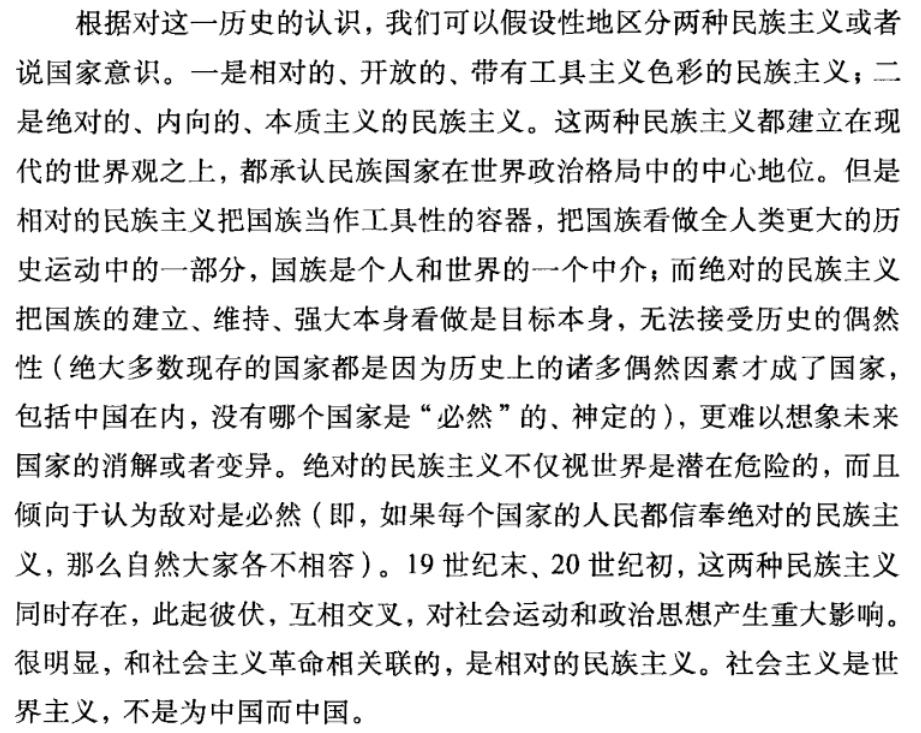

> 没有看视频教程，而是学了前面的课后自己琢磨着把乘法表的代码写了出来。虽然不是什么大不了的事，但是这是第一次完全独立，是靠自己琢磨，举一反三写出来的代码！开心~~ 
>
> 琢磨了一下怎么输出数据（这次也没看教程！），然后乘法表完全体出来了！- 10.22

> 我和伊坂幸太郎好像不是特别对付，看他小说改编的电影觉得无聊，看了他的书以后觉得更无聊）
>
> 当初看完《金色梦乡》甚至有一点点被气到。- 10.22

> 一件牛仔裤好久没穿，拿出来穿发现屁股口袋有东西，以为是忘记拿出来的钱呢，结果是口罩。晦气。- 10.21

> 哈哈哈哈哈第一次看到用“能当中老年人头像”来形容花开得好，戳到我笑点了。- 10.21

> 国内（应该是普遍性的，只是国内太明目张胆了）男性对女性的认识潜意识里就设置了一个“疯”的选项，但凡女性有一点什么“失常”行为，男性就很容易达成“这个女人疯了”的认识。男性不会考虑或体谅女性“失常”的原因，或者只是简单地做出任何安抚，而是在做出“疯了”的判定后剥夺女性的一切权利。（《风中有朵雨做的云》里面就有一段这样的情节，唐奕杰通过强行判定妻子是精神病患者来“正名”对妻子的殴打和软禁） - 10.21

> 今天起得老早（准确来说没睡），去嗦了碗久违的粉，到超市买了点菜，现在在床上准备睡了。
>
> 精瘦肉我记得上次买的时候好像还是17、18元左右，现在要22、23了···虽然上次买是在一两个月前，但是这涨幅也有点夸张了吧。- 10.21

> 挺奇怪的，按理说现在也不是清明节，气温也不是很高，怎么会到处都烧起山火来了呢…… 
>
>湖南山火真好严重，各个地方都在烧，从来没这么严重而且这么大范围地烧过，我还和朋友说是不是有人到处流窜纵火……- 10.21

> 今天才回想起来可以在学编程的时候弄一个错题集，没事看看，免得总是犯同样的错误。（今天就把elif和if的嵌套弄混了x）- 10.20

> 才发现四叠半又出新系列了！！但是这次汤浅政明没有参与导演······
>
>  也就是说：是考验我究竟是喜欢四叠半还是喜欢汤浅政明的时候了）
>
> 毫无疑问的是，我喜欢明石（x）- 10.19

> 发现我还真对方言有着朦胧的“情愫”，包括老北京话在内的各式方言，我都喜欢在电影里面或者什么地方听到、看到。但普通话则不知道为什么（兴许是因为我极其讨厌任何形式的规范），让我天然有些抵触。
>
> 在看电影的时候，讲方言会特别加分——当然，是像侯孝贤和杨德昌那样使用方言，而不是像某些电影里用东北或河南话作为笑点。
>
> 在侯孝贤、杨德昌的电影里，方言的存在是那么自然、那么亲切，那些方言的存在不是为了博人一笑，而是作为某种见证和某种唤起人深处记忆的“锚”。如果把那些对白全部替换成国语，而不是国语、闽南话、客家话交叉，杨德昌，特别是侯孝贤的电影带给人的感触会少去很大一部分。- 10.16

> 今天下午去后湖散步的时候，远远看到草地上两个人一人一把吉他在唱着什么，两人都笑得很灿烂，无论是朋友还是情侣都觉得他们俩的气氛真的好好呀 - 10.11

> 用了大概四五年后终于重新去配眼镜了，验光结果出来：瞎了（不是）- 10.09

>自己煮了顿夜宵，土豆粉+今天晚上没吃完的火锅食材，弄完洒上花椒油和香菜，真香。有时间、有闲心自己弄吃的真是组成幸福的一个重要部分——或者说其实算一个标志？ - 10.09

>  “ 孩子们梦见自己的小孩，
>
> 老人们想着自己的奶奶。” - 10.08

> THERMOS保温瓶的质量是真好，大一买的现在保温效果还特好——刚刚被开水烫到的嘴巴如是说。- 10.06

> 但我真的很想让人知道，让人感受和体会到，这些事情的美妙和它所能带给人的——如果你想对抗什么，那它会带给你力量；如果你想从繁杂中脱身，那么它带给你平静。至少我觉得那些是好事情，是对人有帮助的，值得我不停尽力去尝试，去做出准确的描述。这绝对是一件超出现在我所能的事情，但也是一件值得我去追求的事情。 - 10.06

> 其实最美好的事情我都没说，因为无论如何都无法很好地得到描述。无论怎么写都总是会让我担心，担心别人会低估我从这些事情中得到的平静与幸福。10.06

> 还挺享受小说人物自己“冒”出来的这种感觉。不是我构建的，此前我脑海里也从未有过这个形象和这段故事，但他自己突然“冒”了出来。- 10.06

> 娄烨这几年拍的电影，镜头都远远比故事本身要好看。《兰心大剧院》在影院看的大屏幕，实在太舒服了，根本没怎么在意故事是怎样的······ - 10.05

> 刚看到象友转的关于八十年代的学生会的事情，想到今天学校让填毕业工作调查，最后一个问题是对学校有什么建议，我写了一个：建立由学生自治的学生会。- 10.05

> 现在看电影，要么追着导演看（像最近），要么就追着演员看。之前就追着刘亚仁把他主演的电影看得都差不多了。刘亚仁的演技是真好，而且是无声无息的好，演谁就完全是谁，这其实比布拉德皮特演那些变态疯子的难度更高。- 10.05

> 最近很幸福的一段时光：看杨德昌，看完看朴赞郁，看完又看侯孝贤。
>
>各自最喜欢的一部大概是杨的《一一》、朴的《我要复仇》，侯还没看完，看完的也不怎么选得出来，觉得《悲情城市》《冬冬的假期》《恋恋风尘》《风柜来的人》都很好。- 10.03

> 想起以前去幼儿园接我小侄子，他总是问我“给我买的黑暗火花到了没”，我就说：黑暗火花现在正在一艘曲率飞船上，由奥特兄弟一路护送，从奥特曼的故乡——M78星云的光之国以超光速跨越多个次元宇宙来到我们家里，那是近兆亿光年的距离，路上不知道有多少怪兽想抢你的玩具，这比你叔叔接你回家的路要远上很多很多倍，要麻烦得多得多得多，你明白吗？他似懂非懂地点点头，然后问我：“可是，便利店里不就有吗？”
> 
>……
>
>“什么时候能到呢”“等你长大以后。”似懂非懂地点点头again，“是明天吗？” - 09.30

> 今天心情不太好，被小猫咪治愈了。以前遇到的猫猫不知是不是因为是野猫的缘故，一见到我就跑得远远的（还是我的缘故……），这次小猫猫一看见我就昂起头让我rua，rua完背挠脖子摸头一条龙服务，非常享受的样子。好舍不得啊，好不容易见到一只这么亲我的猫猫，但是总不能蹲那rua一晚上吧！虽然是很想）但是不能。09.29
> 
> 本来打算离开长沙了，因为小猫猫再待会！

> 一直以来都不是特别明白，为什么我总是不得不被花时间在我毫不关心，其自身也毫无意义的事情上？为什么？我有这么多的事情要做，我花十辈子都做不完的事情，为什么我还非得捏住鼻子，忍住自己的恶心来做这些？真的够了。09.29

> 每个人都可以以自己的方式反抗，但不能不反抗。你觉得能继续韬光养晦，但现在那已经是为虎作伥。09.29

> 所有以那种方式死去的人并非真正死去了，他们成为攀附在生者背后的幽魂，直到所有知晓的生者死去他们才真正死去了。- 09.28

> 每本书或者剧或者电影，让我无法忘怀的总是那些选择自我了结生命的人，我总是想知道他们的想法，想知道他们为什么做出这个选择，想在他们死去之前和他们好好聊一会天。
>
> 我真希望能在Shruti这么做之前，和她出去散会步，吃吃冰淇淋。我不会劝她别这么做，这是她的自由，我只是希望在她离开之前的最后一天能够开开心心的。
>
> 

> 故事总是写着写着往自己预想不到的地方走了，虽然没有预想到，但是却莫名很合理。
>
> 有时候有这种感觉，就好像故事中的人物在对我说，你怎么回事？我应该这么做才对！然后我就犹豫好久，担心听了她的话会失去对故事的掌控。最后想来想去，突然领悟到，这是她的故事——不是我的，无论如何应该听她怎么说。- 09.27

> 有时候想到自己学的都是哑巴英语还有点介怀，但是转念想到自己说得非常熟练的中文也没怎么张嘴就释怀了。哑巴可不就得学哑巴英语么。
>
>（当然，感谢雅思带来的医学奇迹，哑巴开始张嘴了x）- 09.27

> 好像每条路都走不到尽头，但是自己的生命一眼就能望到边。 - 09.26

> 在江边找了块（符合人体工程学的x）礁石，躺在上面一边晒太阳一边听流水拍打江岸。我有一点声音都很难睡着，但是在这就好困，感觉一睡可以睡一个世纪。
>
> （但是最后还是被游船打搅了美梦，发出噪音就算了，还激起潮水，我跑得快没被淋湿，但是我的人体工程学礁石被淋湿了……）- 09.26

> 感觉我玩塞尔达就没走过什么正经路，一直在爬山，一直在天上飞-- - 09.26

> 这几天是真有点沉迷涮火锅了x又好吃食材又不贵，还特别方便。刚好最近天气还转冷了，天时地利人和都凑齐了，很难不涮。09.26

> 其实希望过上的吉普赛那样居无定所的生活，但是还是总想着如果能有一个小房子放自己的书就好了。- 09.24

> 折中的选择：像某位作家一样，背上帐篷睡袋驻扎在图书馆附近，白天在图书馆看书写作，晚上回公园睡觉。 - 09.24

> 买了丸子、小白菜和米粉，自己切蒜剁辣椒调了酱料，用煮面的小锅吃了一顿美美的自助火锅。
>
> （唯一美中不足的就是，吃撒尿牛丸的时候没掌握好方向，“尿”给滋到屏幕上了x）09.23

> 适应黑暗的人会隐入黑暗的更深处，自己也成为黑暗的一部分。或者成为它的一部分养料，或者成为被黑暗消化后的粪便。09.23

> 简中互联网让人失去了对互联网的美好想象。- 09.23

> 有一个直觉：杨德昌一定读过塞林格而且很喜欢。 - 09.23

> “请收下我送给你的这一束刚刚绽放的、毫无扭捏之态的括号之花：（（（（））））。”09.22

> 我好像从来学不会好好地告别，所以那些人明明已经离去，我仍然还待在原地。Just Say it. 09.21

> 给出怎样的解答好像不重要，重要的是让人思考。迫使人不断思考，这样他才可能找寻到独属于他的路。 - 09.19

> 禅宗思想似乎从来没有确定的得救之道，只有一些原则和方法，他们崇尚的似乎是“怎样都行”。- 09.19

> 以前觉得他们不相信有鬼、有地狱天堂这种东西，可能是确实信奉科学，现在想来他们是害怕有报应。只要没有这种东西，他们做起事情来便肆无忌惮，也没有心理负担。毕竟如果他们做错了，即使非常明显的错误，活着的人们也没有任何有效的反制措施，只能祈求世界上有鬼，让坏人遭到报应。
>
> 兔子急了还能蹬鹰，但是人和独裁政体的国家机器相比，是蚂蚁和大象，怎么蹬也蹬不疼。更何况，我们这一代也许还是处于强力控制下比较软弱、无力、没有组织性的一代。因此才无奈到寄希望于通过虚无缥缈的鬼去完成所谓报应吧。
>
> 不过应该其实活着的人做到的事情吧，虽然可能很小，作用很有限，会很害怕，但总应该尝试着让事情往可能更好的方向走，总比寄希望于鬼好。 09.18

> 关于文革或同类事情，说只是“死了很多人”，实在显得太轻松了。读叶广苓《去年天气旧亭台》，就知道，那不仅仅是死而已，死甚至也许是这里面算轻松的部分。- 09.16

> 《月亮门》和《扶桑馆》两篇读得眼泪哗啦哗啦的。
>
> 几十年后唐先生故去，小丫头已经变成白发苍苍的老妪，先生死前叮嘱孩子把当年小丫头不懂事，从家里“偷”出去当掉的器物尽数归还给那个小丫头。当装裹一切童年记忆的那个包裹被打开，那一刻，怎么能不让人流泪呢，怎么能不让敬佩唐先生呢。
>
> 所谓有古人遗风，称赞的就是唐先生这样的人吧。- 09.15

> 玩塞尔达的感觉不仅是好玩，完全不仅仅是，能感觉到制作者对游戏的爱，对生活的爱，和对玩家的理解和尊重。
>
> 自由度高不仅仅是说一种游戏机制，也是一种态度。真的喜欢塞尔达，也好佩服任天堂，他们是真的热爱游戏，真的把游戏当成生命很重要的一部分。能玩这样的游戏，有点莫名感动。 - 09.15

> 嗯……今天的菜又做砸了，虽然有客观因素（煮菜用的是户外那种小炉子，煮饭用的宿舍用那种小锅）存在，但说到底还是因为我太随意，全凭感觉一顿煮……之前给小侄子侄女煮的时候还会认真看视频，算好时间和用量，自己一个人吃就彻底放飞自我了。09.14

> 考虑到当权者的权力没有得到有效的限制，而普通人几乎没有任何有效的反抗能力，可以想象，社会必然向这些当权者所希望的方向演进，也就是说，文革或类似的情况大概必然还会在这片土地上发生。
>
> 这大概无关某个人，而是一种专政体制演变的必然结果。 - 09.13

> 到底是年轻。无论处于怎样绝望的境地，心底总不由自主又生出一点希望。 - 09.13

> 动森和塞尔达治好了我艾尔登法环没能治好的电子阳痿，赞美任天堂 - 09.13

> 看叶广苓的《月亮门》这一篇，突然想明白，对于普通人觉得恐怖的文革可能对于一些当权者来说，反而是他们所希望的。这样他们的权力就不会再受任何限制，他们就终于可以不遮遮掩掩，彻底撕开脸皮，嘴里喊着那些光明正大的口号，就可以以光明正大的名义肆无忌惮地使用他们的权力。对于他们来说，文革是天堂。- 09.12

> 动森房贷两天还清了，如果现实生活中有这么快就好了）x - 09.12

> 友友送了一件好可爱的雨衣给我，回家马上试穿） - 09.12
>
> 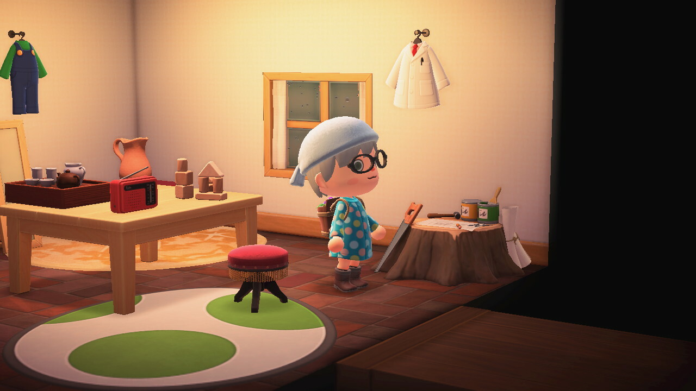

> 看完《月亮门》这一篇心情有点沉重。小丫头再乐观，再活泼，一谈到文革，那种从文字间溢出的天真马上就黯淡了下来。那种感觉就像人被活生生剥去了一层皮，要笑也变成了惨笑。 - 09.11

> 叶广苓好有那种老北京人的幽默，这种幽默在我天津的舍友那也常常能看见。
>
>我一个南方人也说不清楚这种幽默是怎样的，但是能感觉出和他们的语言大概有很大的关系。像比如说“您”这个字，在北京话和天津话里面就有种独特的氛围。
>
> 时常看见有说“英式幽默”、“美式幽默”之类的谈论，我在想这种幽默应该算是一种很典型的中式幽默吧？- 09.11

> 为什么大晚上的会有人独自在湘江里电鱼啊→_→ - 09.11
>
> 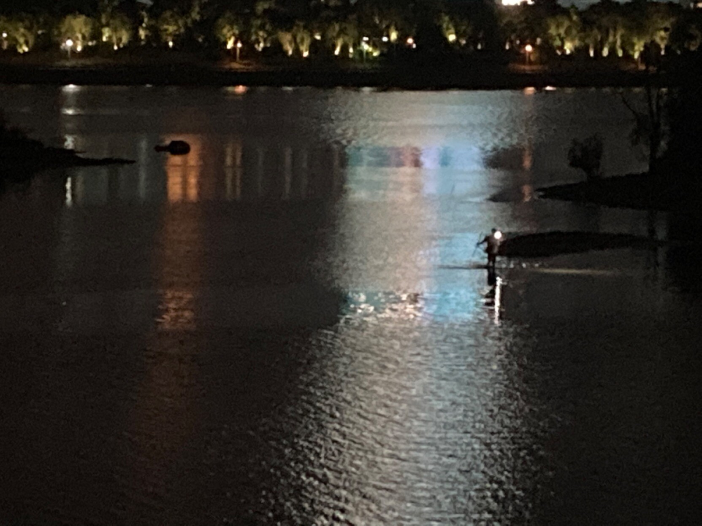

> 想起第一次听到户川纯，大概是高二高三的时候？在微博上看一个视频，一个看上去五六十岁的“老妪”穿着类似Lolita的服装，坐在轮椅上唱パンク蛹化の女，我完全被那种丝毫不加克制的豪放的生命力震撼到了。那一年听了很多首户川纯，那一年我的网易云年度歌手也是她。 - 09.10

> 还有一件事，初中向一个女孩表白是在中秋节。她的答复我现在都记得，那是一句，嗯，大概算是很有趣的回答？
>
> 她说：你希望我怎么回复？
>
> 我很是沉思了一会儿，因为我完全被搞得晕头转向。为什么答案不是接受或者拒绝，而是“你希望我怎么回复？”
>
> 那时候我还太年轻，多少有点像《蓝色大门》里的张士豪吧，对人生的曲折凄苦完全是一头雾水，一无所知。
>
> 在后来，已经是很后来，大一下学期的时候吧，女孩高考失利复读。具体谈话是怎样重新开始的已经忘了，我只记得我们说着说着，她突然同我说：
>
> 我现在开朗多了，每天和复读班的同学都相处得很开心。
>
> 然后我才突然意识到，原来初中的她是那样郁郁寡欢。那时候我以为是因为性情的缘故，她性格就是不爱说话，也不怎么合人群，现在才意识过来，她其实是不开心。
>
> 回过头来说，那个中秋节我是怎么回复她那个让我摸不着头脑的问题的呢？我是这样说的：
>
> 嗯……呃……当我女朋友什么的？
>
> 因为她的问题就很奇怪，所以我的表白最后竟然好像突然变成是在做贼或者怎么，很是心虚。
> 
> 最后我大概看见了她在屏幕那边叹着气摇摇头，她说：
>
> 那不行。
>
> 从这里开始才好像进入了表白的正常程序，我也开始很正常的难受。
>
> 现在回想起来，那个奇怪的问题实际上是在说：你其实根本都不了解我，为什么要那样说“喜欢”呢？你就是一个笨头笨脑的小男孩，什么都不明白，就那样傻傻地想要闯入别人疮痍满目的生活。
>
> 我确实是脑子很笨的，在这方面，现在也大概没好到哪里去。而且，好笑的是，表白那会子我还在和朋友打着DOTA2，本来就不多的脑子大部分用在了游戏上，那一小部分完全不足以理解这件事的复杂；我只知道喜欢就是喜欢，不喜欢就是不喜欢，而她拒绝我就是不喜欢我。
>
> 最后我心里一边难受一边又打了几把，坑得我朋友直喷我。 - 09.10

> 就是说长沙刚住了几天，已经安排好下个月去什么地方了...以后也想过这种住一两个月换一个地方住的生活，如果写小说能够cover费用的话就好了 - 09.05

> 于是，我想到，在许久许久前曾经有一个人对我说过“我爱你”。直到现在，这三个字仍缠绕在我的耳边，仍然以某种方式安慰着我。曾经，有一个人爱过我，这件事对于现在的我来说，是如此近似一个神迹啊。我就像那些被现实捶打，迷失信仰的教徒，在重新看见他们的神亲自为他们施展神迹后，又恢复到信仰中，且这次信仰愈加坚定不移。- 09.05

> 天哪，塞林格也太温柔了吧，The Long Debut of Lois Taggett这一篇，译得我心都要化了···- 09.05

> 好神奇，我正在想塞林格其实在某种程度上和约翰列侬有点像，然后耳机就随机到了列侬的Woman。
>
> 然后刚好这首歌又很符合我正在翻的塞林格这一篇男主的内心活动，就好神奇。 - 09.05

> 《1Q84》里青豆对踢男人睾丸的执着太好笑了，甚至还搬出了毛泽东的话来为踢男人睾丸的必要性做辩护··· - 09.04

> 在这个天气沿着江边跑步太舒服了 09.01

### 8月

> 做可乐鸡翅失败了，没有可乐的味道，但是又没完全失败，吃了三大碗饭。08.28

> gap year其实不一定是用来放松，也不是说为了所谓积蓄能量的，gap year就是暂时脱离人生被设定好的轨道，脱离“应当”、“必须”和“不这样做就会如何”；只有暂时离开这些，许多事情才会想清楚，也可以省去未来很多不必要的痛苦。- 08.27

> 要读张爱玲的散文才能知道她究竟是个多么有趣又有想法的人。- 08.26

> 潭底的雁影虽然转瞬即逝，也并非真实，其中却有某种永恒的深意与美在。- 08.24

> 看了极昼工作室关于杨槠策那篇报导，救命，杨槠策这人真的汇合简中所有爹味元素，这爹味熏得我都快睁不开眼了。每看他说一句话我都觉得我的眼睛和我的心灵受到了极大的污染······大家如果有看见这篇报导，建议是最好不要打开。08.22

> 凌晨在不开灯的房间听歌，也是一种极致的享受。
>
>（现在在听The Cure的Secrets，好好听！！） - 08.14

> 这几年观察的一个结果是，女性在接受新思想和以思想武装自己和组织共同力量反抗压迫时都更积极。这和图中说的女性在新兴宗教的发展与传播中更积极也许是一样的道理？
>
> 也许可以暂且这样粗浅地解释一下：被压迫的人和新兴的、非主流的思想总有天然的“合作”关系，而且女性更敏感、更能够共情，女性的情感表达和交流方式也更有效、更能够联结彼此。- 08.12
>
> 

> 一种社会认为弱势群体应该得到帮助，社会有责任和义务为其提供并完善适宜的生活环境，这也是整个社会全体成员的责任和义务，如果没有做到，有必要为之感到羞耻和愤怒。
>
> 而同时，另一种社会认为弱势群体就应该被统治，应该被代言——应该被牺牲，因为在统治者看来他们如此容易被统治、代言和牺牲。他们知道，这么做也不会有太多代价，因为鸡蛋撞在墙壁上，总是鸡蛋会碎的，墙壁自身只是沾了点鸡蛋的血迹而已。
>
> 但是我猜，当砸在墙壁上的鸡蛋越来越多，总有一天后来的鸡蛋们能够沿着蛋清、蛋黄组成的“血海”飘过墙壁，到那时墙壁也会被淹没，不复存在。
>
> 08.11

> 为什么一下这么多莫名其妙的事情呢
>
> 网易云音乐莫名其妙用不了流量
>
> 整个小区莫名其妙停电
>
> 高中的年级主任患病去世
>
> 通完宵回来还是没电 太热了睡也睡不着 睡着了估计也会被两个小屁孩吵醒
>
> 有一点点丧失耐心了
>
> 08.09

> 高中的年级主任患病去世了。直到现在才觉得好像高中确实是结束了，尽管实际上已经毕业快四年多。
>
> 记得高中有段时间迷上金庸，连着读了几本他的小说，期中考试考得一塌糊涂。当看到金庸去世的消息时，有种感觉，那段完全沉迷于金庸武侠世界的记忆，一下变得模糊不清。
>
> 现在那种感觉如此强烈。高中的记忆正在日益崩溃、瓦解，一切都会从现在开始消散，直到最后什么也不剩下。也许我应该尝试着把一些重要的事情写下来，从这场发生在记忆深处的火灾或地震中看看能抢救些什么出来吧。
>
> 08.09

> 至今看了刘亚仁电影+剧六部，他真的是演什么就是什么，这都不是演技好不好，演得像不像的问题，那种感觉真的就是他演什么就是什么......真的觉得神奇，他是怎么做到的......08.09

> 同样一件事情，如果当作工作去完成，我就烦得不行，如果是当作一次探险，我就会非常有兴致地去完成。- 08.06

> 南方人好像去东北过个年看看，想知道在厚厚的大雪中生活一段时间的感觉。
>
> 08.04

> “谢谢”和“谢谢你”听起来是完全不一样的，“谢谢”听起来就好像只是在走程序，加个你就亲切诚恳多了。
>
> 高中时有个女孩子就常常对我说“谢谢你”，而且会把“你”的尾音拉得很长，变成“谢谢你~”。在此之前，好像别人对我道谢都是说“谢谢”，我也只是点点头就过去了。但在她对我说“谢谢你~”的时候，我就会很开心。
>
> 在那之后，我对人表达感谢就和她一样了。说起来，现在有时候，“你~”的那个悠长的尾音还会在我脑海里回荡呢。
>
> 08.04

> 今天好事：帮老奶奶把两箱矿泉水用小推车从山脚推到了山顶。我一个年轻小伙子都推得大汗淋漓，双手酸痛，真想象不到一个满头白发、身子已经都有点佝偻的老人竟然要每天晚上推一趟上来。
>
> 在我看见之前，老人已经推了一段路程，一路上这么多人平静地看着一个老人，那么吃力那么艰难地推着上坡，却丝毫没有上前搭把手的意思。倒不是想批评谁，也不气愤，只是想到昨天的事情，觉得有点好笑。
>
> 08.03

> 我想如果人们非常认真面对他们的情感，这样每个人的爱情都可以写成一篇传世的小说。 - 08.03

> 看人们如此郑重地彼此相爱，我真地深受触动。 - 08.03

> 好像对于四五岁的小孩来说，什么东西都能变成玩具，什么地方都能成为游乐场。- 08.03

> 啊哈哈哈哈今晚遇到一只特别黏人的毛茸茸小狗，想一把抱回家。 - 08.02

> 不提是不是就代表着克服了呢？你我都知道绝对不是的，但没有人有勇气再去回望。这就是一道伤疤，你知道，我也知道，唯一不同的是，它是一道不会治愈的伤疤，不是因为每次我们回望就是撕扯着把这道疤又揭开，而是因为伤口太深，已经触及到我们存在的本质，甚至我们本身已经成为了它的一部分。
>
> 我们再也无法像往常那样，把它外化为任何一个需要解决的困难，因为它已经与我们的心脏共同跳动着。我们存在，我们呼吸，我们就要感受到它的存在，所有不堪、所有痛苦都每分每秒地像空气渗透在你的呼吸之中一样渗透在你的生命之中。
>
> 08.02

> 塞林格总是喜欢用一些非常俏皮、好玩的词，读原文一读就心领神会，但是翻译出来却很难。 - 08.02

### 6月-7月

> 我有这么多的事情没做，一定不能陷在漩涡里，深呼吸，放轻松，这只是漫长人生中一个睡不着的夜晚，已经不是第一个，也最不会是最后一个，所以放轻松，深呼吸。
>
> 一定有更重要的事情在等着我去做，我没有太多时间可以花在和自己纠缠上，我必须继续前进，而我也绝对能够继续前进，因为我总是比我所遭遇的一切要强大一些些，因为我的存在超越痛苦和苦难本身，它具有更多的意义，更多的可能性，它绝对不会也不应该停在此处。 - 07.30

> 每次给我侄女点夜宵她就睡着，怎么喊都喊不醒，只能我一个人含泪吃掉. - 07.25

> 那些实在太过...怎么说好，夏虫语冰？就像永生的人不会在意时间，沉迷并献身于艺术的人也不会在意自己的生活如何，只要不打扰到他追求他的艺术。痛苦又如何呢？如果自己的痛苦能浇筑出更美的艺术果实，那就让这痛苦再猛烈点。
>
> 相比缪斯女神所赐予的愉悦与欢欣，人世间的享受多么无趣又短暂！ - 07.24

> 如果一个女孩喜欢看悲惨、凄苦的故事，那可能会是因为什么呢？ - 07.24

> 非常日常的对话，但感觉就像是在世界末日后的对谈——一切都消失殆尽，只有我俩的声音在空旷的原野中飘荡。- 07.24

> 我从来只相信那些自发的情感，对那些被构建出来的情感保持相当程度的怀疑和距离。 - 07.24

> 徒步（流浪）回来最大的收获之一是，差不多持续半年的凌晨四点半作息终于改回来了。现在晚上十二点左右就能感觉到明显的睡意，不得不说，这睡意简直是让长久以来只能靠疲惫才能勉强入睡的我沉醉。
>
> 虽然情况完全不一样，但也算是有一点点明白，X中校所说的“只要一个人真正有了睡意，那么他总有希望能重新成为一个——一个身心健康如初的人”这句话的含义。（《九故事》第六篇·为埃斯米而作，既有爱也有污秽凄苦）- 07.20

> 呀，原来苏东坡（准确来说是歌女宇文柔奴）的“此心安处是吾乡”（《定风波·南海归赠王定国侍人寓娘》）出自白乐天的“我生本无乡，心安是归处”（《初出城留别》），今天的意外之喜。 - 07.18

> 那个孩子还没出生，枷锁已经扣在Ta稚嫩的脖颈上了——这大概也是这个社会的某种特征，枷锁早早就先于我们的出生而存在。
>
>甚至可以这么说，在这个社会，枷锁本身比我们的存在还要更重要，我们生下来并不是为了自由成长成我们自己，而是长成一个更加适合枷锁形状的囚徒。
>
> 房子、婚姻、学历、编制，所有这些可能是好东西，也可能不过是不同形状的枷锁而已。- 07.17

> 真好烦用“别人都在做”来作为劝我做某件事情的理由，别人做不做干我屁事啊……特别是考虑到这是一件需要花费一个人几年时间和精力的事情，竟然以“别人都在做”来当理由，也未免太过盲目，太过对自己的人生不负责任了。
>
> 虽然这也许确实能够很有效地减轻迷茫的痛苦，但我更宁愿直视深渊，直到它显示出一个方向——对于我来说，任何路都是可以接受的，甚至死亡都可以作为一条道路，但是逃避，绝对不行，不允许。- 07.10

> 做一个正直的人，对身边的人有时候其实会变成一种负担、一种折磨，知道这一点，挺让我难过的。我又想遵守自己的心，又不想影响到身边的人，实在是太难了。- 06.27

> 其实即使环境条件很好，也未必会去养一只猫，但如果那只猫可怜巴巴地独自流浪在外，刚好又遇见我，迎面向我扑来，那即使我自己也吃不着饭了也会想去养活它吧。 - 06.25
>
> 01.05追加：真的捡到了！！已经养了半年长成大胖猫了！

> 想起前些日子亲戚又劝我去考公务员、考编，有点哭笑不得。以我的性子，要是远远躲着那还能各自相安无事；要让我进去做事，保不齐哪日就闹翻天，进去吃牢饭了。 - 06.23
>
> 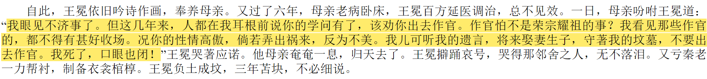

> 人与人之间的相遇才是玄之又玄呐。06.23

> 不敢骂昏君无道，就推给红颜祸水，所谓腐儒就是这般计量。说到底，褒姒也好，妲己、杨贵妃也好，可有选择不的空间？当圣旨降下，她们可有选择不的权利？她们从始至终都没有。
>
>反倒是自诩忠臣栋梁的诸大臣是从始至终都有选择的，他们可以选择像比干以死相谏，可以像于谦力挽狂澜，可以像陶潜隐居田园，但他们都没有。他们一边吃着皇粮，一边尸位素餐；临到国灭了，就把全部责任推给一个不能决定自己命运的弱女子。
>
>最好笑的是，他们也不敢骂皇帝，即使已经改朝换代，皇帝的坟头草都已经三尺高，他们还是不敢，只是因为要遵守所谓君臣之纲。连做一个基本的人都做不到，遵守这死纲有什么用呢？所谓腐儒就腐在这了。夫子要是知道后世以儒自称者大多数是这般人士，会哀叹儒道已亡吧。 - 06.23

> 沧浪之水清兮，可以濯我缨；沧浪之水浊兮，可以濯我足。- 06.23

> 这一刻的感受好神奇，无法用言语形容。
>
> 翻译的一篇小说（塞林格1947年写成的《1941年一位完全没有腰的女孩》），里面有一个场景是在邮轮的舞厅中，众人随着音乐轻轻摇摆，等到舞曲快结束的时候，一位女士请管弦乐队指挥演奏这首歌曲，我也跟着一起打开播放器搜索这首歌。
>
> 当音乐响起的那一刻，那种难以形容的感觉一下就喷涌出来，我一下明白塞林格是想说什么了。此前的理解只是基于小说情节的理解，只有打开这首歌后我才有那种感同身受的感觉。
>
> 这是一篇对那个战争还没开始，人性、历史都还不至于残忍到那般地步的，那个一切都是那么平静与美好的那个世界的怀念与追溯。这份追溯中充斥着淡淡的忧郁，因为塞林格很清楚地知道，在不久之后，战争爆发，这艘邮轮会被改造为军舰，舞池中的男人会上战场，成为一具具尸体，女人会成为孤儿、寡妇或者可怜的母亲独自哭泣，一切的一切都会在这首Stardust中烟消云散。 06.16
>
> 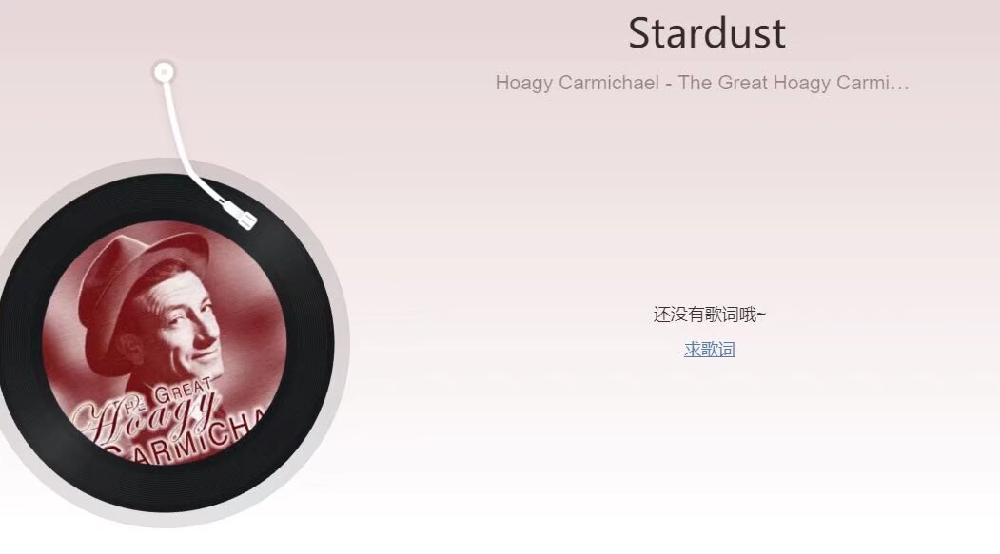

> 这是已经发生的现实，我们已经生活在一种对巨大不确定性的恐惧和不适应之中。我们只能去面对，去承担，去尝试先适应，然后做出改变，只能抱着希望，在也许无止境的挫败中，无论如何也要继续走下去。因为生活只有这一条道路可走——你也许以为可以放弃，但放弃也是这条路的一部分，任何抉择都是路的一部分。所以你不能不走，无论路通向哪儿，你必须坚定地做出抉择，坚定地走下去，你明白吗？可以放弃，可以停歇，但不能说你不想走，我们是不能停止行走的！只要继续走下去，路就会自己延伸出方向，那时候你再跟着它走，一切的一切就都会顺畅得多得多。- 06.17

> 一直不太理解，为什么李靖在哪吒闹海后对他那般冷漠，甚至是仇恨，看到[笨笨的妈妈在她吞安眠药自杀的反应](https://mp.weixin.qq.com/s/8VAJ7yEkDFODVpzsUyEFqQ)是觉得丢脸时突然明白了，原来李靖也是觉得丢脸。
>
> 大概在那一刻，我才终于完全感受到哪吒滔天的怒火，才明白哪吒不惜削肉还父，剔骨还母，也绝不愿再欠他们分毫的决然；才明白哪吒即使在化莲重生，斩断前世因缘后，还执着于一定还要亲自手刃李靖的愤怒。
>
> 所有降生在世上的小孩，他们无不只是希望从别人，特别是父母那得到一点点关心和爱，只需要一点点就足够让他们坚持到他们能够自己去给予别人爱，或者世界上另一个人赠与他们爱。但哪吒自以肉胎怪形降世之初，到自刎的那个夜晚，从头到尾只有李靖无尽的厌恶与憎恨，他从来没有一个机会从本最应该的人那里得到过哪怕一丝关心和爱。
>
> 我猜这大概就是为什么他必须杀死李靖，只有杀死李靖，他才可能突破内心，从那未被爱、被关心的深渊、阴影中逃离，真正长大成人，真正成为一个能够去爱与被爱的独立个体。 - 06.17

> 我有时候会想，如果你真是我女友就好了，或者干脆就是陌生人。这样我就不用花那么多时间和精力揣度你是否需要帮助，而我该以怎样的名义，我的帮助又是否会逾越界限……这些事情就已经耗尽我所有的精力，还怎么再和你说什么呢？最后的结果只能是疲倦地保持沉默和距离。尽管我其实是想去到你的城市给你一个拥抱的。
>
> 我再也找不到一种合适的方式来和你交谈，我想这大概就是某种形式的告别。06.15

> 即使去了你在的城市，我大概也不会联系你，即使我知道你其实会很欢迎、很高兴我的到来。我会去你可能去过的地方待一会儿，发会呆，想象你在这玩耍或休息的模样，甚至你和我转身擦肩而过。然后默默离开。
>
> 我想也许是因为那一部分的我已经死去，那一部分可以和你只是静静地散会步、聊会天的我，在无数个无法入眠，蜷缩着身子流泪的夜晚，那部分的我已经静悄悄死去——所以我只能选择那样的方式。
>
> 只有一种可能我会联系你，那就是想拥抱你的冲动突破了一切阻碍——甚至生和死，我想这是有可能的，至少现在我就无论如何都想拥抱你。06.13

> 就男性群体在这次事件中的失责，我不觉得就这件事情和其衍生的相关问题,男性有任何资格作出任何、分析或定义。我的建议是老实站好挨骂,怎么被骂都是应该的,挨完骂认真听别人怎么说。要怪要骂就怪自己和打人者、旁观者是同一性别。
>
> 有点血性的，就下定决心以后遇到这样的事情一定出手帮忙;没有血性的至少自己下定决心不让自己成为打人者那样的人。06.11
>
> ps: 这里说的是唐山打人事件。

> 忍住了破开大骂的冲动，但还是真的上火。一些人既然打的也不是你，你也说你要是在现场也不会上去帮忙，怕惹麻烦，那你究竟是有什么本事，有什么资格，有什么脸在这理性分析，说不是性别议题呢？是不是轮得到您这啥事不干的人来定义么？这脸皮究竟是得有多厚？有劲儿要用，有话要说，就下次遇到这样的事件的时候冲上去和加害者说行吗？在现场的时候唯唯诺诺，到网上就敢大声发言，指点江山了是吧？真的就让人作呕。06.11

> 不能理解女性在唐山事件中处境的男性朋友，可以设想这样一个场景：
>
> 设想平民、士兵和侵略者三个身份；而这片土地上就像抗战时期，到处都是侵略者。平民已经尽可能小心翼翼行动，但即使如此，不知道为什么还是被发现了，然后平民遭到殴打、虐待乃至屠杀——而且更让平民寒心的是，平民们亲眼看到，就在她们被侵略者屠杀的时候，士兵就在她们不远处饮酒喝茶吃烧烤，没有一点别说保卫，劝阻的意思都没有。就只是看着，看着侵略者耀武扬威地把刺刀刺进她们的喉咙，砍下她们的脑袋。
>
> 将自己代入一下平民的身份，就能明白一点点女性在这次事件中的绝望和恐惧了。06.11

> 在微信群里，有几个人说什么量力而行，不要惹麻烦，一点进去，果然都是男性。（不是开地图炮，就事论事）
>
> 这些人大概从来意识不到作为男性，或者说只是作为一个人，在见到这样的事情时是有责任和义务去阻止的，他们只会想到自己惹不惹麻烦。这些人大概也意识不到，自己的女友可能有一天也会被人殴打，到那时他会为今日的漠视而自责么？还是只是骂别人怎么不帮他？
>
> 别总是用量力而行，不想惹麻烦为自己脱身，特别是作为男性。你以为自己什么也没做，但你允许并选择漠视就已经是帮凶，你手上就已经沾满每一个因此而受伤的女性的血。06.11

> 当你学会和风做朋友时，还怎么会孤独呢？ - 06.10

> 一直以为“狐假虎威”这个词出自《伊索寓言》或者《格林童话》什么的，想不到是出自《战国策》……- 06.10

> 现在才发现原来自然界中的同性性行为很普遍，但我们的生物课却从来没提到过。- 06.10
>
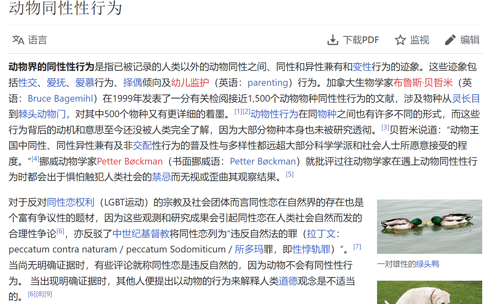 

> 发现我的习惯是读文学作品，比如小说和诗歌会更喜欢读实体书，但是读学术著作就偏向于电子书，更方便做笔记和查阅相关资料。06.08

> 书店看完书想去学校门口吃碗粉再回，走到桥上才发现原来今天高考。刚考完人多得不行，桥上都快站不下，但还是逆着人潮（几乎只有我一人往这个方向走）硬是走到了粉店。
>
> 逆着人潮的时候突然想到，这一幕不是很有象征意义么？——大学即将毕业的我，已经和那时，高三即将毕业的我逆向而行，走上了一条和那时想法完全相反的道路。
>
> 逆着人潮的时候如果时空交错，遇到那时刚刚考完试的自己，他大概会同我说：顺着人流走吧，那样会更简单，只需要顺着人流走一段就有一家很不错的饭店，在那你可以吃得很好。
>
> 但我会跟他说：我不要，我要去我想的地方，这才是适合我的路，这才是我想去的方向。即使逆着人潮，逆着过去的你，我也要找到勇气，找到方法，从那水泄不通的人墙中穿过去，明白吗？
>
> 他看着我，突然笑得很开心。他说你去吧，我替你过上正正经经、规规矩矩的生活：我会考上公务员，或者研究生，我会回到我们的母校当一名语文老师，我会谈恋爱、结婚，有一个可爱的女儿，我会照顾好我们的母亲。你去吧，我会照料好这一切。但你不许让我失望，不许你自暴自弃，不许你半途而废，你只许克服所有困难，义无反顾地朝着你想去的方向前进！
>
> 我还想再跟他说什么时，他已经被人流裹挟着消失不见。06.07

> 我倒是宁愿做伯夷叔齐，饿死不食周粟。只是天下粮食，是出于自然，出于土地，出于百姓，你周室何德何能，占为己有？
>
> 先民有歌曰：“日出而作，日入而息。凿井而饮，耕田而食。帝力于我何有哉！”我虽四体不勤、五谷不分，但也请以此为榜样。06.07

> 还挺有意思。退个共青团，先是跟我说要写退团申请书，手续很麻烦；然后又说影响工作，以后无论考编考公（不感兴趣），还是正常公司工作（无所谓）都过不了政审；现在就说要联系直系亲属。
>
> 我挺好奇还有什么手段，当初小学加入时可没这么多手续，连问都不问就给我加入了。 -2022.06.07

> 之前共青团中央发那条所谓“女权猖獗”的文章时，我就问过团委怎么退团。团委说等27岁自动退团，我也不想让团委难堪，就没有再多问，想等27岁退了就完事了。
>
> 结果还有转接团关系这一出。辅导员就说必须得转，不转的话你得申请退团。我就说，好，我申请退团。然后辅导员就说一大通比转接团关系手续更麻烦，影响考编考公政审之类的话。老实说，如果辅导员说让我配合一下工作，他工作也不容易，那我也许会去转，我不想因为自己的事太麻烦他人；但他说这些威逼利诱的话，只会坚定我退团的决心。
>
> 我就宁愿做伯夷叔齐，饿死不食周粟。再说了，天下粮食，是出于自然，出于土地，出于百姓，你周室何德何能占为己有？- 2020.06.07

> 之前在与朋友（都是从小玩到大的朋友）的对话中，朋友问我为什么这么不喜欢中共。我说我谈不上喜欢不喜欢，又不是谈恋爱，我只是对他们做的事极为反感。
>
> 然后朋友说起那套书里的陈词滥调，大概意思就是没有共产党就没有新中国，没有我们现在的幸福生活。
>
> 当时我特认真地看着他，说，我们能拥有现在这样的生活，纯粹是因为我们自己，明白吗？不因为任何人，任何组织，任何机构，只是因为我们自己。
> 
> 认真完后就开始调侃他，你是从中共的子宫里生出来的吗？你高考是中共帮你考的吗？你恋爱是中共帮你谈的吗？你工作是中共帮你找的吗？主管狗血淋头的斥骂是中共帮你挨的吗？既然都没有，为什么说没有中共就没有你现在的生活？
> 
> 朋友：停停停，我们好好吃饭。 - 2020.06.07

> 一想到不能安安静静地读书，就肉眼可见地开始枯萎了。06.06

> 提旧事者失一目，忘旧事者失双目。06.04

> 影片赛璐珞被制鞋业回收再利用，做成鞋跟。这不是非常奇妙的，关于生活和艺术的现实联系吗？所有那些影片中的片段——那些画面、声音，人物、故事变成了我们的鞋跟——那不仅仅是物质上的鞋跟，也是精神上的。06.02

### 5月

> 一个能够放下一张床、一张桌子的房间，维持生命的一日两餐，我只需要赚够提供这些的钱就够了。其余时间我都想放在读书写作上。05.26

> 突然想起我们老师教我们教到半路被迫换教材，因为突然发文件说不能用外语的教材书。讲的就是外国史，用外国语教材无可厚非。本来很有精神、教得很好的老师，在那几天一下就没劲头了，话少了很多。05.24

> 笑死，今天早上我和我小侄子互相拿自己的袜子给对方闻，问臭不臭。（先声明一下，是他先动的手，我是防守反击）05.24

> 卧槽，人真的有点懵了。我说为什么我的qq空间和朋友圈这么冷清，我以为是大家都不用或者我被屏蔽了，直到我打开“不看他（她）”，发现我高二以前的好友基本都在里面……wtf？？？我真完完全全一点印象都没有？？？我是什么时候，为什么要这样做……我甚至开始怀疑自己是不是有分裂人格，晚上我睡觉的时候他爬起来把我好友都拉到不看的名单里面……否则无法解释我为什么一点记忆也没有？？离了大谱了
>
> 清除所有不看后，空间一下活了过来。就好像在末世独自游荡很多年后，突然又看见那些以为早已消失不见，以为不会再联系的朋友们其实正平安生活在不远的那个小镇里……05.24

> 天呐！为什么我这么坚强一个人，一进入到亲密关系中就会变得这么脆弱？一下就虚弱得和路边奄奄一息的小流浪猫一样了！05.23

> 一定是有那么一段时间，输入了你的名字一遍又一遍，所以输入法永远将你的名字定在联想词位置的第一栏。而你的姓又是那样一个常用字，无论我想不想，它都会频繁出现在我每天会输入的词中，我每输入这个字一次，你的名字就出现在联想词上一遍。但此前我从未注意到，即使注意到我也不曾在意，更不想特地花时间去清除联想词的记忆——因为这已经无所谓，一切都已经结束在多年以前。在那时，我一定不顾一切爱过你，我向你确信这一点。但现在说这些都已经没有意义，不是吗？即使每天看见你的名字也无法再在我心底泛起一丝涟漪，只有死寂，只有麻木。
>
> 我已经随着你的死去而部分死去。05.21

>  05.19
>
> ps: 因为提了一嘴轮台罪己诏，直接封了我一个月，不玩了。

> 听歌的时候也会看看评论，因为有时候能看到一些非常好的描述。比如说刚刚在万晓利的《这一切没有那么糟》下面看到一个评论，他说万的声音就像森林里一棵生长了很多很多年的树。这个比喻我太喜欢了，以后肯定用在某个地方。05.19

> 玩了这么些游戏，发现还是Rimworld(环世界)最耐玩。因为太多有意思的mod了，每次换mod就相当于新换了个游戏，相当于以下游戏的结合：《星露谷物语》《异星工厂》《饥荒》《我的世界》《丧尸国度》《模拟人生》《森林》……总之如果习惯这游戏的操作，这游戏真可以从小玩到大。05.19
>
> 01.04追加：环世界也没玩了···

> 论文终于过了，吸取了极大的教训。其实学校并不严，你只要认真对待，认真写了都能过，但我就是在错误的选题上认真，越认真走得越远···我要是老老实实但凡选个本专业的题目，或者就把历史论文写作的期末论文深入一下，都不至于受这份罪···以后如果还打算继续读研，对选题一定慎重慎重再慎重。05.19

> 好奇有生之年能不能看到罪己诏。05.15

> 塞林格和海明威竟然有一次相遇，而且相谈甚欢；最戏剧化的，他们的相遇是在刚刚被盟军解放的巴黎。遥想到后来海明威自杀，塞林格隐居，这次相遇就更有一种特别的含义在了。
>
> 忍不住想，如果杜甫和李白在安史之乱后重逢，那会是怎样的一个场景？子美还会只是感慨“正是江南好风景，落花时节又逢君”么？05.12

> 突然觉得“这是我们最后一代”听着好舒心，有种终于一切都要结束了的愉悦。05.12

> 布莱希特最有名的一首诗是《致后代》，写得特别特别好，而且很通俗易懂，推荐大家都读读看。
>
> 但是我们这代人大概都做不到像布莱希特那样，所以我们也许更适合另一首《致后代》——这首的开头会这样写：
>
> 这是我们最后一代，谢谢。05.11
>
> 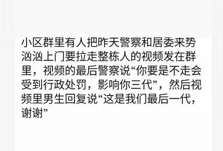

> 看介绍野菜的书，想起一个朋友。都记不太清了，只记得和她在大概是在野外玩。她说这个能吃，然后掰下一片茎叶嚼起来，然后过一会又说这个花蕊也能吃，然后又摘下一朵放嘴里。那时候就觉得又神奇又好玩，她就像一个仙女，在我面前不停地表演着各式戏法：法棒指一下那株不起眼的植物，它就变得能够吃了。
>
> 那时候我就清楚地感觉到，她眼里有一个和我看见的完全不同的世界，那个世界好像有趣得多。嗯…至少能吃的东西多得多？相比她，我在那个世界就像个双目失明的聋哑人，看不见，听不到，说不出，更别说吃了（怎么还是吃…）。
>
> 真希望有一天能够像她一样啊，认识所有花草树木，然后就可以放心大胆地吃了哈哈哈）05.11

> 感觉我指导老师是真的我论文也没认真看过，我写巴门尼德对A的否定，他给我把标题改成巴门尼德的A。
>
> 然后一个礼拜前发给我论文规范，让我按照那改，我改完了，现在又说那个不对，按照他要求的来。
>
> 之前论文的修改也是改改题目（比如把赫拉克利特改成赫拉克利特的A），改改框架，里面说的估计也没认真看，然后就说你这述的太多，论的太少，让我去改……所以实际上就相当于我论文真就基本全靠自己写，也没人给我改……
>
> 其实也不是多生气，也不是想埋怨他，毕竟我自己选题就问题很大，专业不对口……而且这次独立写论文也让我真的学到了很多。只是真的不想理这指导老师了，二辩过不了我就延毕吧，延毕了换之前一辩给我指导的那个老师，认真把这篇论文写好。05.05

> 也许是因为有能够倾诉的对象，才会能够很放心地展现出脆弱的一面；如果没有的话，就会无论如何都变得坚强起来，尽管这往往不会是以一种良性的方式，总要付出某种对应程度的代价，但是有什么办法呢？首先是活下来，失去的再慢慢找回来吧，如果可能的话。05.04

> 买的王力全家桶到了（bushi），打算好好系统学习一下古代汉语。
>
> 其实古文功底大概相对普通人来说会好一点，以前高中自习的时候会自己一个人在那读《古文观止》。学校也没有要求，但就是自己喜欢。
>
> 但越是觉得自己还不错就其实越要认真地、系统地好好学一遍，一些基础的能力要越扎实越好。
>
> 但是！在这之前，毕业论文一定要顺利！顺利毕业，就可以专心学自己想学的，做自己想做的了！05.02

> I can't beat it. 从老爸的死中活下来（一部分）我已经用尽全力。我和Lee一样，已经没有气力。好朋友，恋人，似锦的前程，幸福美好的生活，这一切的一切与我都毫不相干，都是在亿万光年之外发生的事情。只有对于书，我好像还是和以前一样，能从里面获得很简单、很纯粹的快乐。也许是因为我爸跟我说过，如果是买书，就随时找他拿钱吧。
>
> 其实因为照顾小侄子小侄女恢复了一些气力，但还是不够用。
>
> 就像表弟跟我说的那样，如果是他他早就崩溃了。我没有崩溃，还做得很好，没有抑郁，也没有自暴自弃，实际上我比我想象中还要坚韧，还要做得更好，我近乎化茧为蝶。但是一些事情我实在就是做不到，就是can't beat it.
>
> 初次读《挪威的森林》的时候，我无论如何都想理解直子，但从来没做到过。但在老爸去世多年后重读，我一下就明白了。那是一种失去至亲至爱，生活突然脱轨，然后开往另一个截然不同的世界的过程，这个世界幽深、冰冷，就像直子死去的那片森林。你不会明白从另一个世界传来的“爱你”“喜欢你”“你很重要”是什么意思，因为语言都已经不再互通了。05.01

### 4月

> 咱也不知道这是什么原理，一铺凉席收被子天气就转冷，都快五月份了我还在挨冻。04.30

> 打盹的时候做了一个很短的梦，梦见自己杀死了一个小孩。
>
> 我好像是在参加一场战争，在其他国家，那个小孩他突然端着武器从门后跳出来，我出于防卫下意识选择开枪。
>
> 这个小孩大概只是小学年纪吧，他父母不知道是战死了还是只是离开去找食物了，他一个人在家。他听到声音后就警觉地拿着武器（那也许甚至不是武器，只是塑胶玩具）出来查看，然后被不知道是在清扫战场还是执行巡逻任务的我杀死了。
>
> 在此之前，我都好像觉得自己是在参加一场特别正义的战争，所以之前在杀人的时候都没有感觉，但在失手杀死那个小孩以后，我彻底地对这场战争，这个世界都绝望了。最后在打算自杀的时候醒了。
>
> 醒来后，我突然意识到，我可能已经死了。04.29

> 每天去接我小侄子他都问我“给我买的黑暗火花到了没”，我就说：黑暗火花现在正在一艘曲率飞船上，由奥特兄弟一路护送，从奥特曼的故乡——M78星云的光之国以超光速跨越多个次元宇宙来到我们家里，那是近兆亿光年的距离，路上不知道有多少怪兽想抢你的玩具，这比你叔叔接你回家的路要远上很多很多倍，要麻烦得多得多得多，你明白吗？他似懂非懂地点点头，然后问我：“可是便利店里不就有吗？” 04.29

> 读首辅在知乎关于从事中哲学术的那篇文章很受触动，那种对于学习和知识的纯粹向往，在我心里引起好深的共鸣。如果能更早地明白这些道理，自身和社会都有更好的环境和条件就好了，那即使资质愚钝，我也愿意尽自己的余力。现在也不迟吧，环境也没差到哪里去，但我的状态还能否支持自己一心一意地学下去呢？唉，我也不知道了。总角闻道，白首无成。听这句话就觉得难过。04.28
>
> 陶潜《荣木》开头是「总角闻道，白首无成」，结尾是「千里虽遥，孰敢不至！」。又悲又叹。

> 答辩完了，有不详的预感，但是还是能过（祈祷句无疑）？
>
> 遇见了最喜欢追根刨底的一位老师，给了我蛮多挺好的意见，至少看得出这老师是真看了而且知道我具体问题在哪，如果答辩之前我指导老师给我来这么一通就好了——
>
> 但是这是在答辩中啊！（爬 04.28

> 这两天打算把网易云音乐里面的几千首歌都听一下，然后按季节分类下载，最后注销账号了。真有点舍不得，某种意义上简直又是把自己的一部分杀死了。但是我已经受不了这些人说删就删，说犯规就犯规了。我祝福有那么一天，你们这些人自娱自乐地立下的那些法条，已经没有一个账号在里面遵守。04.28

> 万万没想到最先被网易云禁言了）04.27
>
> 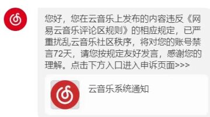

> 哈哈哈突然想起一件让我挺乐的事情。初中的时候，有一次我一个同学（评论区有请当事人）和其他班的人发生冲突，快打起来了。我在看书（好像是红楼梦），朋友就喊我去掠阵，初中那会我还挺高的，而且因为练跆拳道，所以体格也还行。我就拿着书出去看了会，结果说着说着好像没事了，我就又回去看书。后来才知道，我这朋友就在我们班后门口外面被两个人暴揍，揍哭了都；之前我还因为担心会打起来，所以我没回原位置，找了个靠门的位置，结果打起来的时候我两耳不闻窗外事，一心只读《红楼梦》 。后来打完了他们才问我怎么不出来，然后我责怪他们怎么不叫我...04.27

> 虽然很难过，但还是不得不离开。她需要的不是我，是一个能够在北京陪在她身边，能够和她一起去伦敦的人，那人当然不会是我。04.27
> 
> 这次我很努力地尝试过了

> 突然想起一件觉得滑稽，不知道是该笑还是怎样的事情，那就是如果不看任何社交媒体的话，疫情存在与否与我好像差别不大。
>
> 在学校里，即使不封校，我也不经常出校。在家里的话，小县城只有20年春节那会儿管得严了些，在之后就基本恢复日常。这波疫情也是和没发生过一样。
>
> 某种意义上来说，即使明天世界末日，我的心情起伏也不会太大。
>
> 县城、农村里不看新闻的老人大概会以为这就是很普通的一年。这么说起来，也许对于山中隐士来说，这三年就是很普普通通的三年。和上一个三年，和下一个三年都差不多。
>
> 这么一想，又有“到乡翻似烂柯人”的恍若隔世的感觉了。04.25

> 我觉着等我翻译完塞林格的文章时，我大概就能找到一种适合自己的叙述方式，我一直都想写自己的故事，但是这些故事总是像沙滩上的城堡，潮水一涨或者台风一吹就散，塞林格让我感觉到我可以找到或砌起一面厚厚的墙来挡住那些潮水和飓风。04.25

> After so many years,you just go back to the place where you stand before,and you ask:where am I? 04.24

> 不要无力和绝望，要保持冷静的愤怒。04.24

> 很狼狈地发现，我现在组织一句问候他人最近怎么样的语言都组织不出来，感觉站在了黑洞旁边，所有话都跟光一样被黑洞吸进去了。04.21

> 真的很神奇，我好像再次看到了命运的指引，只是这次它以前所未有的直白为我指明了道路。它好像在说，不要再逡巡不前了，是时候去你想去的地方了。04.21

> 有点眩晕，但我还是努力站住了脚。这是我过去一般的生活的一种重演，不停地重复自己的诧异，像在适应不同海拔的高原反应一样，它从未消失过。04.21

> 人是会改变的，而且并不是如想象中那么难，但是我们在将一个人当作一个观察或者叙述的对象时，总是会下意识假设对方已经静止。这使得那些能够巧妙地体现出了人的转变，但是又不会让人觉得突兀的作品很是难得，对于创作者来说，这大概也需要很大的技巧。04.20

> 父亲，今天我觉得我又坚强了一点点，也许有一天，我能够像您一样可靠。04.19

> 很喜欢“张敞画眉”这个典故。也不知道为什么（也许是受《红楼梦》影响），我对那些能够悉心为爱人画眉、梳发的人（这在古代，甚至现代都还是被耻笑的）都特有好感。04.18

> 有时候不想说话，就会看一看自己已经说的话，这是我写一些东西的初衷，当我不知道自己在哪，不知道自己该说什么，就看一看自己一路过来的脚印。04.17

> 我现在开始怀疑那些我对她说过的话是不是都是我说的了，那真的是我吗？我会说出那样的话来吗？真不可思议，我这么想。04.16

> 虽然已经快七八年没碰过dota2了，但是看到受教杯高校赛里，中大校队一穿七，从败者组一路杀回来，最后打败北大夺冠的消息还是有点小激动。04.15

> 填空题：
>
> 已知：
>
> 1.我国不是联邦制。
>
> 2.上海是直辖市。（不明白啥是直辖市请百度）
>
> 3.上海是买办城市。
>
> 综上，我国是____。
>
> 如果不敢回答，就请说话之前动动脑子，什么话也敢信也敢说。以为自己是在拍马屁，一不注意给人拍马腿上了，最后给自己下套还不自知。04.15

> 看电影，里面有一幕是主角从酒吧出来，然后翻墙（不高）去公路上打计程车，我脑子里就突然想到，如果开一家书店的话，想在书店门口砌一道墙，想要进来看书或者出去都得翻墙过去。老实说，我也不太明白这个行为的含义，但是突然就想这么做。04.03

> 如果是表达爱和关心，即使会显得很笨拙，很难为情，也应该去尝试，这很重要，很有必要，因为有人也许此时此刻很需要它们。04.01

### 2月-3月

> 梦见和fumi谈恋爱了，所以醒得特早（bushi）03.25

> 有时候对于我说话会变得很艰难，这时候我只想拥抱你。03.24

> 时常容易怀疑自己存在的价值和意义，但只要想到我所给予的、和他人所给予我的那些善意和帮助，我就觉得心安和一种平静的幸福。我开始慢慢明白，纯粹的善意和帮助，和一种意义更为宽泛的爱，这是一条作为底线又像是最终目的的标准，只要曾给予万物或从万物处得到过，或者只是打算去这么做，那生活就会自己源源不断地去产生所能支持它继续进行下去的一切。03.21

> 已经延迟一个月返校后再次通知推迟，具体返校时间待定。距离毕业还剩三个月时间，不知道还要待定去多少。
>
> 上次召开专业年级大会的时候，懒懒散散不想去。朋友语重心长地说，这也许是最后一次这么多人聚在一起。那时还不以为意，心想怎么会，不是至少还有拍毕业照的时候么？现在看来也许是一语成谶。03.16

> 老实说，如果痛苦能催使出某种才能一样的东西，我倒是非常乐意处于长时间且不间断的痛苦之中，但现实常常是痛苦于自己的没有才能……所以其实不是二选一的问题，其实是坏的都占了，好处一点没捞着——但是！如果想得开的话，有一条柳暗花明的小径可以走——那就是将一切颠转过来，在某种程度上满足并享受自己的无能。然后再沉下心来看看自己究竟能做到什么。03.14

> 什么都想学，如果有无限的生命就好了，我就先从我最不擅长的数学开始学起。03.11

> 写论文的动力已经由ddl成功转变成了“赶紧写完就可以心无旁骛地玩《艾尔登法环》”。02.28

> 因为一直成绩相对比较优异（矮子个里拔将军），于是常常有亲戚让我帮忙开导开导他们不学习的孩子，但是他们不知道，从小到大，我才是最叛逆的那个孩子，现在也还是。02.27

> 看见朋友发的和女友离别的视频，才突然发现很久很久没有看见过离别时难过的模样了。我的所有的离别好像看起来都是如此轻易，像是走程序一样就走完了。以前小侄女小的时候我去学校她会哭啼啼地拉着我不让走呢，当然现在她听到我要离开也会唉声叹气，不过再大些就不会了吧。想到这稍稍有点伤感，以后就没有人为我离开而伤心了，而我还得不停地离开。02.22

> 我不想要“什么样”的生活，任何样的生活都迟早让我枯燥、烦闷，我想要的是：尽可能地生活。02.21

> 开心的一晚。
>
> 在朋友家rua了好久的猫猫，猫猫又乖又亲我。然后听着喜欢的歌在细雨中散步回家。02.16

> 真想有一段时间好好重新读一遍以前喜欢的书，想知道那时候的心情，想知道那时候从书中明白了什么，想知道那时候那本书里的什么深深地吸引住了我。等到开学，就这么做吧。02.16

> 自己以为是突然兴起才决定的事情，翻自己的日记才发现几年前就已经有类似的想法。所以觉得开心，像是得到了自己的应援，如果那是一条少有人走的路，至少还有自己的影子陪伴。02.15

> 我不会以自己的标准去要求你变得更好，也不会以此阻止你去变坏，那都是你的选择，你的命运；我即使想干涉，我知道我也做不了太多。我能做的，我会坚持去做的，就像霍尔顿所希望做的那样，做一个麦田里的守望者——你可以在麦田里开心肆意地戏耍，你乐意的话即使闭着眼睛往前冲刺也行；我会时刻在悬崖的边缘守望，以防你过于调皮不小心坠入悬崖。02.13

> 对于爱这件事大概没有多少话语权，毕竟“纸上得来终觉浅，绝知此事要躬行”，但我可以确信的一件事是爱绝不是占有与控制，也不是一种束缚。因为真正的爱会给予一个人更大的自由，它绝不是对原本一个人自由自在的生活的打破，它是在此基础上的延伸与扩展。它使一个人的世界变成了两个人的世界，而两颗心变成了一颗心——两个人的世界是更广阔，更自在的，融汇在一起的两颗心当然也是更有生命力的——就这样，爱变成一颗更强大的心跳动在更广阔的世界里，它理应是更自由的一种生活。
>
> 萨特对爱的忧虑出于自我与他者的抵触，这使得相恋的两个人实际上会有意识无意识地想要掠夺彼此的存在，想要将其化为自身意志的附庸，这也许是恋爱中矛盾的本质所在。但我相信真正的爱会解决这个问题，因为爱永远是包容的，慈悲的，它不是武器，它不会侵略，不会掠夺彼此的存在；相反，爱给予彼此存在，给予价值和意义。要记住，所有爱所产生的矛与盾都是蜜饯所化，它并非为了发动战争消灭彼此，而是一种隐秘的馈赠，是为了更好地爱。02.09

> 被亲戚家的小女孩可爱到了，三四岁，憨憨的，特认真地说蚯蚓是青蛙的儿子。02.04

### 1月

> 也许是前些日子见朋友见得太频繁，消磨了太多能量，最近有点自闭，不想说话，也不想搭理人，只想一个人安安静静地待着。
>
> 所以大概会不用手机（准确来说，不用通讯工具）一段时间，这段时间如果因为不在给大家造成什么困扰，非常抱歉，但这已经不在我考虑范围内。我需要彻底断电一小会，需要时间来重新积蓄能量，其他的事情都往后稍稍。
>
> 能量积蓄足够的时间说不好是什么时候，但是上线大概会是在过年后，毕竟还需要微信收红包（）01.24

> 听Patti Smith的一点感悟：好的乐队主唱在古代也是一个好的萨满x 01.19

> 疫情结束以后如果有时间的话，想剪短头发，去骑行或者徒步一段时间。在那之前，先锻炼好身体，保持好心情，在放晴的那天应该是最好的一个状态。01.13

> “人生得意须尽欢”人人都懂，可又有几人知道人生不得意处须尽悲的道理？该哭哭，该嚷嚷就嚷嚷，借酒消愁完全没问题，凌晨在大街上吐个不停也在所不惜——重要的是，不能藏着掖着，欢这种东西，暂时不尽不过觉得可惜，而悲要是不及时尽，可是会积悲成疾的。01.12

> 写得很烂，但还是得继续写——应该把这当作生活本身，活得很烂还是得继续活。即使知道诸多名家在动笔时也挣扎、迟疑，自我否定，但这也完全舒缓不了自己的挫败感……只能说咱头发多，还能掉个一阵子。01.05

## 2021

### 12月

> 头发乱得让我有种“差不多了，该去捡废品了”的感觉。- 2021.12.15

> 少年老成的人老了以后怎么办呢？真为他们担心。- 2021.12.14

> 在一些部门的视角下年轻人就是工具一样的存在，更温和来说，是绵羊、奶牛一样的存在。供给其一定的环境（对于大多数来说，是畜棚的环境），同时要求其按时按量地给予产出。
>
> 但近十几年来的生育率下降，恰恰在一定程度上说明了新一代年轻人责任意识的觉醒——我们要作为人而不是工具，畜牲的责任意识觉醒了——我们的下一代人也是如此。我们不要再被傲慢地告诉怎样生产，怎样繁衍后代——更不要当我们做不到时还被告知要反省自己的“生育责任意识”。
> 
> 这是一种用实际行为做出的宣言和警告，告诉一些部门，如果一些问题没有得到适当的解决，那么就让这工具和畜牲一样的命运，我们会更乐意在我们当下这代人就结束循环——我们会玩得很开心，我们会有宠物作为自己的孩子，我们可以伴随孩子的长大、衰老和死去，然后什么也不留下就悄然离开这世界——我们绝对会这么做——如果我们的孩子无法被当作一个人来看待，最好就让他不来到这个世界，或者让它本来就不是人（笑）。- 2021.12.12

> 没想到看《论语》能看得笑得我肚子疼。- 2021.12.11

> 我觉着，面对同样的人生经历，要是学会积极自嘲，人生的乐趣大概得多上一半吧。同理可证，要是自怨自艾，人生的哀愁就得多上一半。- 2021.12.8

> 我是真喜欢《九故事》里《为埃斯米而作——既有爱也有污秽凄苦》这一篇，打心眼里喜欢，来来去去读了四五遍还是喜欢得不行。两者应该是没有什么关联，但读这篇还是不知道为什么总让我想起高中读《红楼梦》的时候。- 2021.12.04

> 如不可求，从吾所好。- 2021.12.03

> 啊，写实习日记呀，实习日记！- 2021.12.02
>
> 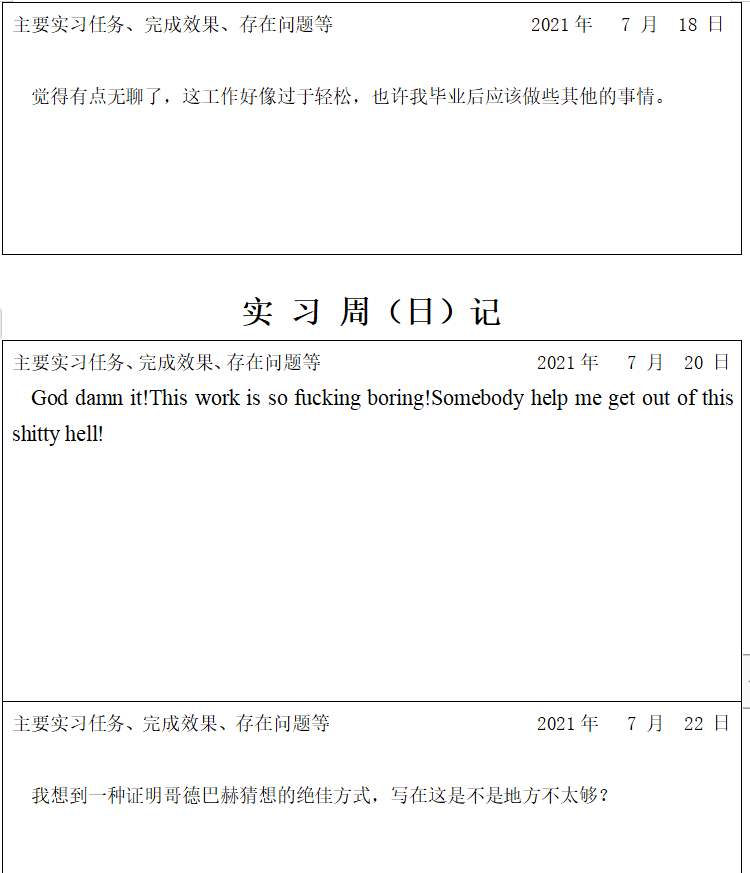;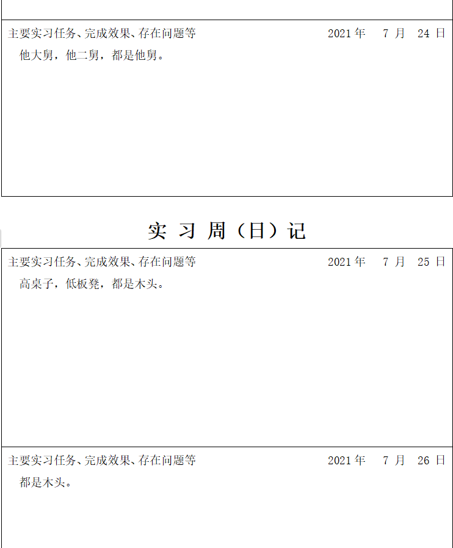

### 11月

> 大多数人的生活是为自己搭建一座稳健的城堡，但他们往往认识不到自己的城堡是搭建在沙滩上的，也看不见远处潮水的涨退。有些人则好像不知道为什么被赶出了这条路，他们不搭建城堡，而是在海边点燃篝火，用灵魂作为火绒，用自己的心血、筋骨作为柴薪，尽可能地使火焰高涨。至于篝火熄灭后将去往何方，他们好像不太关心。 - 2021.11.22

> “玫瑰般我的肤色雪白，嘴唇美丽而我的双眼澄碧。” - 2021.11.20

> 之前在豆瓣小组看过一位翻译《海德格尔导论》的帖子，还把他翻的书下了下来看。之前以为大概最差也是一位比较有闲暇时间（比如中学老师之类的）的哲学爱好者，想不到竟然是一位农民工兄弟（其实不完全算，是从大学辍学）。这位大哥确实是扎扎实实，当作学术工作一样在读书和做翻译，而不是像民哲……只是真的很可惜，《海德格尔导论》出版可能真的不大可能，翻译海德格尔太需要扎实的学术功底了，一个非科班出身的爱好者的翻译不太可能被接受。
>
> 另外一点算是偏题又不算偏的是，我觉着这是互联网时代特有的现象，即使作为一个名义上的农民工，只要有心，也能够轻易在网络上获取到学习资源：国内外大学的教学视频，各个学科前沿的研究论文，中英文电子书籍，前人的指导，这些都能几乎在网络上免费获得。这些足够让一个人拥有超过大多数大学所能给予的教育。但却只有非常非常少的一部分人认识到了这种可能，能够接受到的就更少了。说到底，有信息差，大多数人根本不知道各种获取信息和资源的渠道；再者，社会没有予以平常人在工作之外学习的条件，无论这种条件是简单的时间方面，或者是复杂一些的社会舆论方面。- 2021.11.18

> 见到一位写得巨差但是不知道为啥巨自信的网友，反思了一下自己是不是应该对自己写的东西稍微有点自信？- 2021.11.12

> 现在看来，始皇焚书也不是文化灾难了。它是以赵高、李斯同志为代表的朝廷领导班子积极出谋划策，为建设新秦朝特色思想做出的一项千年大计；它确立了秦的四个文化自信，巩固了始皇在全天下的领导，为实现新秦朝法治社会迈出了历史性的一步。秦朝百姓只有用命来帮始皇和朝廷修筑长城，才能勉强表达自己的感恩。呀！始皇！您可真是名副其实，真真的千古一帝哟。- 2021.11.10

> 还有什么能比在凌晨两点听地下丝绒的同名专辑The Velvet Underground更让我觉得幸福呢？ - 2021.11.02

### 10月

> 唉，以前看草东现场的时候，还特别有印象，记得鼓手是个可爱的女孩子，长相甜美，打起鼓来却特别稳重厚实。那时候想她一定内心有非凡的力量，才能从看起来这么柔弱的身体里迸发出这样的鼓声。即使到现在看见新闻，我也不怀疑她内心的坚强，一点也不，只是再次清楚地了解到，生活总比我们想象的要更复杂、艰难和不可捉摸。逝者已逝，生者且前行。- 2021.10.30

> 哲学译作中的名词滥用真的太多了，有时候不明白翻译老师们为啥就不能变下句式，非得译成XX性？“心理学研究结果具有含混性和仅只概然性特征”，这“仅只概然性”我硬是一会子没反应过来，一看英文原来是mere probability，译成“是含混的和仅仅概然的”不好吗？好理解，也不影响原意，非得整出个拗口的术语来折磨人……- 2021.10.24

> 最后半分钟进影厅，一坐下就开演，巧了。看完在冷风中骑了半个多小时到学校。感觉像是从异世界归来，每天经过的路口看着很陌生，一直回到宿舍这种陌生感也没驱散。上次徒步完回到家也是这种，好像自我被暂时抽离，无法理解眼前景象与自己的关联。- 2021.10.16

> 去理发店剪是千篇一律，自己剪是千疮百孔。-2021.10.15

> 脑子里总是突然蹦出一些好玩的故事，顺着情节我可以想上许久，但一写就像云雾一样都消散了。- 2021.10.25

> 我以为我会在更年轻的时候碰着你，那样的话我会给你念阿赫玛托娃的那首诗，当我念到“你晚来了很多年啊，可我还是为认识你而神往”，我们或许会相视一笑，明白彼此眼中的心意——但是，总有但是——我已经过于衰老，我的心老得更多——这颗心已经在沙漠中掩埋太久，已近乎枯死。但是即使如此，我也绝对不会说遇见你已为时过晚，在我离开这世间之前都不会太晚——只消看上你一眼，确信你的存在，下一刻我就能安然地躺进自己的坟墓。- 2021.10.12

> 现在玩游戏都觉得特无聊，玩Rimworld玩着感觉自己是在给NPC打工……- 2021.10.10

> 因为我不仅是一支箭，还是一把弓。我控制自己飞向哪，飞出去以后绝不回头。- 2021.10.01

### 9月

> 洗完澡出来楞住了，想不起来自己的柜子号是多少，一点印象都没有，连是在上层还是下层都记不清……还好三浴室柜子不多，凭着感觉硬找到了……- 2021.09.30

> 怎么向我不足五岁的侄子解释，他最喜欢的奥特曼为什么突然从电视上消失了？又怎么说服小时候的自己，那些让自己心萦梦绕的拯救世界的英雄“涉及暴力和持械斗殴”？有朝一日奥特曼竟然背上了和古惑仔一样的罪名，一代人的记忆被以这样的方式，连原因也不屑给予便悄然抹杀。- 2021.09.25

> 现在读书有了特别的心得：看不懂的不是因为我不行，是因为作者没说清楚or译者没译好。- 2021.09.21

> 好吧，第二十三个年头也开始了，许多记忆开始发酵。
>
>小时候因为成绩还不错（大概还因为可爱，不是自夸，小时候确实如此！），人也还算乖（虽然谈恋爱，还有几次出去通宵上网，但总体来说品学兼优，性格开朗），老爸也十分开明（买书的话随便拿钱，也不管我看什么，还以买手机为诱惑怂恿我和我们班班长谈恋爱……），所以从小就没挨过管（当然，通宵被抓住后的大嘴巴子还是少不了），总的来说，是像幼兽一样在山林里，不被禁锢也不受监管地，完全按照自己的天性自然长大的。
>
>也是因为这样，我很早就有自己自成一体的世界，我知道自己喜欢的事物，知道自己前进的方向，所有抉择，无论大的小的全由自己做，自己驱动自己，自己为自己的选择负责。- 2021.09.20

> 我是个实验家，我的实验对象是：我的生活！- 2021.09.18

> 好羡慕，我也想去太空 - 2021.09.16
>
> 

> 我可是很认真、认真、认真地活着呀 - 2021.09.15

> 我是你的灰烬，也是你灰烬中涅槃的新生。- 2021.09.15

> 我完全信任自己，无来由地信任——甚至说是盲目也不为过。我也不明白为什么，是如何做到的，也许是曾激烈搅荡我内心的两股矛盾得到了某种消解。总之我与自己建立了一种挚友间的亲切和信任，这种亲切与信任使我内心意外地平和。- 2021.09.11

### 7月-8月

> 你确实没有印象中那么可爱、活泼，但是你比过去要笑得多，我想你也许是用同样弥足珍贵的东西同命运作了一次交易，砝码一定比想象中还要沉重，但是你承担了起来，勇敢地做出了决定。- 2021.08.20

> 不太明白，为什么有些人对彼此的斥责总大于宽容？为什么如此呲牙咧嘴地抓着别人的一丝错误和缺点百般辱骂呢？
>
>人不理解蚂蚁无可厚非，于是随意践踏也无可置喙，但同为人类，人与人彼此不是天生就存在着一定程度上的互相包容、理解的可能性和义务性么？
>
>这样的包容和理解往下会自然而然地推及我们的朋友、家人、恋人，无需提醒，我们也清醒地知道体谅家人，宽容朋友的错误；往上则必须推及那些罪大恶极的人，即便是纳粹，如果无宽容，我们也不得不表示相当程度上的理解——我们也不得不去理解，否则下一次大屠杀又会在茫然与惊慌中上演。那时凶手便不只是纳粹，而是不思反省的整个时代。- 2021.07.28

> 张亚东这么克制的人都如此坚定地说出了“你们的歌曲完成度，编曲和词是最好的，最棒的创作”，可见“超人田田”这只乐队有多好了。
>
>曾经有一只叫“哪吒”的乐队和他们好像，无论是表达的主题还是两位主唱的音色。
>
>但你非要问我两个乐队表达的是什么主题，我实在答不出，但我脑海里不停浮现出一本书的名字：《麦田里的守望者》。
>
>守望自己过去枯死的童年，在用成人的流欲与浮华灌溉而成的麦田中，孤独地唱歌，唱歌，让那些失路的孩子暂时停下脚步，坐下来围着篝火，开心地聊上一小会儿。然后再启程步入深渊（坠下悬崖）。- 2021.07.24

>「死去的人的灵魂，在山的那一边」 - 2021.07.16

> 有时候觉得我的双眼就像一部摄影机，正在拍着《路边野餐》或者《雾中风景》那样的电影。- 2021.07.11

> 回到了小城青年熟悉的节奏，看云，吃夜宵，在公园漫步，与朋友闲聊，观察街道的变化，解答风的谜语。大抵是无所事事，漫不经心。古人云，闲人之所忙，才能忙人之所闲，诚不欺我。这般散漫地沉静下来，对一些东西领悟得便更加轻松和自然了。- 2021.07.09

### 6月

> 不知不觉都三年了，不知道那时路上遇见的各位现今过得怎样？我已经向我所预想的生活迈出了非常重要的一步，衷心希望大家也是如此。
>
>（那位载我一程的大叔，他的孩子今年也高三毕业了，考得一定不错吧，这时候大叔会不会跟孩子说起我呢/深思）
>
>（路上遇见的大爷大妈，有的训斥我浪费家里的钱，有的安慰我不要怕，有的夸赞我的勇气，希望大家都还身体安康）
>
>（半途遇见的聚祥哥，现在想起来也觉得真是巧合，我们俩走的同一方向，早一点迟一点都遇不着。那时聚祥哥问我，对于我来说，幸福是什么？那时回答了什么，已全然忘记，但现在我已了然于心。聚祥哥有他的微信，看样子是一切都好，那就很好。）
>
>（雅静姐现在大概是世界上最幸福的人吧？可能也是最忙碌的人。书院已经置办得周全、雅致，俨然是一座山中的小天堂了，还多了一条神奇的小生命。呀！每每想到在那人迹罕至的深山里竟然能够诞生一个小生命，我就为此而莫名欣喜和感动。小家伙，一定要像山里高大的树木一样健康茁壮地成长呀，以后一定是一个李太白，嵇中散，陶潜那般的神仙人物！）
>
>（啊对，还有路上的每一条河流，路过的每一朵云朵，带给我清爽的每一阵风，我双脚所丈量的每一寸土地，也请听见我最真挚的祝福与思念吧）

> 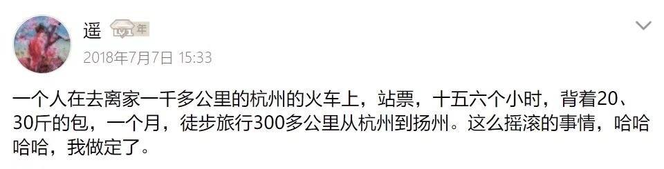

> 我最近这一两年，特别是最近几个月，才十分深刻地感受到，原来读书是如此快乐的一件事情。过去为上学而读的那都不算书，读的那些课外书虽然也快乐，不过到底是为了解闷而已。如今没了束缚，有了自己些许的认知和审美，也不再对读书抱有“非分之想”，于是能够全身心投入。或闭卷细思，或抚书戚然，有时兴起，则如逍遥游一般神游无极，好不畅快自在。- 2021.06.19

> 发现用辫子扎着头发好不舒服，女同学是都已经习惯了吗……（还是我扎的方式不对？）- 2021.06.18

> 今天一路从劝学楼拍云拍到生活区操场，从5点半拍到八点半，一般也不拍照，但是今天真的，太好看了！！！- 2021.06.17
> 
> 

> 北方晴朗时的天空总有种浓重的不现实感。看看云仿佛就能把一辈子过完。- 2021.06.17

> 以后还是少说话。想与人认真交流讨论问题，却每每被一句“立场预设”拍回。我不明白，有什么话不能好好说呢？非得预设别人的立场，继而预设别人的德行，最后再把别人的想法全批得一文不值。何必呢？求知的人永远不会这么做。- 2021.06.16

> 我从未如此满足于自己的存在。- 2021.06.14

> 下雨的时候想光着脚到处跑. - 2021.06.13

> 这几天前前后后买了差不多30来本书……想有段时间好好消化下，但是学年论文初稿还没写完（准确来说，还没怎么动笔），马上就要期末考试，暑假还得实习……一想到这些，我就…读得更得劲了！
>
> 不愧是我，泰山崩于前而不改咸鱼本色 - 2021.06.09

> 难过，想起以前初中的一件事，如果那时候的我是现在的我就好了，那样我能帮她帮得更多……- 2021.06.09

> 大象北上这事挺有趣的，说不定以后会有个卡尔维诺那样的作家把它写成一篇好玩的小说。—2021.06.06

> 路上看见一队由老师组织来学校参观的初中生（还是小学生？），叽叽喳喳地好不热闹。看着他们，心里莫名奇妙地开心。是在慨叹逝去的过往青春么？可为什么浮现出来的情绪是喜悦呢？- 2021.06.03

### 5月

> 之前闲聊的时候老妈无意中提到过，在我之前本来还有一个哥哥（或是姐姐？记不清了），大概就大我两三岁的样子。
>
> 有时候觉得愧疚，觉得自己顶替了Ta才得以出生；有时候我又怀着美好的憧憬，想象Ta如果活下来的话会是怎样？我会不会有个知书达理，温婉贤淑，闲暇时候教我读诗的姐姐？抑或一个调皮捣蛋，鬼灵精怪，总是打游戏时就让我望风的二哥？- 2021.05.31

> 今天心情不错，甚至有点小开心。发现心情好的我和平常时候的我完全两个人嘛。
>
> 能从平常人看来很小的事情获得极大的满足，这也大概算得上某种天赋吧，某种好命的天赋～
>
>另外，发现自己其实还是喜欢和人相处，只是不喜欢大部分人相处的方式。人们在人际交往中总喜欢考量：那人长得怎么样？家境怎么样？性格值不值得一交？然后有目的，有计划地去结识，就好像在菜市场问好鱼的品相然后去购买一般。这样的考虑无可置否，但我就是不喜欢，非常不喜欢。我不喜欢对别人这么想，也不喜欢别人对我这么做。我希望与人的相处就是自然而然，水到渠成的事，就像小时候和小伙伴那样，连对方名字都不知道就开开心心地一起玩了起来。
>
> 我希望与朋友的相处就是这样的，否则为什么不一个人自自在在的呢？ - 2021.05.21

> 这是不是一件神奇的事情？他和她二位因为种种缘故勉强凑合在一起，对彼此都算不上满意，心里筹划着哪日有资本再另作打算。这样的二位即使短时间内能够相安无事，也难以长相厮守吧？但命运弄人的是，其中一位因意外离世，来得何其突然，摇摇欲坠的恋情仿佛在这番打击下马上就要进入尾声。但神奇的是，在死去恋人的葬礼上，另一位仿佛顿悟一般，竟在一瞬间真正地爱上了眼前这位相处不和的恋人，于是便一辈子孤苦伶仃，不渝此情。
>
> 不知道其中境况的人还以为他们曾是一对多么恩爱的情侣！知道的人便会慨叹，在这光怪陆离，物欲横流的世间，有些人已经丧失真正去爱人的能力，唯有到生死离别，一切不可追回之际，爱的本能才被以如此强烈而又可悲的方式唤醒。
>
> 命运是如此不可捉摸与揣测，如何得知明日，明月，明年身边的人还会在身边否？不可知，也无须知。此刻紧紧抓住Ta的手，轻轻一声“我爱你”（哪怕是在心中默念），一切混沌带来的不安与惶恐就会在此刻停歇。这就是爱情的力量呀——就是那位愿意为之一生孤苦的原因呀！ - 2021.05.20

> 勤工俭学，在欧研院图书室打扫卫生，把每个书柜都抹了一遍，累并快乐着。
>
>抹的时候想起高中那会儿，读太白读得痴了，慨叹“若能为太白书童，为其研墨洗笔，一生足矣。”如今细细擦拭书柜，看着里面琳琅满目的书籍时，心中不知为何，生出了同样的心思。心里那种特别的安宁与喜悦，仿佛正在为太白洗笔研墨一般。
>
> 此番历毕，余自嘲兴许自己做学问的天赋不如做店小二的天赋——不过太白作古千年，书童一事已是谵妄，假如能做书籍的仆人，为其尽一些杂务事，倒还做得到。 - 2021.05.13

> “但行好事，莫问前程。”
>
> 以前听着这么像一句鸡汤的话，现在听着咋这么刻骨铭心呢？ - 2021.05.11

> 使人麻木的不是单调的生活，而是面对不义时自己无能为力。当人们已经把这种不义当作平常，甚至戏谑的笑料时，这种死寂的绝望怎么能不将你拖入对这个世界的深深恐怖与怀疑之中呢？
>
> 但是有另一种生活，另一种抵抗的方式，另一个……家。以这样的方式，我们也许能建立出自己理想的世界，至少建立起保护自己的高墙。

> 近代史老师给我印象最深的一课，是上课时随口提的几句话。他说那时候他们那的村子里，生下来的女婴都会被溺死。溺死以后还不够，害怕女婴回来报复，还会将女婴钉住，埋在家门口的道路上，每日践踏。福州等地的“弃婴塔”出现的原因也大概是因为如此。
>
>也许可以这么说，那个时代的很多男性的诞生，背后都背付着沉重的原罪：这并非他们的本意，但他们的出生以一个又一个被溺死的女婴为代价。他们那还没来得及起名的姐姐，被迫把生命的权利交给了他们，而这本该是所有人平等享有的。（他们大概也不知道自己曾还有个姐姐，那些孩子是世界上最短暂的流星）
>
> 即使只是为补偿那些溺死的婴儿，让她们的灵魂安息，这个社会也应该为女性的权利多做些什么。- 2021.05.18

> 第一次知道原来还有社会工作这样一门专业，还有社会工作者这样一个职业。大概，也许，可能会对我未来的选择造成一定影响吧。- 2021.05.08

> 有时候停下来，注视自己，觉得自己活得越来越像只兽，动物园里的兽。只需按照指令，遵守规则，简简单单地做上几个动作，就可保衣食无忧。多么美妙的愿景与遐想呀，为什么不呢？
>
> 为什么不呢？我问自己，这样美好的生活有什么错呢？想了许久，心里的答案开始逐渐清晰，并最终坚定如一：因为我是个人。这个答案多么简单啊！——但许多人都已经遗忘。遗忘了自己还是个人，也遗忘了作为一个人意味着什么，自愿住进动物园，甚至宠物店、斗兽场……更让人悲哀的是，他们还不自知，枷锁已经扣在手脚上了还当做是珍奇的首饰！他们不仅放弃了自己的自由，还放弃了自己独立的思考。如果说少去了自由，那么人也只是时运不济而已；而没有自己的思考，则彻底沦落为兽。
>
> 也许大家都需要好好想一想，外界所应许的——驯兽师所口口声声的必须得这么过的生活里究竟有多少是必须？有多少只是不知所措？有多少是真正的未来？又有多少只是麻木的惯性推动的结果？对自己负起责任来吧！即使要付出惨痛的代价，也应该静下来好好想想这件事情。做一个兽，还是做一个人，这取决于你是否真正自由自在地独立思考过。- 2021.05.06

> 哈哈哈哈成功劝服打算来劝我考研的姨丈姨妈，什么叫晓之以情，动之以理呀（战术后仰）
>
>下一个要攻略（划去），劝服的是家族里最有文化的一员——二外公，作为家族里的文化当担，劝服他家里就没人再反对我的决定了吧！- 2021.05.06

> 披上年轻人的皮，要教年轻人怎么做年轻人。好滑稽的一场戏呀！- 2021.05.04

> 我妈真好说话，我说今年不考研了，她说随你便。- 2021.05.01

> 细腻而又绵长，融雪化成的一弯小溪，缓缓穿过寂寞的高山与幽暗的密林，来到她的身边——这是她的爱情，是她人生长河中一条永恒流淌着的支流。她那曾被泥土、沙石、水藻、废液所充斥，一度陷入沉滞，麻木着被热辣的阳光即将烘干的河呀，只因这条小溪带来的爱与希望，竟也再次缓缓流动了起来。
>
> 每当她隐隐约约回想起那时候，她都觉得那是她人生道路上的一个分叉口，也是她人生长河的一个汇合地：有的人在路口离开，未曾告别，却再也不见：而有的人萍水相逢，却心意相通，终成知己。
>
> 那是怎样一个人呢？那又是怎样一段奇妙、曲折的情感呢？她无法轻易回答，她已经太老了，太多太多的往事已随故人的辞去而烟消云散，无可寻觅。但她想，一定能想起他来，一定可以，只是要慢慢地等，等那些记忆自己游过黏稠、阴森的时间沼泽再次爬上她的心头，告诉她那个时代的风云变换，告诉她那个少女的赤诚无悔。
>
> 她想起来了一些。
>
> 那一年是民国二十年，那时她正年轻，十七岁出头。在她微弱的记忆中这一年满是暴雨滂沱，怎么下也下不尽。- 2021.05.04

### 4月

> 其他rpg游戏打完的感觉是我装备好强，我技能好强，我的角色好强，黑魂打完的感觉是：我好强！- 2021.04.27

> 第一次对一位女生有一种莫名的熟悉的感觉，虽然只是在夜晚的操场跑道上迎面看了几眼，也不明白这熟悉感从何而来。虽然常常说黛玉和宝玉的故事，但到自己只觉得一半莫名一半奇妙…… - 2021.04.24

> 虽然每次到最后都会剩一两本连封都没拆就放着积灰了，（比如大一时买的三岛由纪夫的《上锁的房子》，至今还一副新得可以拿回去退的样子……）不过转念一想，拥有钟意作家的书带来的快乐就足够了嘛！阅读带来的快乐是额外附加的呢！这么一想，更加快乐了！
>
>（又想起朋友常常跟我念叨，说书籍是当今时代最便宜的“奢侈品”，多多益善） - 2021.04.24

> 集中听了下Quark乐队的歌，真的觉得很神奇，一个乐队竟然竟然能够如此持之以恒，不厌其烦地写着“青春”这个主题，而且唱得这么真诚。
>
> 写青春的歌几何，但他们唱的青春大多是三流青春片里那种无趣的青春，而Quark唱的是幼时追蜻蜓，扑流萤；是偷喝爷爷泡的茶，还在一旁瞎絮叨；是年轻人以真诚与关心面对世界，而世界报之以吻。
>
> 也许可以这么说，Quark的歌就是一首首写给少年们的童话与情歌，他们说：对过去是怀念但不驻足，对现在是耐心但不浪费时间，对未来是憧憬但不害怕失败。- 2021.04.21

> 人们对“生活永远会照常进行”的执念有时让我觉得敬佩，有时让我哑然失笑。- 2021.04.29

> 感觉已经是上辈子的事情了，但是看到的一瞬间，又回到了那个时候。
>
> 那时候朋友玩猴子，我玩光法；我玩海民，他就玩人马；我玩斧王，他就玩术士……不过最难忘的还是一把他的美杜莎，（我好像是玩斯温还是莱恩），对面猴子光法。
>
> 前期节节败退，下路崩盘。猴子出辉耀后三路带，30分钟三路高地破；五人围着水晶苦苦支撑，全靠美杜莎和一把圣剑，打到水晶一度只有丝血；甚至，在一次团战中美杜莎还把圣剑弄丢了，但马上又带上一把新的圣剑，不对，也许是两把。（和zsmj那场成名战太像了，甚至怀疑是记忆混淆了x）
>
> 最后，这局将近打了将近90分钟（也许更长），最终龙心板甲的猴子也经不住美杜莎几下的时候，终于以绝对碾压的方式打赢了。- 2021.04.17

> 不管有钱没钱，我对钱都真的毫无概念……（这是日后穷困潦倒的象征x）
>
> 我卖一张门票，我反向讨价还价：朋友这样是不是太贵了？我可以便宜点。如果你实在没钱的话，其实我可以送你……送你……
>
> 不过最后结果还是好的，那位朋友不好意思白要，我也不好意思多要，于是便折中卖了出去，顺带还交了位朋友（这才是最重要的不是？）哈哈～
>
> 啊，这种完全信任他人，不担惊受怕的感觉真是美好。更容易受骗？那是当然，但是相比这份真诚带来的安宁，受骗只是很小的物质代价而已。（再次增大自己的贫穷可能性x）- 2021.04.17

> 嗅到自己的恐慌正在弥漫
>
> 那是嚯滨酸、双流水的味道
>
> 黑色的 沥青般粘稠的
>
> 将我淹没 将我石化 - 2021.04.16

> 我的天，年轻时候的广末凉子好好看呀！ - 2021.04.14

> 把“二”叫作“爱”，太可爱的口音。（不过不应该叫作口音，听起来像看不起似的，明明很可爱不是）- 2021.04.18

### 1月-3月

> 临行前看她最后一眼，记住她的模样，记住自己与自己说的话。

> 沿着记忆把自己一片一片捡回来，碎片之中拼出爱。

> 在超市里，老妈问我喜欢吃什么菜，我木了一会儿，脑子里想的不是喜欢吃什么，而是在回忆过去我喜欢吃什么。
>
> 不知道什么时候吃喝对于我来说，变为了一种和拉撒同样性质的（所谓“吃喝拉撒）事情，只是一种需要满足的生理需求。
> 所以问我喜欢吃什么菜，就好比问我擦屁股用什么纸一样无所谓。简单快捷就好，好不好吃只是次要。
>
> 这对于现在的我来说当然是件好事，大概算得上我“知行合一”的一种表现，不过确实有些怀念小时候闹着要老妈买自己喜欢的菜的时候。

> 忧郁的孩子
>
> 悲叹
>
> 原来世界比他 更忧郁

> All the lonely boys & girls，送你们一捧小菜花～
>
> 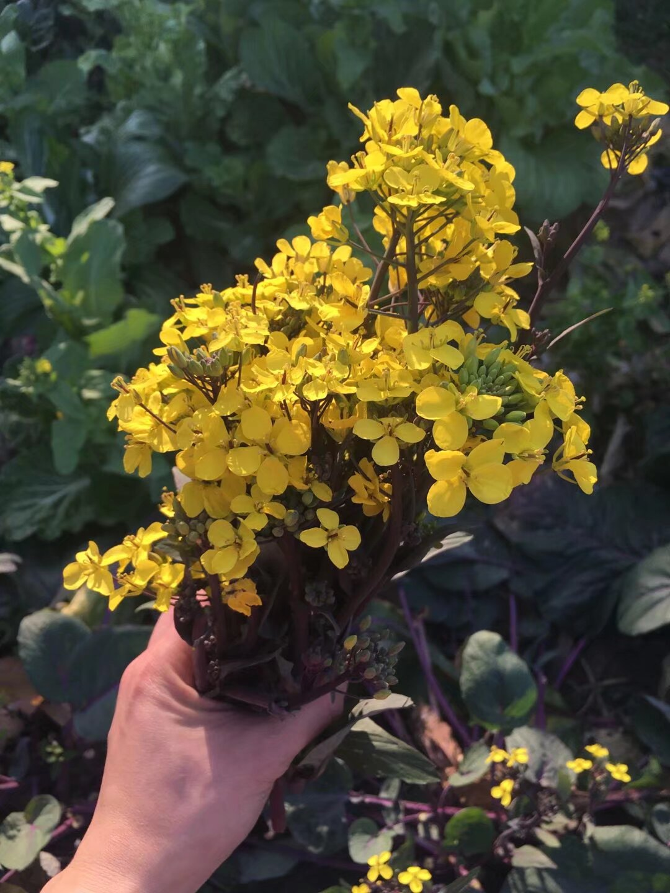

> 感谢《唐人街探案3》让我在国内的银屏上看到麻酱，麻酱真美～
>
> 但电影我真的接受不能，硬插广告的电影不是没看过，能这么插的没头没脑，又破坏电影本身又影响观众体验的真少见。

> 《戴森球计划》太上头了，好不好玩感觉不出来，但是一玩是真的停不下来……

> 有时候就是不明白，为什么有些人能够满足于如此简单而又拙劣的陈述？- 2021.01.23

> 看了墨茶Official的事情，好难受。
>
> 再想到之前同样是B站的那位“微服私访”工地的集团大小姐，更难受了。
>
> 也许真像《神经漫游者》里面说的那样：“未来已经来到，只是尚未分布平均。”只是可惜，似乎在可预期的未来里，未来的分布只是越来越悬殊。也许，更恐怖的会是，这种悬殊最终为自己正名。-2021.01.22

> 不带防护措施骑了会电动车，人差点交代了……- 2021.01.08

> 说实话，生活带给你的苦恼已经够多了，别自己给自己找多余的苦恼。
>
> 什么人参，什么地瓜，这重要么？如果以外界的眼光，无非一个用来熬药，一个用来饱腹而已，但以自己的眼光来看，一个地瓜一个人参就是一个宇宙呀，还有什么能比这更重要，更让人开心的么？
>
> 生命之珍重在于存在，在于体验（无论是好是坏），以他者的标准所度过的一生是实际上不存在的一生。（因为那样你只是世界这幅机器运转的结果，不是你自己的存在）- 2021.01.04

> 每次剪完头发都要适应自己的新丑样X - 2021.01.03

## 2020

### 12月

> 今年最大的收获是户川纯和周二下午谁没来还有Joni Mitchell！！我爱Ta们！！- 2020.12.28

> 8点半睡着，11点醒，然后一直看书做笔记到现在。一个感慨：果然凌晨学习的效率最高。- 2020.12.26

> 买完饭下楼的时候，有个女孩小心翼翼、蹑手蹑脚地跟在我后面，当然不是想跟踪我，只是怕被门帘打着。
>
> 有意思的是，一般前面打开门帘的人后面的人就会伸手接着，然后出去，但是这个女孩就猫着身子想从我打开门帘的时候从缝隙中钻出去，我第一次没注意，门帘差点打着这个女孩，第二次我就先打开门帘让这个女孩先过去……出来才发现原来这个女孩提着两碗饭，不好打开门帘。- 2020.12.13

> 迷茫时亲亲脚下正生活着的这片土地，想想生活在这片土地上的人——无论是认识的，还是不认识的，为他们做点什么，为这片土地做点什么——如果你不知道往哪走，那往这个方向走吧，这条路是绝无错误的。至于你能否得到你想要的，我不知道，谁也不知道——命运无常。我只能告诉你：这个世界上除了死亡，没有什么是“必将得到的”。（你唯一真正拥有的是生命，你唯一能做的是真正地“生活”，而你对于未来唯一能够确信的是“死亡终会来到”）- 2020.12.05

> 只有帮助他人才是真正的快乐。- 2020.12.05

> 我要为自己的言行负责，每一句话，每一个想法，每一个动作，都要负责。我要知道我的所做所言，它们最终都出于我，而非外界的逼迫，也非命运的安排的，我是我的所有的最终的裁判官，所以我要负责，为我的所有负责。
> 
> 生活是意义的废墟，我们只有为自己的一切负责才能搭出存在的庄园，将那些意义重新栽种。- 2020.12.03

### 11月

> 虽然差不多半年没怎么跑过步了，但还自信地以为自己能跑，结果5公里跑得差点吐血。
>
> 也给我提了很大的醒，有些事情一荒废就会马上退步。这个寒假趁着多出来的一个月假期好好学，离目标还很远，再这样自以为是就玩完了。 - 2020.11.26

> 听到老师说他微信的名字就是他村庄的名字的时候，顿时有点感动。
>
> （此前因为被他口音折磨的一点小不满瞬间消散了，另外一点有缘分的是这位老师的家乡离我家不远，当然只是相对于离天津来说）- 2020.11.26

> 肚子不舒服，睡不着，起床把吕翔举报天津大学教授张裕卿长达123页的举报信看了看。
>
> 我很早就走出象牙塔了，也从不觉得世界，人类社会是美好公正的，只是从来没想到可以如此不堪。
>
> 联想到之前那位大连理工大学的同学，也是化学。也许，他对着的是一篇又一篇造假的论文，却一遍又一遍地想要获得正确的数据，最后在绝望中绞死自己，生前还自责自己没有能力，连老师那句“你的数据没有意义”现在看起来也别有它意。我能说什么呢？一幕巧夺天工的荒诞剧，让贝克特、热内来拍也拍不出这样的效果。
>
> 当然可以安慰自己说这只是少部分，只是媒体放大，只是幸存者偏差，尽管现在看来也可能是冰山一角，而且也无关少数多数，根本的是像吕翔在信中说到的那样，他没有地方去举报造假，没有建立常态化的机制，非得搞到微博治校，知乎治校。
>
> 让我更觉得心寒的，是还有人谴责吕翔让其他同学毕不了业；是所谓业内的老师说吕翔这样的同学在圈子里面混不下去。即使人类的欢喜并不相通，但这样不通未免太丧失人性。
>
> 今年不知道在网上读了多少封遗书了，有南航同学的，前面提到的大连理工同学的，还有那位成都大学党委书记的，最近上海一位高三女同学的，还有一些不知名的人的。
>
> 这些人让我知道了即使你热爱生活，积极阳光也会自杀，因为你永远不知道生活能有多操蛋。- 2020.11.21

> 今天看到了那一句康德的经典台词：“人是手段，不是目的。”刚好又学到了“内在价值”和“工具价值”两个概念，也许可以从另一个层面上来解释这句话上。
>
> 内在价值和工具价值可以用追求快乐和追求金钱两件事来解释。我们追求快乐说纯粹为了快乐，我们说这是快乐具有内在价值，不具有工具价值。而我们追求金钱是为了用金钱获得其他东西，金钱本身并不是我们所追求的，如果我们能直接获得想要的，那么金钱根本不会存在，所以我们说金钱有工具价值，没有内在价值。
>
> 把这两个概念套用在康德的那句话里面理解就是：人应该是具有内在价值而不是工具价值的。举个例子，我们帮助人应该是因为帮助人本身就是具有价值的，而不是说帮助人是为了其他目的。这不仅仅是帮助，可以套用在任何人与人之间的活动上。
>
> 再举个更详细的事件来解释：老妈总叫张三上大学多认识些人，扩展、积累社交人脉，以后走上社会就如何如何，这就是把人当做手段的表现，人在这里面是一种工具，一种资源。而张三很叛逆，他不这么想，他觉得结交兴趣相投，性格有趣的人本身就是一件非常快乐的事情，至于以后走上社会怎么样他根本不关心。
>
> 从这两个例子可以看出，把人当目的而不是手段实际上是更理想、更好的一种方式，但事实是绝大多数人都是相反的，这是一个值得玩味的地方，也是这句话经常被吐槽的地方（“说得挺好，可现实不这样啊”）。- 2020.11.21

> 有一次外卖阿姨送错了，多送了份地瓜丸，阿姨说算了，但是我搜了搜一份地瓜丸的钱然后捐给了某个希望工程。
>
> 我不是从道德上说不能占小便宜，彰显自己崇高的美德，我想说的是世界上，或者说至少我心里，存在一杆以某种“等价代换”为法则的秤。便宜不是白占的，它会在你心里开一个口子，让外界某些东西有机会能够腐蚀、裂解你的心灵。
>
> 正如茨威格在《断头皇后》里所说：“她那时候还太年轻，不知道所有命运赠送的礼物，早已在暗中标好了价格。”
>
> 一切以为能够占到世界便宜的人，都不明白他们早已在暗中付出了代价。- 2020.11.19

> 一晚上没学习，就在一边听琢磨《七七连环杀人调》的词，琢磨完第五章终于大概非常勉强地明白主要剧情和主要人物了。这张专真的厉害，刷新了我对于音乐和文字的认识，原来音乐还可以这么玩……只听过概念专辑，没听过概念小说专辑。好家伙，小说和音乐一起办了，还真方便了许多（？）
>
> Ps:等考完试有时间一定好好写篇文章把专辑剧情搞明白。- 2020.11.19

> 撑着伞在微风细雨里依次掠过布满枫叶、柳絮、银杏的小路，一瞬间仿佛获得了前世的记忆，在北平？在武林？还是在长安？只觉得眼前的景色是那么熟悉，那么亲切。在前世，也兴许曾撑伞路过这样一个街道，也许是给贵妃呈贡千里外的荔枝，也许是给朝廷上奏边寇入侵的急报，又或者是众多游行抗议的学生中的一员。总之，在冥冥之中，在经过那片布满树叶的街道时，只在无意中瞥了一眼，便再也无法将这片景色忘怀，但是却不能驻足观赏，因为还有更重要的事情要去做，等到再回来时街道已经被打扫干净。于是，望着空荡荡的街道，叹的一声，将这片记忆刻在了灵魂深处，后世每当经过时都会隐隐约约地想起。 - 2020.11.18

> 我不可能被现实击倒，我只会被现实击倒的自己击倒。- 2020.11.15

> 和朋友一番交流，深深体会到自己的不足，读的书太少，又杂，想学哲学，专业是历史但书架里全摆的小说、诗集。
>
> 但是我总觉得，我不想成为某方面的专家，钻在某个时期某个哲学家的思想上不出来，而对其他不听不看。
>
> 我与那些民哲的学习动机是一样的：我渴望我所学的能够解释我与世界、社会、他者的联系，解释自然、国家、人类运行的道理，或者至少消解我的迷惑与不安。也许可以这么说，我想学的不是学科意义上的哲学，不是专业化的哲学，我想学的就是（我现在也还没想清楚怎样准确地去描述）- 2020.11.11

> 世界上那么多诗人写山，都写山如何高耸，山石如果怪异，山色如何秀丽，只有两个人独辟巧径，搞特殊（？）：一个是李白的“相看两不厌，唯有敬亭山”：二是辛弃疾的“我见青山多妩媚，料青山见我应如是”。- 2020.11.15

> 近来总是做梦，梦见以往，梦见小时候老爸把车开进院子，从车上带下许多水果。有时候我想，生命就像在一条水泥和混凝土混成的长河中游泳，过去是河的上游，已经风化、僵硬，被塑成一座座水泥像，有的很美，有的很扭曲，但都已无可更改。过去我时常驻足不愿离开，望着那些雕像独自惆怅神伤，但现在也该明白了，待在原地只会被涌上来的河流毫不留情地浇筑成石像。回到过去已经不可能，我，我们，能做的只有前行，只有前行。（有时候我听见那些雕像也在喊我离开：“离开吧。往前走。”）- 2020.11.05

> 读的书越多，你就越能发现，要读的书更多. - 2020.11.03

> 今天张老师的话让我深有感触，也与我一直以来的一些想法相通：学习不是为了成为某个方面的专家，这只是学习的结果不是目的，学习的目的是使自己更“好”。这个“好”老师和康德都强调伦理意义上的（“更好地做人”，“追求至善”）。以我做例子，无论是学习历史也好，哲学、文学也好，我关心的从来不是希望成为研究某国历史或某个哲学家思想的专家，我所希望的是能够借助阅读和学习来理解认识自我，他人，社会，世界等等，甚至更简单来说只是为了满足求知欲。- 2020.11.02

> 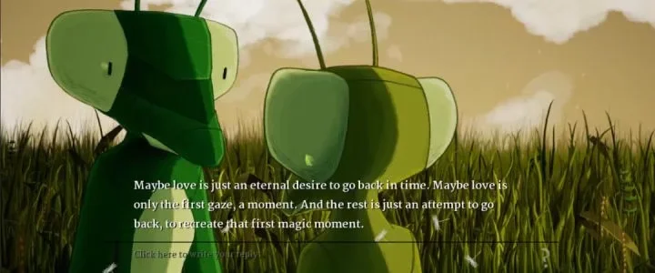

### 10月

> 哎，只可惜一百年过去了，闺中人和梦里人还是没能相遇。不过真是最好的跑团体验之一了。- 2020.10.20

> 大概是高中时候做过的一个梦 印象最深的梦之一 在一个蜂巢一样的建筑 每个蜂房都是一个排练室 里面都有一支我爱的乐队 我听完这支乐队就推开门听下一支的 齐柏林 创世纪 大门 涅槃 绿洲 史密斯 山羊皮 电台司令 音速青年 妖精……数不清的房间 数不清的乐队 在梦里我不停地听不停地听 好像一辈子都这样就过去了 这些音乐对我来说 已经不是为了好听 它们是我生命的一个支点 没有它们我可能已经崩溃瓦解 好在它们在 而且它们这么美这么好 它们不仅把我支撑了起来 还让我看见了一个更高的更美丽的新世界 - 2020.10.11

> 路边的野菊也好，山谷的幽兰也好，无论人们时常驻足，还是从未见过，你都是要开花的。- 2020.10.04

### 9月
> 三刷《告白》，太精彩了。
>
> 《告白》里的母亲竟然和《四月物语》里的少女竟然是同一人，不得不感叹松隆子演技真的太好了。 - 2020.09.29

> 分析哲学太牛掰了，天能想到高数学的一阶二阶导数竟然能用到证明上帝是否存在上？？ - 2020.09.29

> 一直不明白康德的“不要把他人当做手段，而是当做目的”，今天联想到金钱，一下明了了。 - 2020.09.28

> 对于任何外文读本，特别是诗歌，找到一个好的译者就好比找到一位钦慕已久的心上人。- 2020.09.25

> 如果我幽默、风趣、平易近人，那会让我离你的心更近一步么？我过去以为是，但我早已不这么认为了。
>
> 我会通过冥思，打坐，阅读，写作，和与天地、自然、生灵的沟通中找到你，接近你。你如果有心的话，在雨雪季节，仔细听，天空落下的是什么，甚至不用那么麻烦，你只需要找个空旷的地方，等风来，风会告诉你的。
>
> 风会告诉你什么？你去听，一定好好听，如果你听到了，也许你会会心一笑，也许你会不屑一顾。但，我的目的已经达到了：我不是要你爱我，我要你听自己内心的声音。 - 202.09.25

> 生日就在做志愿、找书和赶ddl中度过了（最惨的是还没赶完）……总之，又长了一岁。这一岁大抵过得还算满意，有些坎还是过不去，但在许多方面已经有了称心的成长，许多事情也想得清楚了。在新的一岁，希望自己不再吝啬于表达对亲人朋友的爱，不再掂着自己不放，再坦诚些，还有最重要的是，多读书！！！（再次希望有精神时光屋就好了） - 2020.09.20

> 一年多没去清真食堂，阿姨还认识我，问我是不是回来读研了……- 2020.09.20

> 看完《春宵苦短！少女前进吧！》心情好激动！完全睡不着！想痛痛快快、大谈特谈一场恋爱！ - 2020.09.09

> 哲学对于一个人最大的功用是使你对自以为熟知的生活变得陌生，让你再次以幼时好奇的目光审视度量世界，然后再让你以学徒的谦卑和信徒的虔诚去重新发现、了解、学习。就像阿多尼斯的诗里说的那样，哲学所帮助我们的是解决这样一个问题：“我如何对我的日子说：‘我住在你那里，却从未抚摸你；我周游了你的疆域，却未曾见过你？’” - 2020.09.09

> 她穷尽一生追求的不是某个人，她所追求的是爱情本身。- 2020.09.02

### 8月

> “瞬间”真是个奇妙的修饰语，它使得生活中随处可见的简单物什都变得弥足珍贵。 - 2020.08.31

> 昨天晚上梦见了彩虹，近得快要能抓到，我想，这一定是新生活的一个美好征兆 - 2020.08.30

> 许许多多个夜晚我们围着篝火相聚，谈论、追忆过往的人与事，我们都知道一切都即将改变，一去不复返，但我们迟迟停留，喝了一钟又一钟的醇酒，直至酒杯碰碎，踩着稀碎的瓷渣，我们的赤子之心崩溃瓦解，终于，音讯全无。 - 2020.08.24

>  我羞于表达这样的感情，自以为这是一种失态与散漫。 - 2020.08.24

> 哈哈哈哈哈哈我就知道一定会有人说刑星像某（指第一支也是几乎影响力最大的一支）朋克乐队sex pistols的那个主唱，真的太像了，那扮相，那神经质的唱法，说是主唱本人过来了也有人相信？？乐夏这一季也是真的神奇，夺冠热门后海大鲨鱼竟然被淘汰了... - 2020.08.15

> 一张图说明我对《南方》这首歌的爱之深切～
>
> 初中回家的路上，高中散步的操场上，大学去往北方或者归来南方的一千三百公里外的火车上，我不停地听，不停地听，从来没有倦过，绝对不只是听了一百次而已，一千次一万次都不过分了吧
>
>（第一名是新概念英语，单曲循环的时候睡着了没关放了一晚上--） - 2020.08.08
>
> 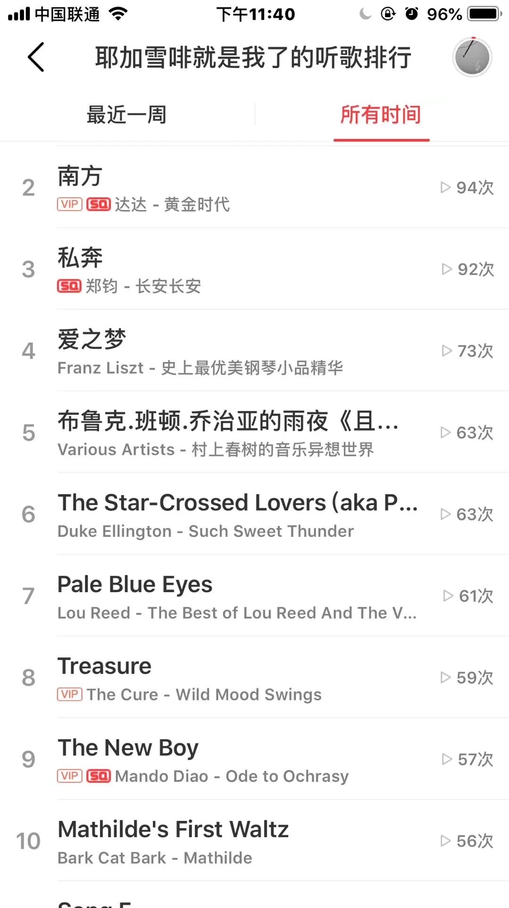\

> 以稍微长一点的时间观来看待发生在自己的身上的事情，这件事情一年后还重要吗？三年后还重要吗？十年后还重要吗？这样很容易就能过滤一些不必要的烦恼，让你将你的烦恼用在真正用得着的地方哈哈哈 - 2020.08.03

### 7月
> 以你的直觉和本能去爱你所爱，让你的心脏和血液来告诉你什么是爱，遗忘你的算计与考量，丢弃你的成见与傲慢——谁跃入爱河时是穿着衣服的呢？ - 2020.07.31

> 我不喜欢有人能随时随地让我有义务有必要地应答，也许几个小时，也行一天几天，有时候就是不想说话也不想和谁联系。- 2020.07.29
>
> 2021.09.15追加: 太天真了 对于喜欢的人恨不得天天跟她讲呢

> 有些好笑，说是日记，但是翻了翻，最近的一篇已经是在去年12月份了。 - 2020.07.29

> 让我成为你的爱人，或是你的影子。 -2020.07.27

> 想去有雪、有森林的地方住一会儿。 - 2020.07.25

> “为什么能对屋子里的大象视若无睹？”
>
> “呵，你抬头看看天那里有什么？一只冷漠的巨眼正监视着我们。” - 2020.07.24

> 太多书要读了啊啊啊真希望有个《七龙珠》里面悟空修炼的小屋，1小时当10小时用…… - 2020.07.24

> 白票了不知道多少文献书籍课程后，不得不感谢这个时代的伟大，特别是感谢网络的伟大，没有网络穷学生真不知道上哪找来买书去 - 2020.07.21

> 三浦春马自杀了？？？ -2020.07.18

> 《睡前消息》真的越来越能冲塔了，不过幸好现在整体舆论还过得去，众目睽睽之下也不能怎么样，不过真保不齐以后会怎样……
>
> 如果这些情况发生在美国，那没得什么好说的，《睡前消息》批判的那些东西不过是家常便饭而已，但我们是中国，资本垄断巩固到这种程度理论上来说是不该有的事……
>
> 我想督工英勇无畏的冲塔大概真能冲醒一部分人，让一部分人参与到他们本该参与的政治生活中。
>
> 仅仅按我个人看到的来说，网络上的键政明显要比一两年前要多得多了，虽然只是键政，但也是走向真正的政治讨论的一大步了。如果以后我的孩子能够非常自然地和同学讨论政治问题，那真的要给督工烧柱香了。 - 2020.07.12

> 《明日之子乐团季》第一集至少让我情不自禁地鼓掌喝彩三次，跟着节奏甩头摇晃两次，热泪盈眶一次，难受得哭一次……
>
>很久没有看见朴师傅这么开心过了，也看见几次朴师傅红了眼，能让朴树这么动情也可以看见这节目有多好了
>
>看的时候第一感觉就是这群男孩真的真的太有活力太青春了（还有部分选手太帅了哈哈哈），看到他们我才深深感觉到自己青春的一部分丧失，和他们比我好像已经垂垂老朽了……不过我和他们对听到好音乐的感觉还是一样的哈哈哈
>
>最有印象的选手是最后的杨钲博同学，除此之外还有杨英格、王江元还有吹唢呐那位同学。杨同学很神奇的一点是他唱的是Radiohead的Creep，这首大概是我印象中接触摇滚乐初最喜欢的一首，那时候不被喜欢的女孩子喜欢，拿来听了又听，觉得自己听出了歌中的那种不被爱者的卑微与渴望。现在听杨同学的翻唱，结合杨同学个人的经历和性格，我听出一点更有趣的东西，就是这首歌与爱无关，就是creep的自我宣泄而已。
>
> 最让我难受得想哭的时候不是邓紫棋哭着和杨同学说我明白你的感受的时候，而是邓紫棋这么说而杨钲博躲躲闪闪不敢回应的时候，我想到《海边的曼彻斯特》里最高潮的那段戏，就是妻子和Lee再次在街...... - 2020.07.12

> 有时候看某些书会不由自主地在内心发问：究竟是翻译没翻成人话还是原作者就没说人话？- 2020.07.18

> 新舍友好强……养蝎子、蜥蜴，还有蜘蛛、甲虫，还有我不认识的虫子，而且听他说他那还是天津规模最大的虫社，他靠卖虫子发家致富了……- 2020.07.02
>
> 01.05追加： 这个室友超级有意思的！

> 应该是看了学校的高考加油视频的原因，又梦见回到了高中……
>
>但是好像除了生物还是周老师，数学还是黎老师外其他老师都换了，最有印象的是英语老师换成了一名外教？
>
> 然后最诡异的是我不知道为什么吞了副假牙进去，然后碎了，整个梦里面基本就一直在垃圾桶旁边吐假牙…… - 2020.07.11

### 6月

> 天津都是些什么离谱的天气，雷阵暴风雨还夹小拇指大的冰雹？？？把手伸了会出去直接被打红了？？？感觉这是我最接近世界末日的一次…… - 2020.06.25

>  从来没有一门考试挂得这么毫无悬念过，真好，一点都不用提心吊胆,担心过不过了。
> 
> 还好前两天复习中通4-4的时候舍友在我旁边看剧，我也跟着看了，所以也算没浪费时间（？） - 2020.06.24

> 你的心事还在咿呀咿呀地响。- 2020.06.19

> 在学校不好的是，想出去走走的时候出不了了，马上宿舍楼要关门了。如果是在家里，大概又要成为游荡在家乡大道上的孤魂野鬼了。散散步，散散心，没什么心事是解不开的。- 2020.06.19

> 虽然史院老师人均通情达理，善解人意，但是杜老师真的好到超出我理解？我离开办公室的时候第一个心理活动就是：杜老师也太好了吧？？
>
> 哈哈可能是因为和杜老师很喜欢的一位同学一起的，沾了她的光，还从老师那拿了个旺仔牛奶糖。- 2020.06.12

> 世界已经被不可避免地分裂，巨大的阴影开始覆盖整个世界的上空。- 2020.06.11

> 挺奇怪的，有时候你连最亲近的人也不在乎，但有时候你却连一个陌生人伤心你也想去安慰。我很长时间里都觉得你是冷漠而又自闭的一个人，但你安慰他人时真切的模样又让我觉得好像你才是最热心的那个，真是奇怪啊你这个人…… - 2020.06.10

> “朋友”的意思不是从不产生冲突，而是产生冲突后能够心平气和地坐下来 ，直言不讳地谈谈对互相的看法，争取互相理解互相包容。甚至在某一方面来说，有更多冲突的朋友反而情谊更深（当然前提是冲突解决了）。
>
> （观两舍友冷战两天后现在在阳台聊天有感） - 2020.06.06

> So sad,忘记了这是《银翼杀手2049》，不是《第一滴血》。他不是英雄，他只是一个“发生故障”的电子人。
>
> 所以K还是失去了一切，爱人（尽管是虚拟的），父亲母亲（虽然那其实从未属于他），还有记忆……也不是他的，是被植入的。他过去认为的使命也只是一个“障眼法”。
>
> 这样看起来他好像没有失去什么，因为他什么也没真正得到过，等他死去后，又会有一个K被生产出来代替他的位置。 - 2020.06.05

> 现在的生活状态：教室挨冻，宿舍蒸桑拿。- 2020.06.03

### 5月

> “有时候日子非常不好过，我知道。好像你的整个世界都垮了。不过我还是要告诉你，你表现得很好，你把自己的世界又重建起来了。你真的很了不起。我知道你的世界已经不可能和过去完全一样了，不过我也知道你已经重新出发，为自己建筑了一个幸福快乐的未来。还有，我会永远在一旁帮助你，我要你知道这一点。” - 2020.05.29

> 天津的天真的好蓝啊，是这辈子都没见过的蓝，可以让人直愣愣望上一整天也不觉得枯燥。- 2020.05.27

> 虽然一切都是那么急，但还是觉得今天的风儿很慢，还是有足够的时间驻脚，看小径旁野花的生长状况，有时间听着喜欢的歌入睡，最重要的是，还有时间同你谈述昨晚遇到的好梦。 - 2020.05.25

> 柳暗花明又一村，终于看见了写完西方史学原著选读论文的曙光！
>
> （虽然有点水，基本没看英文文献，但是真的不是因为我懒，是真的没时间看了啊啊） - 2020.05.24

> 之前一直以为网课不用急，看了一半就放着没有看了，结果收到通知明天就截止了？？？
>
> 吓得我打开电脑，二倍速一通狂刷，但是最难受的是一移开鼠标就停止播放，二倍速我又不想看（想等刷完后再补），这时候万能的百度登场了
>
> 百度搜索如何解除限制，果然有，更骚的还有调成4倍速和直接快进的和自动播放的……对付《形势与政策》这种emmm的课简直不要太好用
>
> 于是开起自动播放模式出去散步了√ - 2020.05.09

> 星光黯淡时才需我们持着火把前行 - 2020.05.09

> 这真的是今年乐夏阵容就厉害了，去年说实话阵容不全，八强里面我闭着眼睛就猜中了七个，五强也是猜对四个（Click#15是真猜不着）
>
> 今年就真不好说了，百花齐放，就我听过的来说，去年没有的许多乐队风格都给补上了，有达达（我的最爱之一！）Joyside这样的老牌却音乐新的乐队，有后海这样的类似新裤子有群众有实力的乐队，也有告五人这样的网红乐队，更厉害的是重塑（重塑竟然上综艺了，我都能想象到观众听到歌后被惊讶/惊吓到的表情了）和木马这样的非主流但业界口碑爆表的乐队（按理来说应该还有个野外合作社），马赛克、声音玩具、岛屿心情和野孩子、Carsick Cars也非常好，霓虹花园、椅子、康姆士也还不错
>
> 非得说啥缺陷的话就是后朋风格的乐队还是邀得少了，兵马司那随便拉几个来不香嘛，不过重塑来了，我满足了！
>
> 今年乐夏阵容真的强，先行向大家安利一波 - 2020.05.03

### 4月

> 绝了，熬完夜早上还倍精神……
>
> 出去吃个早餐，公园转两圈再回来睡 - 2020.04.28

> 你知道吗？任何让我觉得幸福的事情都让我心里隐隐约约感觉到这样一个念头：如果你在这就好了。 - 2020.04.26

> 从人们理所当然地认为窃·格瓦拉（实际姓周，下文称周某）会签约直播赚大钱的成见到周某自身“好不容易获得自由，要好好珍惜，想回家务农陪父母”的看法，我才感觉到从他被逮捕到出狱的四年里（也许不只四年），所谓网红、流量等概念给这世界还有人们的观念带来的意外变化。 - 2020.04.24

> 终于明白老师说的写文献综述很难是啥意思了，第一步查找文献就把我头搞秃了，想到我还要看这些文献，还要总结，头发不知不觉又少了几根…… - 2020.04.19

> 比较开心的是，在我眼里似乎比较博学的同学竟然向我请教问题，而我似乎也回答得不错。
>
> 但比较苦闷的是，我觉得自己只是在转移别人的知识，只是将从这儿知道的知识转移到另一处回答问题而已，而不是真正知道了什么。这算不了什么能力，只是刚好看到，刚好知道而已。
>
> 其实这也算一种能力，只是处于书读太少的我出于本能产生了焦虑吧。
>
> 还是得多读多想，将外部的知识点汇聚，演化成自己的知识体系，这样我才觉得我说出的话是我自己的知识而不是转交他人的观点。
>
> 一些思考，暂作叨唠也无妨。 - 2020.04.15

> 刚刚看书突然发现艾欧尼亚和爱奥尼亚（也译伊奥尼亚）原来都是Ionia……
>
>惊！也就是说传说中的哲学之父泰勒斯和刀锋意志艾瑞莉娅竟然是老乡！
>
> （学习学到神经错乱x）
>
> 也可以说是下棋下到神经错乱x 食我三星刀妹啦！ - 2020.04.11

> 即使在这样的情况下，我们也不应该放弃表达，但确实我们需要言辞更加清晰，逻辑更加合理，更重要的深入到人们的心中，使他们切实地感受到你确实在为他们说话——不要以为这是取巧，这是一种必要的修辞技巧。
>
> 很难说我们能改变什么，甚至我们的努力也许会将我们自身摧毁，但即使是这样，这也是必须的，这是我们的责任和义务。- 2020.04.11

> 看老菊玩骑马与跑商（bushi）,骑马与galgame(划去)，骑马与砍杀2真的心动了，但是想起前几天打麻将输的钱念头灰了大半……
>
> 留着买骑砍和赛博朋克不香吗！ - 2020.04.10

> 现在才发现我们明清史老师大学专业竟然是数学，还是在吉林大学 
>
> 所以是受了什么苦才会跑我们学校来硕博连读中国古代史……hhh突然让我转专业考研的想法变得很理所当然 -2020.04.08

> And as the echo fades from her final fusillade
>
> Remember the promises you made - 2020.04.01

### 2月-3月
> 人类真是个难以伺候的存在 - 2020.03.23

> 那边"Chinese virus"喊得正欢，这边恭喜“中国以外87182例，反超了！”（这个“！”真的绝），真是世间百态，一应俱全。 - 2020.03.18

> 自从知道没有早课（最早的课都是9点50）后日常作息就开始微妙起来..吃完饭学习会8、9点睡觉，睡到11、12点醒，醒了开始学，学到两三点睡觉……睡醒后特别有精神，深夜看书又没人打扰 - 2020.03.18

> 下书如山倒，看书如抽丝……
>
> （老师真的别推荐书了我真的看不完啊啊啊）
> 
> 我问个问题，老师反手就是三本书推荐给我看，留下我在原地一脸懵逼--而上次问问题老师推荐的书我还没打开 - 2020.03.16

> 在那个时代，那么多的英雄，那么多的传奇，那么多的血与肉都被埋藏在彻骨的冻土中，经受无限的死亡酷刑，才换得一个得以平安长大的国家。
>
> 唉！怎么到如今给我们所留下来的印象却是“敏感”二字？那英雄们的英灵由谁来祭奠呢？英雄们的功绩又由谁来惦记？ - 2020.03.10

> “永远不要认为我们可以逃避，我们的每一步都决定着最后的结局，我们的脚正在走向自己选择的终点。” - 2020.03.07

> 别人深夜食堂，而我，深夜洗碗。 2020.03.05

> 革命是历史的要求，而拒绝革命只是个人的希望，独裁者虽有千军万马，在历史面前也是螳臂当车，必然被巨轮所碾灭。- 2020.02.24

> 有时候静下心来凝视自己的房间，一种陌生感会莫名浮现，心底诧异已经在这儿生活了十多年却不明白那有什么好诧异的。 - 2020.02.22

> 哈哈哈哈今天去外公家地里偷菜太好玩了 - 2020.02.05
> 
> 01.05追加： 如果没记错的话，摘错部位了···把不能吃的地方给摘回去了···

> Darkness and helpless at one no-electricity night. - 2020.02.03

> 这个世界是多么奇妙啊，真想带你去看看 - 2020.01.20

> 永恒难以抵达，一瞬又把握不住，究竟是在什么样的道路上蹒跚而行？ - 2020.01.15

## 2019

## 2018

> 我还未出生时，我与世界一体，我即世界本身，我知晓世界时间空间上的每一种物质，每一个存在性和可能性。但那之后，我与世界被隔离，以一个婴儿的身份再次出现在世界上，我遗失了所有的记忆，甚至丧失了自己的本原和对唯一真理的本能的渴望。我逐渐落入每一个人群中，有时候我是个瘾君子，有时候我是个茶花女，更多时候我是个在瘟疫中暴毙的路边尸体。无数次的回溯与遗忘，我开始发现自己的特殊性。我拥有着对事物的最本质了解，我看透所有虚妄背后的假象，我开始与世界再融为一体。- 2018.03.13

## 2017

## 2016

## 2015

## 2014

> 我总在想假如当初不降个年级的话我就不会遇见你们 总想着我是初三的然后偶尔经过你们教室时我会看见很多个可爱的学弟学妹 我不认识你们但是我喜欢你们 全部人 然后想着啊怎么办我看见一个很可爱的学妹我喜欢上她了 如果是那样我怎么会想那是现在的你- 2014.04.26

> 小侄女出生了！ - 2014。04.03

> 从去年冬天要到了开始，我回家的必经之路的一个院子的藏獒就不见了，当时以为是天冷了，狗主人让它进家里取暖去了，但直至今天，这么温暖的春天，我回家时还是没有看见它，大概是死了吧。- 2014.03.23

